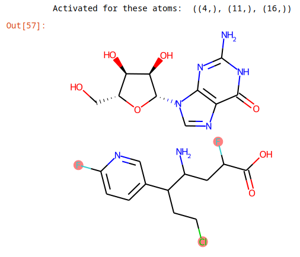
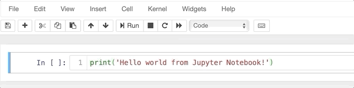
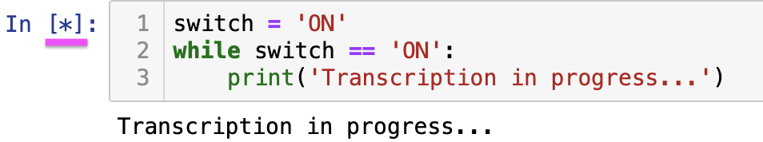
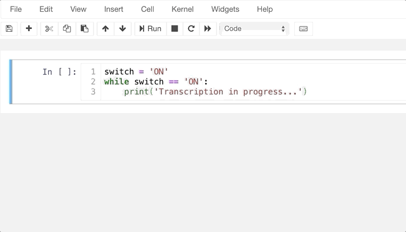
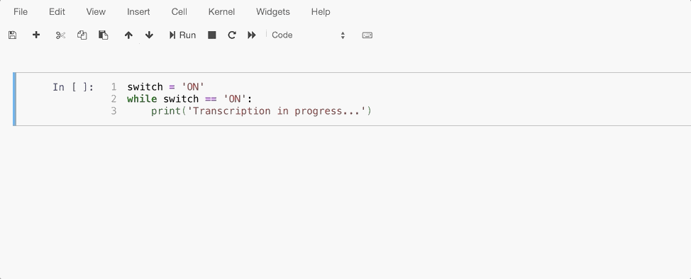

fingeRNAt - additional data and pipelines
=========

Repository with data and complete pipelines to reproduce results from *fingeRNAt - a software tool for analysis of nucleic acid-ligand complexes.* doi: [10.1371/journal.pcbi.1009783](https://doi.org/10.1371/journal.pcbi.1009783)

<!-- TOC START min:1 max:6 link:true asterisk:false update:true -->
- [Repository contents](#repository-contents)
- [Jupyter Notebooks pipelines](#jupyter-notebooks-pipelines)
- [Quick intro to Jupyter Notebooks](#quick-intro-to-jupyter-notebooks)
  - [Opening a Jupyter Notebook](#opening-a-jupyter-notebook)
  - [Running a cell](#running-a-cell)
  - [Common troubleshooting](#common-troubleshooting)
  - [Saving Jupyter Notebook](#saving-jupyter-notebook)
  - [Closing Jupyter Notebook](#closing-jupyter-notebook)
  - [Further reading](#further-reading)
<!-- TOC END -->


<!-- markdown-link-check-disable-next-line -->
[](https://github.com/n-szulc/fingeRNAt-additional/actions/workflows/action-links.yml)


# Repository contents

This repository holds data and pipelines to perform the following analyses:

1. Analysis of interactions statistics in RNA-Ligand complexes - directory [RNA_ligands_interactions_stats](RNA_ligands_interactions_stats/README.md).
2. Analysis of RNA Puzzle 23 data [RNA_Puzzle_23](RNA_Puzzle_23/README.md).
3. Analysis of interactions of HIV-1 TAR structure in complexes with it's active/inactive ligands - directory [HIV-1_TAR_active_vs_inactive_ligands](HIV-1_TAR_active_vs_inactive_ligands/README.md).
4. Test of fingeRNAt interactions detection in various combinations of receptors and ligands: - directory [fingeRNAt_test](fingeRNAt_test/README.md).
5. Auxiliary jupyter notebook [SMARTS_checker](SMARTS_checker/SMARTS-playground.ipynb) for testing SMARTS patterns used in yaml plugin.



6. Fingerprint calculation times: [plot generation and raw data](exec_time/).
7. [Relationship of RMSD and SIFts similarity for docking data for set of 144 RNA-ligand complexes](RMSD-vs-SIFts_similarity/)

# Jupyter Notebooks pipelines

All pipelines are in form of Jupyter Notebooks. They should be **run from within fingeRNAt environment** to allow for calculation of Structural Interactions Fingerprints using program fingeRNAt. To learn how to use jupyter notebooks, please look at [our quick guide](JN.md).

Some of them require **additional dependencies** to be install from within fingeRNAt environment.

These are:

* Jupyter Notebook
* ipywidgets >= 7.5.1
* seaborn >= 0.10.1

**Example of installation using conda**

```
conda activate fingernat
conda install -c conda-forge notebook
conda install -c conda-forge ipywidgets
conda install -c anaconda seaborn
```

# Quick intro to Jupyter Notebooks
==============

<!-- TOC START min:1 max:6 link:true asterisk:false update:true -->
  - [Opening a Jupyter Notebook](#opening-a-jupyter-notebook)
  - [Running a cell](#running-a-cell)
  - [Common troubleshooting](#common-troubleshooting)
  - [Saving Jupyter Notebook](#saving-jupyter-notebook)
  - [Closing Jupyter Notebook](#closing-jupyter-notebook)
  - [Further reading](#further-reading)
<!-- TOC END -->

Jupyter Notebook is a free, open-source and interactive web application allowing to combine  code, calculated plots and explanatory texts into a single document.

## Opening a Jupyter Notebook

For the purpose of reproducibility of all the analyzes from this repository, we advise to run Jupyter Notebooks from within fingernat environment.

e.g. using conda fingernat environment:

```
conda activate fingernat
jupyter notebook Pipeline.ipynb
```

A new tab in the Internet browser will be opened with the Jupyter Notebook.

## Running a cell

In Jupyter Notebooks code is divided into cells, to run a cell, simply click on cell you want to run (the frame around it should become green) and hit `►| Run` icon in the upper panel or hit Shift and Enter simultaneously.



## Common troubleshooting

If a cell is running for too long, it may mean that there is some kind of trouble with code or Jupyter Software.

Jupyter Notebook indicates that a cell is running with asterisk (marked with magenta on the picture below). Only one cell may be running at the same time.

<p align="center">

</p>

You may either interrupt cell execution...



...or restart the Kernel



After restarting kernel, you will have to run all Jupyter Notebooks cells once again. <br /> However, `Restart & Run All` runs one by one *all cells* in the Jupyter Notebook.

---
**NOTE**

Running fingeRNAt on large dataset may require some time to finish calculations.

---

## Saving Jupyter Notebook

To save changes in Jupyter Notebook, simply hit Ctrl+S

## Closing Jupyter Notebook

To close Jupyter Notebook, close the tab and shut down it's kernel in the terminal window you used to run Jupyter Notebook.

**How to shut down the kernel?**

1. Hit Ctrl+C in the terminal
2. You will receive the following prompt: `Shutdown this notebook server (y/[n])?`
3. Type `y` and hit Enter

## Further reading

More information about Jupyter Notebooks may be found at [jupyter.org](https://jupyter.org) or in the article [Using interactive digital notebooks for bioscience and informatics education](https://journals.plos.org/ploscompbiol/article?id=10.1371/journal.pcbi.1008326).
