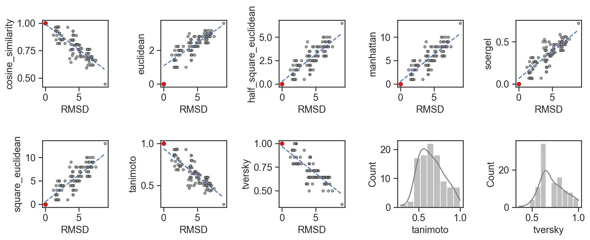
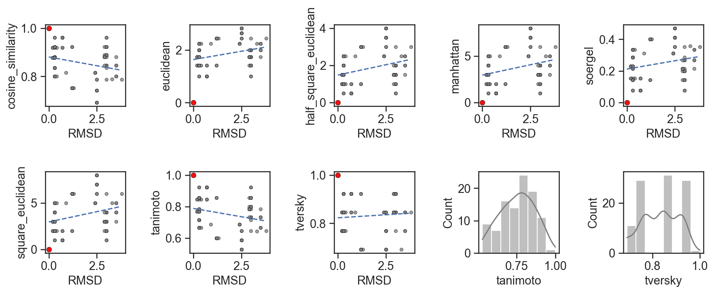
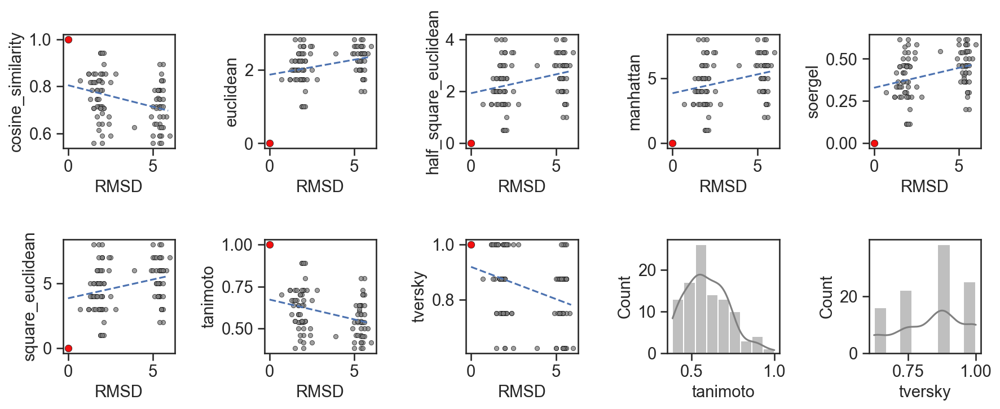
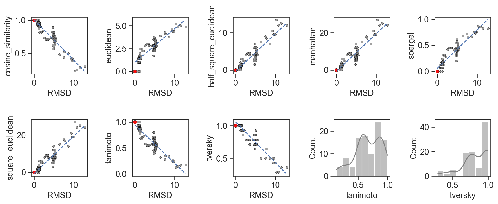
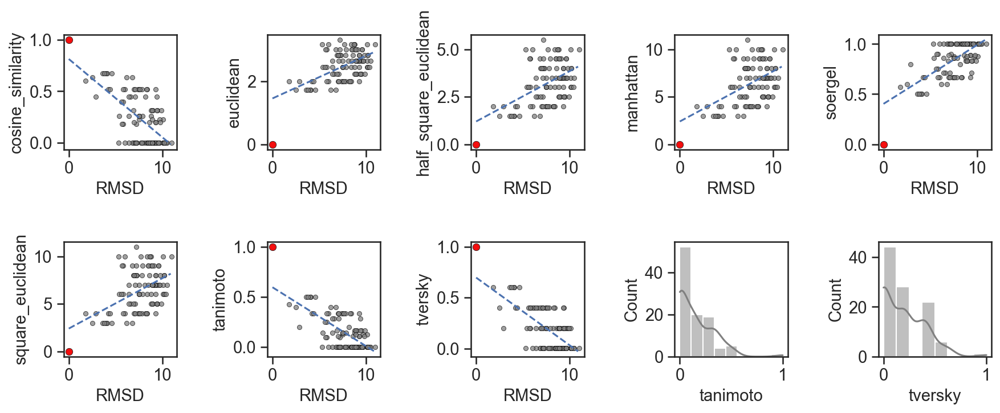
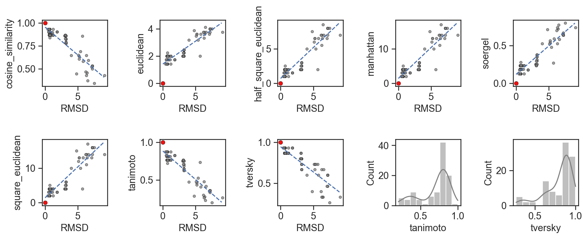
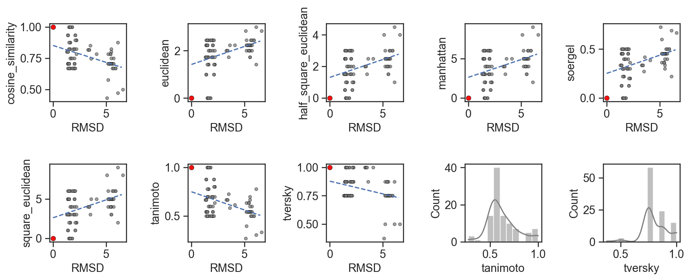
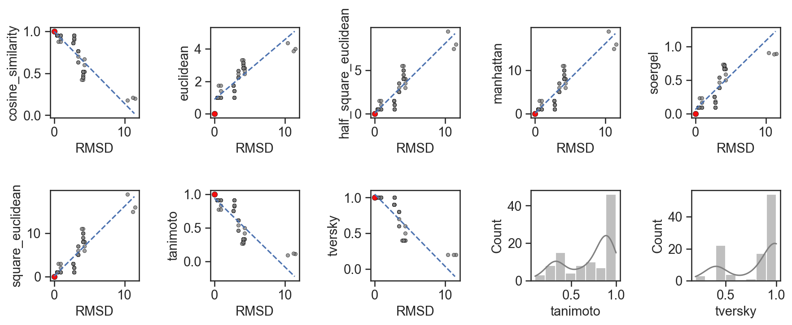
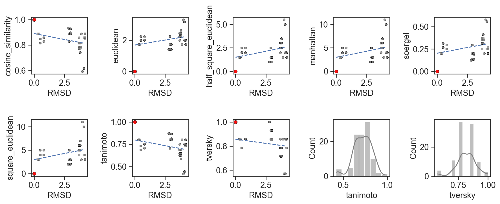

Relationship between RMSD and fingerprint similarity
=============

<!-- TOC START min:1 max:1 link:true asterisk:false update:true -->
- [1AJU](#1aju)
- [1AKX](#1akx)
- [1AM0](#1am0)
- [1ARJ](#1arj)
- [1BYJ](#1byj)
- [1EHT](#1eht)
- [1EI2](#1ei2)
- [1F27](#1f27)
- [1FMN](#1fmn)
- [1FUF](#1fuf)
- [1FYP](#1fyp)
- [1G4Q](#1g4q)
- [1J7T](#1j7t)
- [1J8G](#1j8g)
- [1KOC](#1koc)
- [1KOD](#1kod)
- [1LC4](#1lc4)
- [1LVJ](#1lvj)
- [1MWL](#1mwl)
- [1NBK](#1nbk)
- [1NEM](#1nem)
- [1NJN](#1njn)
- [1O15](#1o15)
- [1O9M](#1o9m)
- [1PBR](#1pbr)
- [1Q8N](#1q8n)
- [1QD3](#1qd3)
- [1RAW](#1raw)
- [1TOB](#1tob)
- [1UTS](#1uts)
- [1UUD](#1uud)
- [1UUI](#1uui)
- [1XPF](#1xpf)
- [1YRJ](#1yrj)
- [1ZZ5](#1zz5)
- [2A04](#2a04)
- [2AU4](#2au4)
- [2B57](#2b57)
- [2CKY](#2cky)
- [2EES](#2ees)
- [2EEU](#2eeu)
- [2ESI](#2esi)
- [2ET3](#2et3)
- [2ET4](#2et4)
- [2ET8](#2et8)
- [2F4S](#2f4s)
- [2F4T](#2f4t)
- [2F4U](#2f4u)
- [2FCX](#2fcx)
- [2FCY](#2fcy)
- [2G5K](#2g5k)
- [2G9C](#2g9c)
- [2GDI](#2gdi)
- [2GIS](#2gis)
- [2GUN](#2gun)
- [2KD4](#2kd4)
- [2KGP](#2kgp)
- [2KTZ](#2ktz)
- [2KU0](#2ku0)
- [2KX8](#2kx8)
- [2L1V](#2l1v)
- [2L8H](#2l8h)
- [2L94](#2l94)
- [2LWK](#2lwk)
- [2M4Q](#2m4q)
- [2MIY](#2miy)
- [2MXS](#2mxs)
- [2NPZ](#2npz)
- [2O3V](#2o3v)
- [2O3W](#2o3w)
- [2O3X](#2o3x)
- [2O3Y](#2o3y)
- [2OE5](#2oe5)
- [2OE8](#2oe8)
- [2QWY](#2qwy)
- [2TOB](#2tob)
- [2W89](#2w89)
- [2XNZ](#2xnz)
- [3BNQ](#3bnq)
- [3C44](#3c44)
- [3C7R](#3c7r)
- [3D0U](#3d0u)
- [3D2G](#3d2g)
- [3D2V](#3d2v)
- [3D2X](#3d2x)
- [3DIG](#3dig)
- [3DIL](#3dil)
- [3DIO](#3dio)
- [3DIQ](#3diq)
- [3DIR](#3dir)
- [3DIY](#3diy)
- [3DJ0](#3dj0)
- [3DJ2](#3dj2)
- [3DS7](#3ds7)
- [3DW4](#3dw4)
- [3E5C](#3e5c)
- [3E5E](#3e5e)
- [3F2Q](#3f2q)
- [3FO6](#3fo6)
- [3G4M](#3g4m)
- [3GAO](#3gao)
- [3GCA](#3gca)
- [3GLP](#3glp)
- [3GOT](#3got)
- [3GX2](#3gx2)
- [3GX3](#3gx3)
- [3GX5](#3gx5)
- [3IQR](#3iqr)
- [3LA5](#3la5)
- [3MIJ](#3mij)
- [3NPQ](#3npq)
- [3OWW](#3oww)
- [3Q50](#3q50)
- [3RKF](#3rkf)
- [3SD3](#3sd3)
- [3SKI](#3ski)
- [3SKL](#3skl)
- [3SKR](#3skr)
- [3SKZ](#3skz)
- [3SUH](#3suh)
- [3SUX](#3sux)
- [3TD1](#3td1)
- [3TZR](#3tzr)
- [4ERL](#4erl)
- [4F8U](#4f8u)
- [4F8V](#4f8v)
- [4FE5](#4fe5)
- [4JF2](#4jf2)
- [4K32](#4k32)
- [4KQY](#4kqy)
- [4LVV](#4lvv)
- [4LVW](#4lvw)
- [4LVX](#4lvx)
- [4LVY](#4lvy)
- [4LVZ](#4lvz)
- [4LX5](#4lx5)
- [4LX6](#4lx6)
- [4NFO](#4nfo)
- [4P20](#4p20)
- [4P5J](#4p5j)
- [4P95](#4p95)
- [4ZNP](#4znp)
- [5BWS](#5bws)
- [5BXK](#5bxk)
<!-- TOC END -->

# 1AJU

### Statistics of similarity metrics

|       |      RMSD |   cosine_similarity |   euclidean |   half_square_euclidean |   manhattan |    soergel |   square_euclidean |   tanimoto |    tversky |
|:------|----------:|--------------------:|------------:|------------------------:|------------:|-----------:|-------------------:|-----------:|-----------:|
| count | 101       |          101        |  101        |               101       |   101       | 101        |          101       | 101        | 101        |
| mean  |   6.12772 |            0.430283 |    2.79776  |                 4.24753 |     8.49505 |   0.680707 |            8.49505 |   0.319299 |   0.407183 |
| std   |   2.24958 |            0.293121 |    0.821213 |                 2.17442 |     4.34885 |   0.258248 |            4.34885 |   0.258244 |   0.287032 |
| min   |   0       |            0.0001   |    0.01     |                 0.0001  |     0.0001  |   0.0001   |            0.0001  |   0.0001   |   0.0001   |
| 25%   |   4.6     |            0.1336   |    2        |                 2       |     4       |   0.4      |            4       |   0.0714   |   0.125    |
| 50%   |   6       |            0.3536   |    3        |                 4.5     |     9       |   0.8      |            9       |   0.2      |   0.25     |
| 75%   |   8       |            0.75     |    3.6056   |                 6.5     |    13       |   0.9286   |           13       |   0.6      |   0.75     |
| max   |  10.3     |            1        |    3.873    |                 7.5     |    15       |   1        |           15       |   1        |   1        |

### RMSD vs fingerprint similarity

|    | PDB   | metrics               |   Spearman |   Pearson |   Kendall |       R² |
|---:|:------|:----------------------|-----------:|----------:|----------:|---------:|
|  0 | 1AJU  | cosine_similarity     |  -0.740809 | -0.755223 | -0.540221 | 0.570362 |
|  1 | 1AJU  | euclidean             |   0.701963 |  0.731555 |  0.493766 | 0.535173 |
|  2 | 1AJU  | half_square_euclidean |   0.701963 |  0.726982 |  0.493766 | 0.528503 |
|  3 | 1AJU  | manhattan             |   0.701963 |  0.726982 |  0.493766 | 0.528503 |
|  4 | 1AJU  | soergel               |   0.74061  |  0.741289 |  0.540073 | 0.54951  |
|  5 | 1AJU  | square_euclidean      |   0.701963 |  0.726982 |  0.493766 | 0.528503 |
|  6 | 1AJU  | tanimoto              |  -0.74061  | -0.74128  | -0.540073 | 0.549496 |
|  7 | 1AJU  | tversky               |  -0.745597 | -0.755391 | -0.587382 | 0.570615 |

# 1AKX

### Statistics of similarity metrics

|       |      RMSD |   cosine_similarity |   euclidean |   half_square_euclidean |   manhattan |    soergel |   square_euclidean |   tanimoto |    tversky |
|:------|----------:|--------------------:|------------:|------------------------:|------------:|-----------:|-------------------:|-----------:|-----------:|
| count | 101       |          101        |  101        |               101       |   101       | 101        |          101       | 101        | 101        |
| mean  |   5.26238 |            0.615927 |    2.2945   |                 3.01485 |     6.0297  |   0.502387 |            6.0297  |   0.497614 |   0.628713 |
| std   |   3.18439 |            0.284175 |    0.879025 |                 2.13009 |     4.26018 |   0.281181 |            4.26018 |   0.281183 |   0.312977 |
| min   |   0       |            0.1179   |    0.01     |                 0.0001  |     0.0001  |   0.0001   |            0.0001  |   0.0625   |   0.125    |
| 25%   |   2.8     |            0.3354   |    1.7321   |                 1.5     |     3       |   0.2727   |            3       |   0.2      |   0.375    |
| 50%   |   4.1     |            0.75     |    2        |                 2       |     4       |   0.4      |            4       |   0.6      |   0.75     |
| 75%   |   7.1     |            0.8528   |    3.1623   |                 5       |    10       |   0.8      |           10       |   0.7273   |   0.875    |
| max   |  11.9     |            1        |    3.873    |                 7.5     |    15       |   0.9375   |           15       |   1        |   1        |

### RMSD vs fingerprint similarity

|    | PDB   | metrics               |   Spearman |   Pearson |   Kendall |       R² |
|---:|:------|:----------------------|-----------:|----------:|----------:|---------:|
|  0 | 1AKX  | cosine_similarity     |  -0.79856  | -0.827471 | -0.57925  | 0.684709 |
|  1 | 1AKX  | euclidean             |   0.786938 |  0.84834  |  0.603407 | 0.719681 |
|  2 | 1AKX  | half_square_euclidean |   0.786938 |  0.862454 |  0.603407 | 0.743827 |
|  3 | 1AKX  | manhattan             |   0.786938 |  0.862454 |  0.603407 | 0.743827 |
|  4 | 1AKX  | soergel               |   0.797226 |  0.831026 |  0.579263 | 0.690604 |
|  5 | 1AKX  | square_euclidean      |   0.786938 |  0.862454 |  0.603407 | 0.743827 |
|  6 | 1AKX  | tanimoto              |  -0.797226 | -0.831026 | -0.579263 | 0.690605 |
|  7 | 1AKX  | tversky               |  -0.846573 | -0.809325 | -0.669146 | 0.655008 |

# 1AM0

### Statistics of similarity metrics

|       |      RMSD |   cosine_similarity |   euclidean |   half_square_euclidean |   manhattan |    soergel |   square_euclidean |   tanimoto |    tversky |
|:------|----------:|--------------------:|------------:|------------------------:|------------:|-----------:|-------------------:|-----------:|-----------:|
| count | 101       |          101        |  101        |               101       |   101       | 101        |          101       | 101        | 101        |
| mean  |   4.3901  |            0.785124 |    2.27467  |                 2.78218 |     5.56436 |   0.348678 |            5.56436 |   0.651323 |   0.717831 |
| std   |   1.87955 |            0.105498 |    0.627842 |                 1.31037 |     2.62075 |   0.146613 |            2.62075 |   0.146616 |   0.132235 |
| min   |   0       |            0.4454   |    0.01     |                 0.0001  |     0.0001  |   0.0001   |            0.0001  |   0.2778   |   0.3571   |
| 25%   |   2.5     |            0.6944   |    2        |                 2       |     4       |   0.2667   |            4       |   0.5294   |   0.6429   |
| 50%   |   4.5     |            0.8018   |    2.2361   |                 2.5     |     5       |   0.3571   |            5       |   0.6429   |   0.7143   |
| 75%   |   6.2     |            0.8487   |    2.8284   |                 4       |     8       |   0.4706   |            8       |   0.7333   |   0.7857   |
| max   |   8.9     |            1        |    3.6056   |                 6.5     |    13       |   0.7222   |           13       |   1        |   1        |

### RMSD vs fingerprint similarity

|    | PDB   | metrics               |   Spearman |   Pearson |   Kendall |       R² |
|---:|:------|:----------------------|-----------:|----------:|----------:|---------:|
|  0 | 1AM0  | cosine_similarity     |  -0.823839 | -0.8325   | -0.654846 | 0.693056 |
|  1 | 1AM0  | euclidean             |   0.8177   |  0.813897 |  0.658998 | 0.662429 |
|  2 | 1AM0  | half_square_euclidean |   0.8177   |  0.82781  |  0.658998 | 0.685269 |
|  3 | 1AM0  | manhattan             |   0.8177   |  0.82781  |  0.658998 | 0.685269 |
|  4 | 1AM0  | soergel               |   0.814035 |  0.8322   |  0.648198 | 0.692556 |
|  5 | 1AM0  | square_euclidean      |   0.8177   |  0.82781  |  0.658998 | 0.685269 |
|  6 | 1AM0  | tanimoto              |  -0.814035 | -0.832202 | -0.648198 | 0.69256  |
|  7 | 1AM0  | tversky               |  -0.764759 | -0.805922 | -0.61534  | 0.649511 |

# 1ARJ

### Statistics of similarity metrics

|       |      RMSD |   cosine_similarity |   euclidean |   half_square_euclidean |   manhattan |    soergel |   square_euclidean |   tanimoto |    tversky |
|:------|----------:|--------------------:|------------:|------------------------:|------------:|-----------:|-------------------:|-----------:|-----------:|
| count | 101       |          101        |  101        |               101       |   101       | 101        |          101       | 101        | 101        |
| mean  |   6.3505  |            0.371998 |    3.72988  |                 7.29703 |    14.5941  |   0.74797  |           14.5941  |   0.252033 |   0.352307 |
| std   |   2.03615 |            0.214844 |    0.829959 |                 2.59921 |     5.19842 |   0.194772 |            5.19842 |   0.194773 |   0.196803 |
| min   |   0       |            0.0001   |    0.01     |                 0.0001  |     0.0001  |   0.0001   |            0.0001  |   0.0001   |   0.0001   |
| 25%   |   5.4     |            0.25     |    3.1623   |                 5       |    10       |   0.6667   |           10       |   0.1429   |   0.25     |
| 50%   |   7.1     |            0.3062   |    4.1231   |                 8.5     |    17       |   0.8235   |           17       |   0.1765   |   0.25     |
| 75%   |   7.9     |            0.5103   |    4.2426   |                 9       |    18       |   0.8571   |           18       |   0.3333   |   0.4167   |
| max   |   9.4     |            1        |    4.7958   |                11.5     |    23       |   1        |           23       |   1        |   1        |

### RMSD vs fingerprint similarity

|    | PDB   | metrics               |   Spearman |   Pearson |   Kendall |       R² |
|---:|:------|:----------------------|-----------:|----------:|----------:|---------:|
|  0 | 1ARJ  | cosine_similarity     |  -0.606946 | -0.878825 | -0.4609   | 0.772334 |
|  1 | 1ARJ  | euclidean             |   0.740284 |  0.911554 |  0.594    | 0.83093  |
|  2 | 1ARJ  | half_square_euclidean |   0.740284 |  0.911185 |  0.594    | 0.830259 |
|  3 | 1ARJ  | manhattan             |   0.740284 |  0.911185 |  0.594    | 0.830259 |
|  4 | 1ARJ  | soergel               |   0.605714 |  0.893777 |  0.462125 | 0.798837 |
|  5 | 1ARJ  | square_euclidean      |   0.740284 |  0.911185 |  0.594    | 0.830259 |
|  6 | 1ARJ  | tanimoto              |  -0.605714 | -0.89378  | -0.462125 | 0.798843 |
|  7 | 1ARJ  | tversky               |  -0.564436 | -0.848388 | -0.439521 | 0.719762 |

# 1BYJ

### Statistics of similarity metrics

|       |      RMSD |   cosine_similarity |   euclidean |   half_square_euclidean |   manhattan |    soergel |   square_euclidean |   tanimoto |   tversky |
|:------|----------:|--------------------:|------------:|------------------------:|------------:|-----------:|-------------------:|-----------:|----------:|
| count | 101       |          101        |   101       |               101       |   101       | 101        |          101       | 101        | 101       |
| mean  |   6.6802  |            0.529332 |     3.20779 |                 5.27228 |    10.5446  |   0.637422 |           10.5446  |   0.362579 |   0.4524  |
| std   |   2.22149 |            0.135917 |     0.50721 |                 1.31058 |     2.62116 |   0.138946 |            2.62116 |   0.13895  |   0.15396 |
| min   |   0       |            0.2097   |     0.01    |                 0.0001  |     0.0001  |   0.0001   |            0.0001  |   0.1111   |   0.1538  |
| 25%   |   5.5     |            0.4385   |     3       |                 4.5     |     9       |   0.5625   |            9       |   0.2778   |   0.3846  |
| 50%   |   7.1     |            0.5262   |     3.3166  |                 5.5     |    11       |   0.6471   |           11       |   0.3529   |   0.4615  |
| 75%   |   8.3     |            0.6139   |     3.4641  |                 6       |    12       |   0.7222   |           12       |   0.4375   |   0.5385  |
| max   |  10.7     |            1        |     4       |                 8       |    16       |   0.8889   |           16       |   1        |   1       |

### RMSD vs fingerprint similarity

|    | PDB   | metrics               |   Spearman |   Pearson |   Kendall |       R² |
|---:|:------|:----------------------|-----------:|----------:|----------:|---------:|
|  0 | 1BYJ  | cosine_similarity     |  -0.517854 | -0.63671  | -0.379786 | 0.4054   |
|  1 | 1BYJ  | euclidean             |   0.497382 |  0.624738 |  0.379168 | 0.390298 |
|  2 | 1BYJ  | half_square_euclidean |   0.497382 |  0.632314 |  0.379168 | 0.399821 |
|  3 | 1BYJ  | manhattan             |   0.497382 |  0.632314 |  0.379168 | 0.399821 |
|  4 | 1BYJ  | soergel               |   0.517414 |  0.661968 |  0.383967 | 0.438202 |
|  5 | 1BYJ  | square_euclidean      |   0.497382 |  0.632314 |  0.379168 | 0.399821 |
|  6 | 1BYJ  | tanimoto              |  -0.517414 | -0.661968 | -0.383967 | 0.438202 |
|  7 | 1BYJ  | tversky               |  -0.491243 | -0.653448 | -0.384444 | 0.426994 |

# 1EHT

### Statistics of similarity metrics

|       |      RMSD |   cosine_similarity |   euclidean |   half_square_euclidean |   manhattan |     soergel |   square_euclidean |    tanimoto |     tversky |
|:------|----------:|--------------------:|------------:|------------------------:|------------:|------------:|-------------------:|------------:|------------:|
| count | 101       |         101         |  101        |              101        |   101       | 101         |          101       | 101         | 101         |
| mean  |   1.85347 |           0.86121   |    1.81606  |                1.70792  |     3.41584 |   0.241946  |            3.41584 |   0.758055  |   0.888631  |
| std   |   1.26543 |           0.0552708 |    0.345063 |                0.592734 |     1.18547 |   0.0826214 |            1.18547 |   0.0826243 |   0.0922624 |
| min   |   0       |           0.7144    |    0.01     |                0.0001   |     0.0001  |   0.0001    |            0.0001  |   0.5385    |   0.5833    |
| 25%   |   0.6     |           0.8333    |    1.7321   |                1.5      |     3       |   0.2143    |            3       |   0.7143    |   0.8333    |
| 50%   |   0.9     |           0.8807    |    1.7321   |                1.5      |     3       |   0.2143    |            3       |   0.7857    |   0.9167    |
| 75%   |   3.1     |           0.8807    |    2        |                2        |     4       |   0.2857    |            4       |   0.7857    |   0.9167    |
| max   |   4.1     |           1         |    2.4495   |                3        |     6       |   0.4615    |            6       |   1         |   1         |

### RMSD vs fingerprint similarity

|    | PDB   | metrics               |   Spearman |   Pearson |   Kendall |       R² |
|---:|:------|:----------------------|-----------:|----------:|----------:|---------:|
|  0 | 1EHT  | cosine_similarity     |  -0.33156  | -0.569051 | -0.251322 | 0.323819 |
|  1 | 1EHT  | euclidean             |   0.362087 |  0.53424  |  0.276267 | 0.285413 |
|  2 | 1EHT  | half_square_euclidean |   0.362087 |  0.561647 |  0.276267 | 0.315447 |
|  3 | 1EHT  | manhattan             |   0.362087 |  0.561647 |  0.276267 | 0.315447 |
|  4 | 1EHT  | soergel               |   0.33156  |  0.570637 |  0.251322 | 0.325626 |
|  5 | 1EHT  | square_euclidean      |   0.362087 |  0.561647 |  0.276267 | 0.315447 |
|  6 | 1EHT  | tanimoto              |  -0.33156  | -0.570634 | -0.251322 | 0.325623 |
|  7 | 1EHT  | tversky               |  -0.329359 | -0.553136 | -0.265003 | 0.30596  |

# 1EI2

### Statistics of similarity metrics

|       |      RMSD |   cosine_similarity |   euclidean |   half_square_euclidean |   manhattan |    soergel |   square_euclidean |   tanimoto |    tversky |
|:------|----------:|--------------------:|------------:|------------------------:|------------:|-----------:|-------------------:|-----------:|-----------:|
| count | 101       |          101        |  101        |               101       |   101       | 101        |          101       | 101        | 101        |
| mean  |   7.63465 |            0.51107  |    3.54568  |                 6.41089 |    12.8218  |   0.652688 |           12.8218  |   0.347313 |   0.478781 |
| std   |   1.45199 |            0.114632 |    0.502558 |                 1.40782 |     2.81565 |   0.114585 |            2.81565 |   0.114591 |   0.13536  |
| min   |   0       |            0.2224   |    0.01     |                 0.0001  |     0.0001  |   0.0001   |            0.0001  |   0.1176   |   0.1429   |
| 25%   |   7       |            0.4447   |    3.3166   |                 5.5     |    11       |   0.6      |           11       |   0.2778   |   0.3571   |
| 50%   |   7.6     |            0.5189   |    3.6056   |                 6.5     |    13       |   0.65     |           13       |   0.35     |   0.5      |
| 75%   |   8.4     |            0.5714   |    3.873    |                 7.5     |    15       |   0.7222   |           15       |   0.4      |   0.5714   |
| max   |  11.8     |            1        |    4.5826   |                10.5     |    21       |   0.8824   |           21       |   1        |   1        |

### RMSD vs fingerprint similarity

|    | PDB   | metrics               |   Spearman |   Pearson |   Kendall |       R² |
|---:|:------|:----------------------|-----------:|----------:|----------:|---------:|
|  0 | 1EI2  | cosine_similarity     |  -0.427078 | -0.513592 | -0.321951 | 0.263777 |
|  1 | 1EI2  | euclidean             |   0.264924 |  0.530624 |  0.190059 | 0.281562 |
|  2 | 1EI2  | half_square_euclidean |   0.264924 |  0.437155 |  0.190059 | 0.191105 |
|  3 | 1EI2  | manhattan             |   0.264924 |  0.437156 |  0.190059 | 0.191106 |
|  4 | 1EI2  | soergel               |   0.433477 |  0.568981 |  0.323729 | 0.323739 |
|  5 | 1EI2  | square_euclidean      |   0.264924 |  0.437156 |  0.190059 | 0.191106 |
|  6 | 1EI2  | tanimoto              |  -0.433477 | -0.568998 | -0.323729 | 0.323759 |
|  7 | 1EI2  | tversky               |  -0.435132 | -0.511947 | -0.329468 | 0.262089 |

# 1F27

### Statistics of similarity metrics

|       |      RMSD |   cosine_similarity |   euclidean |   half_square_euclidean |   manhattan |    soergel |   square_euclidean |   tanimoto |    tversky |
|:------|----------:|--------------------:|------------:|------------------------:|------------:|-----------:|-------------------:|-----------:|-----------:|
| count | 101       |          101        |  101        |               101       |   101       | 101        |          101       | 101        | 101        |
| mean  |   3.12079 |            0.733249 |    1.9619   |                 2.09901 |     4.19802 |   0.407659 |            4.19802 |   0.592342 |   0.797718 |
| std   |   1.97222 |            0.145192 |    0.593748 |                 1.11808 |     2.23615 |   0.177555 |            2.23615 |   0.177557 |   0.164458 |
| min   |   0       |            0.4009   |    0.01     |                 0.0001  |     0.0001  |   0.0001   |            0.0001  |   0.25     |   0.4286   |
| 25%   |   1.9     |            0.6299   |    1.4142   |                 1       |     2       |   0.25     |            2       |   0.4545   |   0.7143   |
| 50%   |   2.2     |            0.7559   |    2        |                 2       |     4       |   0.4      |            4       |   0.6      |   0.8571   |
| 75%   |   3.2     |            0.8571   |    2.4495   |                 3       |     6       |   0.5455   |            6       |   0.75     |   0.8571   |
| max   |   7.5     |            1        |    3        |                 4.5     |     9       |   0.75     |            9       |   1        |   1        |

### RMSD vs fingerprint similarity

|    | PDB   | metrics               |   Spearman |   Pearson |   Kendall |       R² |
|---:|:------|:----------------------|-----------:|----------:|----------:|---------:|
|  0 | 1F27  | cosine_similarity     |  -0.683878 | -0.488721 | -0.500244 | 0.238848 |
|  1 | 1F27  | euclidean             |   0.697326 |  0.532106 |  0.522301 | 0.283137 |
|  2 | 1F27  | half_square_euclidean |   0.697326 |  0.526924 |  0.522301 | 0.277649 |
|  3 | 1F27  | manhattan             |   0.697326 |  0.526924 |  0.522301 | 0.277649 |
|  4 | 1F27  | soergel               |   0.693706 |  0.513177 |  0.508907 | 0.263351 |
|  5 | 1F27  | square_euclidean      |   0.697326 |  0.526924 |  0.522301 | 0.277649 |
|  6 | 1F27  | tanimoto              |  -0.693706 | -0.513179 | -0.508907 | 0.263353 |
|  7 | 1F27  | tversky               |  -0.55442  | -0.372268 | -0.433786 | 0.138584 |

# 1FMN

### Statistics of similarity metrics

|       |      RMSD |   cosine_similarity |   euclidean |   half_square_euclidean |   manhattan |    soergel |   square_euclidean |   tanimoto |    tversky |
|:------|----------:|--------------------:|------------:|------------------------:|------------:|-----------:|-------------------:|-----------:|-----------:|
| count | 101       |          101        |  101        |               101       |   101       | 101        |          101       | 101        | 101        |
| mean  |   4.31386 |            0.880719 |    1.20302  |                 1.1832  |     2.36637 |   0.195752 |            2.36637 |   0.804279 |   0.884158 |
| std   |   2.37605 |            0.133361 |    0.963497 |                 1.25042 |     2.50086 |   0.198107 |            2.50086 |   0.198139 |   0.175347 |
| min   |   0       |            0.5164   |    0.01     |                 0.0001  |     0.0001  |   0.0001   |            0.0001  |   0.3333   |   0.4      |
| 25%   |   2.5     |            0.8216   |    0.01     |                 0.0001  |     0.0001  |   0.0001   |            0.0001  |   0.6923   |   0.8      |
| 50%   |   3.3     |            0.9487   |    1        |                 0.5     |     1       |   0.1      |            1       |   0.9      |   1        |
| 75%   |   5.8     |            1        |    2        |                 2       |     4       |   0.3077   |            4       |   1        |   1        |
| max   |  10       |            1        |    3        |                 4.5     |     9       |   0.6667   |            9       |   1        |   1        |

### RMSD vs fingerprint similarity

|    | PDB   | metrics               |   Spearman |   Pearson |   Kendall |       R² |
|---:|:------|:----------------------|-----------:|----------:|----------:|---------:|
|  0 | 1FMN  | cosine_similarity     |  -0.712292 | -0.653789 | -0.546312 | 0.42744  |
|  1 | 1FMN  | euclidean             |   0.694786 |  0.631719 |  0.537158 | 0.399069 |
|  2 | 1FMN  | half_square_euclidean |   0.694786 |  0.631557 |  0.537158 | 0.398864 |
|  3 | 1FMN  | manhattan             |   0.694786 |  0.631558 |  0.537158 | 0.398865 |
|  4 | 1FMN  | soergel               |   0.714029 |  0.672975 |  0.548998 | 0.452896 |
|  5 | 1FMN  | square_euclidean      |   0.694786 |  0.631558 |  0.537158 | 0.398865 |
|  6 | 1FMN  | tanimoto              |  -0.714029 | -0.672977 | -0.548998 | 0.452898 |
|  7 | 1FMN  | tversky               |  -0.732806 | -0.677043 | -0.570362 | 0.458387 |

# 1FUF

### Statistics of similarity metrics

|       |      RMSD |   cosine_similarity |   euclidean |   half_square_euclidean |   manhattan |    soergel |   square_euclidean |   tanimoto |    tversky |
|:------|----------:|--------------------:|------------:|------------------------:|------------:|-----------:|-------------------:|-----------:|-----------:|
| count | 101       |          101        |  101        |                101      |   101       | 101        |          101       | 101        | 101        |
| mean  |  12.703   |            0.214959 |    3.41864  |                  5.9505 |    11.901   |   0.882275 |           11.901   |   0.117742 |   0.151501 |
| std   |   1.88093 |            0.150792 |    0.464808 |                  1.252  |     2.50401 |   0.114874 |            2.50401 |   0.114866 |   0.126956 |
| min   |   0       |            0.0001   |    0.01     |                  0.0001 |     0.0001  |   0.0001   |            0.0001  |   0.0001   |   0.0001   |
| 25%   |  12.3     |            0.1581   |    3.3166   |                  5.5    |    11       |   0.8462   |           11       |   0.0769   |   0.1      |
| 50%   |  13.1     |            0.1826   |    3.4641   |                  6      |    12       |   0.9167   |           12       |   0.0833   |   0.1      |
| 75%   |  13.8     |            0.2828   |    3.6056   |                  6.5    |    13       |   0.9231   |           13       |   0.1538   |   0.2      |
| max   |  14.9     |            1        |    4.1231   |                  8.5    |    17       |   1        |           17       |   1        |   1        |

### RMSD vs fingerprint similarity

|    | PDB   | metrics               |   Spearman |   Pearson |    Kendall |        R² |
|---:|:------|:----------------------|-----------:|----------:|-----------:|----------:|
|  0 | 1FUF  | cosine_similarity     | -0.301894  | -0.546738 | -0.218923  | 0.298922  |
|  1 | 1FUF  | euclidean             | -0.0268618 |  0.474878 | -0.0206872 | 0.225509  |
|  2 | 1FUF  | half_square_euclidean | -0.0268618 |  0.293272 | -0.0206872 | 0.0860087 |
|  3 | 1FUF  | manhattan             | -0.0268618 |  0.293275 | -0.0206872 | 0.08601   |
|  4 | 1FUF  | soergel               |  0.327121  |  0.700488 |  0.235167  | 0.490683  |
|  5 | 1FUF  | square_euclidean      | -0.0268618 |  0.293275 | -0.0206872 | 0.08601   |
|  6 | 1FUF  | tanimoto              | -0.327121  | -0.700538 | -0.235167  | 0.490753  |
|  7 | 1FUF  | tversky               | -0.431867  | -0.719196 | -0.335451  | 0.517243  |

# 1FYP

### Statistics of similarity metrics

|       |      RMSD |   cosine_similarity |   euclidean |   half_square_euclidean |   manhattan |    soergel |   square_euclidean |   tanimoto |    tversky |
|:------|----------:|--------------------:|------------:|------------------------:|------------:|-----------:|-------------------:|-----------:|-----------:|
| count | 101       |          101        |  101        |               101       |   101       | 101        |          101       | 101        | 101        |
| mean  |   8.77723 |            0.639964 |    3.20693  |                 5.30693 |    10.6139  |   0.534814 |           10.6139  |   0.465187 |   0.542805 |
| std   |   3.11907 |            0.128572 |    0.576882 |                 1.58582 |     3.17165 |   0.152755 |            3.17165 |   0.152759 |   0.182811 |
| min   |   0       |            0.297    |    0.01     |                 0.0001  |     0.0001  |   0.0001   |            0.0001  |   0.15     |   0.1765   |
| 25%   |   7.2     |            0.5601   |    3        |                 4.5     |     9       |   0.4444   |            9       |   0.381    |   0.4118   |
| 50%   |   8.8     |            0.6468   |    3.3166   |                 5.5     |    11       |   0.55     |           11       |   0.45     |   0.5294   |
| 75%   |  11.1     |            0.7276   |    3.6056   |                 6.5     |    13       |   0.619    |           13       |   0.5556   |   0.6471   |
| max   |  13.9     |            1        |    4.2426   |                 9       |    18       |   0.85     |           18       |   1        |   1        |

### RMSD vs fingerprint similarity

|    | PDB   | metrics               |   Spearman |   Pearson |   Kendall |       R² |
|---:|:------|:----------------------|-----------:|----------:|----------:|---------:|
|  0 | 1FYP  | cosine_similarity     |  -0.592671 | -0.662593 | -0.434602 | 0.439029 |
|  1 | 1FYP  | euclidean             |   0.524854 |  0.592171 |  0.396271 | 0.350666 |
|  2 | 1FYP  | half_square_euclidean |   0.524854 |  0.593485 |  0.396271 | 0.352224 |
|  3 | 1FYP  | manhattan             |   0.524854 |  0.593485 |  0.396271 | 0.352225 |
|  4 | 1FYP  | soergel               |   0.613465 |  0.683078 |  0.450918 | 0.466595 |
|  5 | 1FYP  | square_euclidean      |   0.524854 |  0.593485 |  0.396271 | 0.352225 |
|  6 | 1FYP  | tanimoto              |  -0.613465 | -0.68308  | -0.450918 | 0.466599 |
|  7 | 1FYP  | tversky               |  -0.645714 | -0.682829 | -0.495131 | 0.466255 |

# 1G4Q

### Statistics of similarity metrics

|       |      RMSD |   cosine_similarity |   euclidean |   half_square_euclidean |   manhattan |    soergel |   square_euclidean |   tanimoto |    tversky |
|:------|----------:|--------------------:|------------:|------------------------:|------------:|-----------:|-------------------:|-----------:|-----------:|
| count | 101       |           101       |  101        |               101       |   101       | 101        |          101       | 101        | 101        |
| mean  |   3.08119 |             0.7685  |    1.34672  |                 1.18813 |     2.37625 |   0.339017 |            2.37625 |   0.660997 |   0.776238 |
| std   |   1.50265 |             0.20709 |    0.753838 |                 1.06968 |     2.13938 |   0.243843 |            2.13938 |   0.243862 |   0.215939 |
| min   |   0       |             0.169   |    0.01     |                 0.0001  |     0.0001  |   0.0001   |            0.0001  |   0.0909   |   0.2      |
| 25%   |   2.5     |             0.6708  |    1        |                 0.5     |     1       |   0.1667   |            1       |   0.5      |   0.6      |
| 50%   |   2.9     |             0.8     |    1.4142   |                 1       |     2       |   0.3333   |            2       |   0.6667   |   0.8      |
| 75%   |   3.1     |             0.9129  |    1.7321   |                 1.5     |     3       |   0.5      |            3       |   0.8333   |   1        |
| max   |  10.1     |             1       |    3.1623   |                 5       |    10       |   0.9091   |           10       |   1        |   1        |

### RMSD vs fingerprint similarity

|    | PDB   | metrics               |   Spearman |   Pearson |   Kendall |       R² |
|---:|:------|:----------------------|-----------:|----------:|----------:|---------:|
|  0 | 1G4Q  | cosine_similarity     |  -0.293194 | -0.641283 | -0.26275  | 0.411244 |
|  1 | 1G4Q  | euclidean             |   0.265944 |  0.503201 |  0.253529 | 0.253211 |
|  2 | 1G4Q  | half_square_euclidean |   0.265944 |  0.678798 |  0.253529 | 0.460766 |
|  3 | 1G4Q  | manhattan             |   0.265944 |  0.678794 |  0.253529 | 0.460762 |
|  4 | 1G4Q  | soergel               |   0.293194 |  0.54618  |  0.26275  | 0.298312 |
|  5 | 1G4Q  | square_euclidean      |   0.265944 |  0.678794 |  0.253529 | 0.460762 |
|  6 | 1G4Q  | tanimoto              |  -0.293194 | -0.54615  | -0.26275  | 0.298279 |
|  7 | 1G4Q  | tversky               |  -0.335806 | -0.615913 | -0.286324 | 0.379349 |

# 1J7T

### Statistics of similarity metrics

|       |      RMSD |   cosine_similarity |   euclidean |   half_square_euclidean |   manhattan |    soergel |   square_euclidean |   tanimoto |    tversky |
|:------|----------:|--------------------:|------------:|------------------------:|------------:|-----------:|-------------------:|-----------:|-----------:|
| count | 101       |          101        |  101        |               101       |   101       | 101        |          101       | 101        | 101        |
| mean  |   9.7901  |            0.360872 |    3.47989  |                 6.18317 |    12.3663  |   0.779091 |           12.3663  |   0.220912 |   0.265795 |
| std   |   2.44882 |            0.184833 |    0.509305 |                 1.36514 |     2.73028 |   0.161073 |            2.73028 |   0.161075 |   0.183828 |
| min   |   0       |            0.0001   |    0.01     |                 0.0001  |     0.0001  |   0.0001   |            0.0001  |   0.0001   |   0.0001   |
| 25%   |   8.3     |            0.2481   |    3.3166   |                 5.5     |    11       |   0.7143   |           11       |   0.125    |   0.1538   |
| 50%   |   9.8     |            0.3397   |    3.6056   |                 6.5     |    13       |   0.8125   |           13       |   0.1875   |   0.2308   |
| 75%   |  11.3     |            0.4623   |    3.7417   |                 7       |    14       |   0.875    |           14       |   0.2857   |   0.3846   |
| max   |  14.8     |            1        |    4.1231   |                 8.5     |    17       |   1        |           17       |   1        |   1        |

### RMSD vs fingerprint similarity

|    | PDB   | metrics               |   Spearman |   Pearson |   Kendall |       R² |
|---:|:------|:----------------------|-----------:|----------:|----------:|---------:|
|  0 | 1J7T  | cosine_similarity     |  -0.688055 | -0.729358 | -0.512771 | 0.531964 |
|  1 | 1J7T  | euclidean             |   0.629569 |  0.689355 |  0.476842 | 0.47521  |
|  2 | 1J7T  | half_square_euclidean |   0.629569 |  0.69379  |  0.476842 | 0.481345 |
|  3 | 1J7T  | manhattan             |   0.629569 |  0.693791 |  0.476842 | 0.481346 |
|  4 | 1J7T  | soergel               |   0.698409 |  0.732573 |  0.521571 | 0.536663 |
|  5 | 1J7T  | square_euclidean      |   0.629569 |  0.693791 |  0.476842 | 0.481346 |
|  6 | 1J7T  | tanimoto              |  -0.698409 | -0.732569 | -0.521571 | 0.536658 |
|  7 | 1J7T  | tversky               |  -0.699047 | -0.716432 | -0.543003 | 0.513275 |

# 1J8G

### Statistics of similarity metrics

|       |      RMSD |   cosine_similarity |   euclidean |   half_square_euclidean |   manhattan |    soergel |   square_euclidean |   tanimoto |    tversky |
|:------|----------:|--------------------:|------------:|------------------------:|------------:|-----------:|-------------------:|-----------:|-----------:|
| count | 101       |           99        |   101       |              101        |   101       | 101        |          101       | 101        | 101        |
| mean  |   8.42871 |            0.263695 |     2.38579 |                2.93069  |     5.86139 |   0.834874 |            5.86139 |   0.165158 |   0.284685 |
| std   |   2.61818 |            0.222808 |     0.4137  |                0.860315 |     1.72063 |   0.167391 |            1.72063 |   0.167364 |   0.266962 |
| min   |   0       |            0.0001   |     0.01    |                0.0001   |     0.0001  |   0.0001   |            0.0001  |   0.0001   |   0.0001   |
| 25%   |   6.9     |            0.0001   |     2.2361  |                2.5      |     5       |   0.75     |            5       |   0.0001   |   0.0001   |
| 50%   |   8.8     |            0.25     |     2.4495  |                3        |     6       |   0.8571   |            6       |   0.1429   |   0.25     |
| 75%   |  10.2     |            0.4082   |     2.6458  |                3.5      |     7       |   1        |            7       |   0.25     |   0.5      |
| max   |  13.8     |            1        |     3.1623  |                5        |    10       |   1        |           10       |   1        |   1        |

### RMSD vs fingerprint similarity

|    | PDB   | metrics               |   Spearman |   Pearson |   Kendall |          R² |
|---:|:------|:----------------------|-----------:|----------:|----------:|------------:|
|  0 | 1J8G  | cosine_similarity     |  -0.492001 | -0.612887 | -0.36821  | nan         |
|  1 | 1J8G  | euclidean             |   0.162313 |  0.372536 |  0.118353 |   0.138783  |
|  2 | 1J8G  | half_square_euclidean |   0.162313 |  0.301449 |  0.118353 |   0.0908713 |
|  3 | 1J8G  | manhattan             |   0.162313 |  0.30145  |  0.118353 |   0.0908721 |
|  4 | 1J8G  | soergel               |   0.502116 |  0.65428  |  0.375234 |   0.428082  |
|  5 | 1J8G  | square_euclidean      |   0.162313 |  0.30145  |  0.118353 |   0.0908721 |
|  6 | 1J8G  | tanimoto              |  -0.502116 | -0.654301 | -0.375234 |   0.42811   |
|  7 | 1J8G  | tversky               |  -0.560199 | -0.659499 | -0.447618 |   0.434939  |

# 1KOC

### Statistics of similarity metrics

|       |      RMSD |   cosine_similarity |   euclidean |   half_square_euclidean |   manhattan |    soergel |   square_euclidean |   tanimoto |    tversky |
|:------|----------:|--------------------:|------------:|------------------------:|------------:|-----------:|-------------------:|-----------:|-----------:|
| count | 101       |          101        |  101        |               101       |   101       | 101        |          101       | 101        | 101        |
| mean  |   4.97624 |            0.740842 |    2.22482  |                 2.87624 |     5.75248 |   0.384676 |            5.75248 |   0.615326 |   0.727284 |
| std   |   2.67747 |            0.205423 |    0.900413 |                 2.2764  |     4.55281 |   0.224906 |            4.55281 |   0.22491  |   0.227098 |
| min   |   0       |            0.1508   |    0.01     |                 0.0001  |     0.0001  |   0.0001   |            0.0001  |   0.0714   |   0.0909   |
| 25%   |   2.6     |            0.7035   |    1.7321   |                 1.5     |     3       |   0.2143   |            3       |   0.5385   |   0.6364   |
| 50%   |   3.8     |            0.7977   |    2.2361   |                 2.5     |     5       |   0.3571   |            5       |   0.6429   |   0.8182   |
| 75%   |   7.3     |            0.8864   |    2.6458   |                 3.5     |     7       |   0.4615   |            7       |   0.7857   |   0.9091   |
| max   |  10.1     |            1        |    4.5826   |                10.5     |    21       |   0.9286   |           21       |   1        |   1        |

### RMSD vs fingerprint similarity

|    | PDB   | metrics               |   Spearman |   Pearson |   Kendall |       R² |
|---:|:------|:----------------------|-----------:|----------:|----------:|---------:|
|  0 | 1KOC  | cosine_similarity     |  -0.621981 | -0.652353 | -0.462998 | 0.425564 |
|  1 | 1KOC  | euclidean             |   0.697028 |  0.721918 |  0.546448 | 0.521166 |
|  2 | 1KOC  | half_square_euclidean |   0.697028 |  0.726419 |  0.546448 | 0.527684 |
|  3 | 1KOC  | manhattan             |   0.697028 |  0.726419 |  0.546448 | 0.527685 |
|  4 | 1KOC  | soergel               |   0.62907  |  0.64705  |  0.469238 | 0.418673 |
|  5 | 1KOC  | square_euclidean      |   0.697028 |  0.726419 |  0.546448 | 0.527685 |
|  6 | 1KOC  | tanimoto              |  -0.62907  | -0.647054 | -0.469238 | 0.418678 |
|  7 | 1KOC  | tversky               |  -0.286793 | -0.379041 | -0.245416 | 0.143672 |

# 1KOD

### Statistics of similarity metrics

|       |      RMSD |   cosine_similarity |   euclidean |   half_square_euclidean |   manhattan |    soergel |   square_euclidean |   tanimoto |    tversky |
|:------|----------:|--------------------:|------------:|------------------------:|------------:|-----------:|-------------------:|-----------:|-----------:|
| count | 101       |          101        |  101        |               101       |   101       | 101        |          101       | 101        | 101        |
| mean  |   8.59901 |            0.409902 |    3.09289  |                 4.9406  |     9.88119 |   0.73012  |            9.88119 |   0.269881 |   0.377315 |
| std   |   2.6281  |            0.164831 |    0.564251 |                 1.43402 |     2.86805 |   0.153235 |            2.86805 |   0.15324  |   0.159545 |
| min   |   0       |            0.1179   |    0.01     |                 0.0001  |     0.0001  |   0.0001   |            0.0001  |   0.0625   |   0.1111   |
| 25%   |   7.9     |            0.2887   |    2.8284   |                 4       |     8       |   0.6667   |            8       |   0.1667   |   0.2222   |
| 50%   |   9.6     |            0.378    |    3.1623   |                 5       |    10       |   0.7692   |           10       |   0.2308   |   0.3333   |
| 75%   |  10.2     |            0.504    |    3.4641   |                 6       |    12       |   0.8333   |           12       |   0.3333   |   0.4444   |
| max   |  11.8     |            1        |    4        |                 8       |    16       |   0.9375   |           16       |   1        |   1        |

### RMSD vs fingerprint similarity

|    | PDB   | metrics               |   Spearman |   Pearson |   Kendall |       R² |
|---:|:------|:----------------------|-----------:|----------:|----------:|---------:|
|  0 | 1KOD  | cosine_similarity     |  -0.596834 | -0.660633 | -0.44724  | 0.436436 |
|  1 | 1KOD  | euclidean             |   0.690568 |  0.73184  |  0.537244 | 0.53559  |
|  2 | 1KOD  | half_square_euclidean |   0.690568 |  0.722236 |  0.537244 | 0.521625 |
|  3 | 1KOD  | manhattan             |   0.690568 |  0.722236 |  0.537244 | 0.521625 |
|  4 | 1KOD  | soergel               |   0.595073 |  0.685685 |  0.444576 | 0.470163 |
|  5 | 1KOD  | square_euclidean      |   0.690568 |  0.722236 |  0.537244 | 0.521625 |
|  6 | 1KOD  | tanimoto              |  -0.595073 | -0.685685 | -0.444576 | 0.470163 |
|  7 | 1KOD  | tversky               |  -0.516405 | -0.587733 | -0.406248 | 0.34543  |

# 1LC4

### Statistics of similarity metrics

|       |      RMSD |   cosine_similarity |   euclidean |   half_square_euclidean |   manhattan |    soergel |   square_euclidean |   tanimoto |    tversky |
|:------|----------:|--------------------:|------------:|------------------------:|------------:|-----------:|-------------------:|-----------:|-----------:|
| count | 101       |          101        |  101        |               101       |    101      | 101        |           101      | 101        | 101        |
| mean  |   8.74752 |            0.409814 |    3.39653  |                 5.88119 |     11.7624 |   0.748336 |            11.7624 |   0.251668 |   0.297794 |
| std   |   1.72317 |            0.159799 |    0.477859 |                 1.2652  |      2.5304 |   0.138417 |             2.5304 |   0.138417 |   0.14942  |
| min   |   0       |            0.0001   |    0.01     |                 0.0001  |      0.0001 |   0.0001   |             0.0001 |   0.0001   |   0.0001   |
| 25%   |   8       |            0.3397   |    3.1623   |                 5       |     10      |   0.7059   |            10      |   0.1875   |   0.2308   |
| 50%   |   8.9     |            0.3922   |    3.4641   |                 6       |     12      |   0.7692   |            12      |   0.2308   |   0.3077   |
| 75%   |   9.6     |            0.4961   |    3.6056   |                 6.5     |     13      |   0.8125   |            13      |   0.2941   |   0.3846   |
| max   |  14       |            1        |    4.1231   |                 8.5     |     17      |   1        |            17      |   1        |   1        |

### RMSD vs fingerprint similarity

|    | PDB   | metrics               |   Spearman |   Pearson |   Kendall |       R² |
|---:|:------|:----------------------|-----------:|----------:|----------:|---------:|
|  0 | 1LC4  | cosine_similarity     |  -0.425618 | -0.528048 | -0.302404 | 0.278834 |
|  1 | 1LC4  | euclidean             |   0.404076 |  0.633372 |  0.293024 | 0.40116  |
|  2 | 1LC4  | half_square_euclidean |   0.404076 |  0.578259 |  0.293024 | 0.334383 |
|  3 | 1LC4  | manhattan             |   0.404076 |  0.57826  |  0.293024 | 0.334384 |
|  4 | 1LC4  | soergel               |   0.430545 |  0.592253 |  0.308129 | 0.350764 |
|  5 | 1LC4  | square_euclidean      |   0.404076 |  0.57826  |  0.293024 | 0.334384 |
|  6 | 1LC4  | tanimoto              |  -0.430545 | -0.592275 | -0.308129 | 0.350789 |
|  7 | 1LC4  | tversky               |  -0.420645 | -0.556854 | -0.313819 | 0.310086 |

# 1LVJ

### Statistics of similarity metrics

|       |      RMSD |   cosine_similarity |   euclidean |   half_square_euclidean |   manhattan |    soergel |   square_euclidean |   tanimoto |    tversky |
|:------|----------:|--------------------:|------------:|------------------------:|------------:|-----------:|-------------------:|-----------:|-----------:|
| count | 101       |          101        |  101        |               101       |   101       | 101        |          101       | 101        | 101        |
| mean  |   6.71584 |            0.527557 |    3.06953  |                 4.83663 |     9.67327 |   0.657481 |            9.67327 |   0.34252  |   0.378512 |
| std   |   1.73382 |            0.147573 |    0.503782 |                 1.26512 |     2.53025 |   0.146758 |            2.53025 |   0.146763 |   0.147039 |
| min   |   0       |            0.1132   |    0.01     |                 0.0001  |     0.0001  |   0.0001   |            0.0001  |   0.0556   |   0.0769   |
| 25%   |   6.2     |            0.4804   |    3        |                 4.5     |     9       |   0.6429   |            9       |   0.2857   |   0.3077   |
| 50%   |   6.9     |            0.5241   |    3.1623   |                 5       |    10       |   0.6667   |           10       |   0.3333   |   0.3846   |
| 75%   |   7.5     |            0.5661   |    3.3166   |                 5.5     |    11       |   0.7143   |           11       |   0.3571   |   0.3846   |
| max   |  11.1     |            1        |    4.1231   |                 8.5     |    17       |   0.9444   |           17       |   1        |   1        |

### RMSD vs fingerprint similarity

|    | PDB   | metrics               |   Spearman |   Pearson |   Kendall |       R² |
|---:|:------|:----------------------|-----------:|----------:|----------:|---------:|
|  0 | 1LVJ  | cosine_similarity     |  -0.656909 | -0.687053 | -0.496172 | 0.472042 |
|  1 | 1LVJ  | euclidean             |   0.651564 |  0.640103 |  0.501701 | 0.409732 |
|  2 | 1LVJ  | half_square_euclidean |   0.651564 |  0.652203 |  0.501701 | 0.425369 |
|  3 | 1LVJ  | manhattan             |   0.651564 |  0.652203 |  0.501701 | 0.425369 |
|  4 | 1LVJ  | soergel               |   0.631199 |  0.63186  |  0.482607 | 0.399247 |
|  5 | 1LVJ  | square_euclidean      |   0.651564 |  0.652203 |  0.501701 | 0.425369 |
|  6 | 1LVJ  | tanimoto              |  -0.631199 | -0.631867 | -0.482607 | 0.399256 |
|  7 | 1LVJ  | tversky               |  -0.562895 | -0.601882 | -0.45159  | 0.362261 |

# 1MWL

### Statistics of similarity metrics

|       |      RMSD |   cosine_similarity |   euclidean |   half_square_euclidean |   manhattan |    soergel |   square_euclidean |   tanimoto |    tversky |
|:------|----------:|--------------------:|------------:|------------------------:|------------:|-----------:|-------------------:|-----------:|-----------:|
| count | 101       |          101        |   101       |               101       |   101       | 101        |          101       | 101        | 101        |
| mean  |   8.80198 |            0.410481 |     3.48272 |                 6.17822 |    12.3564  |   0.754691 |           12.3564  |   0.245311 |   0.281468 |
| std   |   1.90625 |            0.157925 |     0.47905 |                 1.30496 |     2.60992 |   0.135593 |            2.60992 |   0.135597 |   0.147015 |
| min   |   0       |            0.0001   |     0.01    |                 0.0001  |     0.0001  |   0.0001   |            0.0001  |   0.0001   |   0.0001   |
| 25%   |   7.8     |            0.3273   |     3.3166  |                 5.5     |    11       |   0.6875   |           11       |   0.1765   |   0.2143   |
| 50%   |   8.9     |            0.4041   |     3.4641  |                 6       |    12       |   0.7647   |           12       |   0.2353   |   0.2857   |
| 75%   |  10       |            0.5345   |     3.7417  |                 7       |    14       |   0.8235   |           14       |   0.3125   |   0.3571   |
| max   |  14       |            1        |     4.2426  |                 9       |    18       |   1        |           18       |   1        |   1        |

### RMSD vs fingerprint similarity

|    | PDB   | metrics               |   Spearman |   Pearson |   Kendall |       R² |
|---:|:------|:----------------------|-----------:|----------:|----------:|---------:|
|  0 | 1MWL  | cosine_similarity     |  -0.627902 | -0.628134 | -0.45092  | 0.394552 |
|  1 | 1MWL  | euclidean             |   0.602246 |  0.671817 |  0.446771 | 0.451338 |
|  2 | 1MWL  | half_square_euclidean |   0.602246 |  0.652296 |  0.446771 | 0.42549  |
|  3 | 1MWL  | manhattan             |   0.602246 |  0.652297 |  0.446771 | 0.425491 |
|  4 | 1MWL  | soergel               |   0.625601 |  0.653583 |  0.449134 | 0.427171 |
|  5 | 1MWL  | square_euclidean      |   0.602246 |  0.652297 |  0.446771 | 0.425491 |
|  6 | 1MWL  | tanimoto              |  -0.625601 | -0.653587 | -0.449134 | 0.427176 |
|  7 | 1MWL  | tversky               |  -0.598084 | -0.619796 | -0.448608 | 0.384148 |

# 1NBK

### Statistics of similarity metrics

|       |      RMSD |   cosine_similarity |   euclidean |   half_square_euclidean |   manhattan |    soergel |   square_euclidean |   tanimoto |    tversky |
|:------|----------:|--------------------:|------------:|------------------------:|------------:|-----------:|-------------------:|-----------:|-----------:|
| count | 101       |          101        |   101       |               101       |   101       | 101        |          101       | 101        | 101        |
| mean  |   5.26139 |            0.553981 |     2.78342 |                 4.0396  |     8.07921 |   0.596811 |            8.07921 |   0.40319  |   0.573171 |
| std   |   1.74316 |            0.192866 |     0.57896 |                 1.52263 |     3.04527 |   0.177405 |            3.04527 |   0.177408 |   0.219856 |
| min   |   0       |            0.1111   |     0.01    |                 0.0001  |     0.0001  |   0.0001   |            0.0001  |   0.0588   |   0.1111   |
| 25%   |   4.1     |            0.4444   |     2.4495  |                 3       |     6       |   0.4615   |            6       |   0.2857   |   0.4444   |
| 50%   |   5.2     |            0.6299   |     2.6458  |                 3.5     |     7       |   0.5455   |            7       |   0.4545   |   0.6667   |
| 75%   |   5.9     |            0.7035   |     3.1623  |                 5       |    10       |   0.7143   |           10       |   0.5385   |   0.7778   |
| max   |  10.1     |            1        |     4       |                 8       |    16       |   0.9412   |           16       |   1        |   1        |

### RMSD vs fingerprint similarity

|    | PDB   | metrics               |   Spearman |   Pearson |   Kendall |       R² |
|---:|:------|:----------------------|-----------:|----------:|----------:|---------:|
|  0 | 1NBK  | cosine_similarity     |  -0.463323 | -0.628359 | -0.349055 | 0.394835 |
|  1 | 1NBK  | euclidean             |   0.408726 |  0.54808  |  0.299072 | 0.300392 |
|  2 | 1NBK  | half_square_euclidean |   0.408726 |  0.543496 |  0.299072 | 0.295388 |
|  3 | 1NBK  | manhattan             |   0.408726 |  0.543497 |  0.299072 | 0.295389 |
|  4 | 1NBK  | soergel               |   0.461097 |  0.60881  |  0.348055 | 0.37065  |
|  5 | 1NBK  | square_euclidean      |   0.408726 |  0.543497 |  0.299072 | 0.295389 |
|  6 | 1NBK  | tanimoto              |  -0.461097 | -0.608816 | -0.348055 | 0.370656 |
|  7 | 1NBK  | tversky               |  -0.513054 | -0.625942 | -0.414488 | 0.391803 |

# 1NEM

### Statistics of similarity metrics

|       |      RMSD |   cosine_similarity |   euclidean |   half_square_euclidean |   manhattan |    soergel |   square_euclidean |   tanimoto |    tversky |
|:------|----------:|--------------------:|------------:|------------------------:|------------:|-----------:|-------------------:|-----------:|-----------:|
| count | 101       |          101        |  101        |               101       |   101       | 101        |          101       | 101        | 101        |
| mean  |   9.56337 |            0.543752 |    3.28366  |                 5.57921 |    11.1584  |   0.623136 |           11.1584  |   0.376865 |   0.472417 |
| std   |   1.94261 |            0.156703 |    0.616307 |                 1.73599 |     3.47198 |   0.161768 |            3.47198 |   0.161772 |   0.19456  |
| min   |   0       |            0.1482   |    0.01     |                 0.0001  |     0.0001  |   0.0001   |            0.0001  |   0.08     |   0.1429   |
| 25%   |   8.8     |            0.4629   |    3        |                 4.5     |     9       |   0.5556   |            9       |   0.2778   |   0.3571   |
| 50%   |   9.9     |            0.5455   |    3.3166   |                 5.5     |    11       |   0.6429   |           11       |   0.3571   |   0.4286   |
| 75%   |  10.7     |            0.6236   |    3.6056   |                 6.5     |    13       |   0.7222   |           13       |   0.4444   |   0.5714   |
| max   |  12.3     |            1        |    4.7958   |                11.5     |    23       |   0.92     |           23       |   1        |   1        |

### RMSD vs fingerprint similarity

|    | PDB   | metrics               |   Spearman |   Pearson |   Kendall |       R² |
|---:|:------|:----------------------|-----------:|----------:|----------:|---------:|
|  0 | 1NEM  | cosine_similarity     |  -0.62633  | -0.672689 | -0.451875 | 0.45251  |
|  1 | 1NEM  | euclidean             |   0.469189 |  0.677442 |  0.344951 | 0.458928 |
|  2 | 1NEM  | half_square_euclidean |   0.469189 |  0.587104 |  0.344951 | 0.344691 |
|  3 | 1NEM  | manhattan             |   0.469189 |  0.587105 |  0.344951 | 0.344692 |
|  4 | 1NEM  | soergel               |   0.6596   |  0.747159 |  0.482107 | 0.558246 |
|  5 | 1NEM  | square_euclidean      |   0.469189 |  0.587105 |  0.344951 | 0.344692 |
|  6 | 1NEM  | tanimoto              |  -0.6596   | -0.747172 | -0.482107 | 0.558265 |
|  7 | 1NEM  | tversky               |  -0.703603 | -0.716513 | -0.536481 | 0.51339  |

# 1NJN

### Statistics of similarity metrics

|       |      RMSD |   cosine_similarity |   euclidean |   half_square_euclidean |   manhattan |    soergel |   square_euclidean |    tanimoto |    tversky |
|:------|----------:|--------------------:|------------:|------------------------:|------------:|-----------:|-------------------:|------------:|-----------:|
| count | 101       |          101        |  101        |               101       |   101       | 101        |          101       | 101         | 101        |
| mean  |   9.72673 |            0.141093 |    2.60085  |                 3.51485 |     7.0297  |   0.91685  |            7.0297  |   0.0832158 |   0.227788 |
| std   |   2.55064 |            0.221675 |    0.517663 |                 1.18417 |     2.36835 |   0.153827 |            2.36835 |   0.153797  |   0.342919 |
| min   |   0       |            0.0001   |    0.01     |                 0.0001  |     0.0001  |   0.0001   |            0.0001  |   0.0001    |   0.0001   |
| 25%   |   8.4     |            0.0001   |    2.4495   |                 3       |     6       |   0.875    |            6       |   0.0001    |   0.0001   |
| 50%   |   9.5     |            0.0001   |    2.6458   |                 3.5     |     7       |   1        |            7       |   0.0001    |   0.0001   |
| 75%   |  11       |            0.2673   |    2.8284   |                 4       |     8       |   1        |            8       |   0.125     |   0.5      |
| max   |  16.6     |            1        |    3.4641   |                 6       |    12       |   1        |           12       |   1         |   1        |

### RMSD vs fingerprint similarity

|    | PDB   | metrics               |   Spearman |   Pearson |   Kendall |        R² |
|---:|:------|:----------------------|-----------:|----------:|----------:|----------:|
|  0 | 1NJN  | cosine_similarity     |  -0.22887  | -0.306736 | -0.185362 | 0.094087  |
|  1 | 1NJN  | euclidean             |   0.129679 |  0.273418 |  0.11118  | 0.0747574 |
|  2 | 1NJN  | half_square_euclidean |   0.129679 |  0.211259 |  0.11118  | 0.0446305 |
|  3 | 1NJN  | manhattan             |   0.129679 |  0.211261 |  0.11118  | 0.0446311 |
|  4 | 1NJN  | soergel               |   0.22704  |  0.349954 |  0.183837 | 0.122468  |
|  5 | 1NJN  | square_euclidean      |   0.129679 |  0.211261 |  0.11118  | 0.0446311 |
|  6 | 1NJN  | tanimoto              |  -0.22704  | -0.349971 | -0.183837 | 0.12248   |
|  7 | 1NJN  | tversky               |  -0.244044 | -0.271669 | -0.195873 | 0.0738038 |

# 1O15

### Statistics of similarity metrics

|       |      RMSD |   cosine_similarity |   euclidean |   half_square_euclidean |   manhattan |    soergel |   square_euclidean |   tanimoto |    tversky |
|:------|----------:|--------------------:|------------:|------------------------:|------------:|-----------:|-------------------:|-----------:|-----------:|
| count | 101       |          101        |  101        |               101       |   101       | 101        |          101       | 101        | 101        |
| mean  |   3.03267 |            0.543296 |    2.99335  |                 4.64357 |     9.28713 |   0.624425 |            9.28713 |   0.375576 |   0.655941 |
| std   |   1.02461 |            0.132768 |    0.574607 |                 1.37538 |     2.75077 |   0.14566  |            2.75077 |   0.145665 |   0.152486 |
| min   |   0       |            0.1768   |    0.01     |                 0.0001  |     0.0001  |   0.0001   |            0.0001  |   0.0909   |   0.125    |
| 25%   |   2.9     |            0.4903   |    2.8284   |                 4       |     8       |   0.5714   |            8       |   0.3125   |   0.625    |
| 50%   |   3.5     |            0.4903   |    3.3166   |                 5.5     |    11       |   0.6875   |           11       |   0.3125   |   0.625    |
| 75%   |   3.5     |            0.6124   |    3.3166   |                 5.5     |    11       |   0.6875   |           11       |   0.4286   |   0.75     |
| max   |   8.3     |            1        |    3.7417   |                 7       |    14       |   0.9091   |           14       |   1        |   1        |

### RMSD vs fingerprint similarity

|    | PDB   | metrics               |   Spearman |   Pearson |   Kendall |       R² |
|---:|:------|:----------------------|-----------:|----------:|----------:|---------:|
|  0 | 1O15  | cosine_similarity     |  -0.535831 | -0.652356 | -0.40779  | 0.425569 |
|  1 | 1O15  | euclidean             |   0.696    |  0.517194 |  0.576199 | 0.267489 |
|  2 | 1O15  | half_square_euclidean |   0.696    |  0.53381  |  0.576199 | 0.284953 |
|  3 | 1O15  | manhattan             |   0.696    |  0.53381  |  0.576199 | 0.284954 |
|  4 | 1O15  | soergel               |   0.541687 |  0.600081 |  0.41133  | 0.360097 |
|  5 | 1O15  | square_euclidean      |   0.696    |  0.53381  |  0.576199 | 0.284954 |
|  6 | 1O15  | tanimoto              |  -0.541687 | -0.600083 | -0.41133  | 0.3601   |
|  7 | 1O15  | tversky               |  -0.527557 | -0.664186 | -0.410965 | 0.441143 |

# 1O9M

### Statistics of similarity metrics

|       |      RMSD |   cosine_similarity |   euclidean |   half_square_euclidean |   manhattan |    soergel |   square_euclidean |   tanimoto |    tversky |
|:------|----------:|--------------------:|------------:|------------------------:|------------:|-----------:|-------------------:|-----------:|-----------:|
| count | 101       |          101        |  101        |               101       |   101       | 101        |          101       | 101        | 101        |
| mean  |  10.1465  |            0.375879 |    3.56461  |                 6.46535 |    12.9307  |   0.778926 |           12.9307  |   0.221079 |   0.257426 |
| std   |   2.25949 |            0.163429 |    0.476024 |                 1.29471 |     2.58943 |   0.132195 |            2.58943 |   0.132194 |   0.142518 |
| min   |   0       |            0.0001   |    0.01     |                 0.0001  |     0.0001  |   0.0001   |            0.0001  |   0.0001   |   0.0001   |
| 25%   |   8.6     |            0.303    |    3.4641   |                 6       |    12       |   0.7059   |           12       |   0.1667   |   0.2143   |
| 50%   |  10.4     |            0.4009   |    3.6056   |                 6.5     |    13       |   0.7895   |           13       |   0.2105   |   0.2857   |
| 75%   |  11.6     |            0.4781   |    3.873    |                 7.5     |    15       |   0.8333   |           15       |   0.2941   |   0.3571   |
| max   |  14.2     |            1        |    4.3589   |                 9.5     |    19       |   1        |           19       |   1        |   1        |

### RMSD vs fingerprint similarity

|    | PDB   | metrics               |   Spearman |   Pearson |   Kendall |       R² |
|---:|:------|:----------------------|-----------:|----------:|----------:|---------:|
|  0 | 1O9M  | cosine_similarity     |  -0.505949 | -0.595    | -0.350713 | 0.354024 |
|  1 | 1O9M  | euclidean             |   0.376243 |  0.563261 |  0.264774 | 0.317263 |
|  2 | 1O9M  | half_square_euclidean |   0.376243 |  0.51792  |  0.264774 | 0.268241 |
|  3 | 1O9M  | manhattan             |   0.376243 |  0.517921 |  0.264774 | 0.268242 |
|  4 | 1O9M  | soergel               |   0.534568 |  0.662171 |  0.377643 | 0.43847  |
|  5 | 1O9M  | square_euclidean      |   0.376243 |  0.517921 |  0.264774 | 0.268242 |
|  6 | 1O9M  | tanimoto              |  -0.534568 | -0.662178 | -0.377643 | 0.43848  |
|  7 | 1O9M  | tversky               |  -0.576225 | -0.676571 | -0.440402 | 0.457748 |

# 1PBR

### Statistics of similarity metrics

|       |      RMSD |   cosine_similarity |   euclidean |   half_square_euclidean |   manhattan |    soergel |   square_euclidean |   tanimoto |    tversky |
|:------|----------:|--------------------:|------------:|------------------------:|------------:|-----------:|-------------------:|-----------:|-----------:|
| count | 101       |          101        |  101        |               101       |   101       | 101        |          101       | 101        | 101        |
| mean  |   7.86634 |            0.549458 |    3.19463  |                 5.30198 |    10.604   |   0.606569 |           10.604   |   0.393433 |   0.511807 |
| std   |   2.23048 |            0.177619 |    0.634304 |                 1.78196 |     3.56393 |   0.176513 |            3.56393 |   0.176514 |   0.20938  |
| min   |   0       |            0.0001   |    0.01     |                 0.0001  |     0.0001  |   0.0001   |            0.0001  |   0.0001   |   0.0001   |
| 25%   |   6.7     |            0.4193   |    3        |                 4.5     |     9       |   0.5294   |            9       |   0.2632   |   0.3846   |
| 50%   |   8.2     |            0.5604   |    3.3166   |                 5.5     |    11       |   0.6111   |           11       |   0.3889   |   0.4615   |
| 75%   |   9.4     |            0.6472   |    3.6056   |                 6.5     |    13       |   0.7368   |           13       |   0.4706   |   0.6154   |
| max   |  11.4     |            1        |    4.3589   |                 9.5     |    19       |   1        |           19       |   1        |   1        |

### RMSD vs fingerprint similarity

|    | PDB   | metrics               |   Spearman |   Pearson |   Kendall |       R² |
|---:|:------|:----------------------|-----------:|----------:|----------:|---------:|
|  0 | 1PBR  | cosine_similarity     |  -0.547481 | -0.599842 | -0.391865 | 0.359811 |
|  1 | 1PBR  | euclidean             |   0.483201 |  0.648356 |  0.353705 | 0.420365 |
|  2 | 1PBR  | half_square_euclidean |   0.483201 |  0.59924  |  0.353705 | 0.359088 |
|  3 | 1PBR  | manhattan             |   0.483201 |  0.59924  |  0.353705 | 0.359089 |
|  4 | 1PBR  | soergel               |   0.55968  |  0.660792 |  0.402456 | 0.436645 |
|  5 | 1PBR  | square_euclidean      |   0.483201 |  0.59924  |  0.353705 | 0.359089 |
|  6 | 1PBR  | tanimoto              |  -0.55968  | -0.660799 | -0.402456 | 0.436655 |
|  7 | 1PBR  | tversky               |  -0.570605 | -0.617823 | -0.425485 | 0.381705 |

# 1Q8N

### Statistics of similarity metrics

|       |      RMSD |   cosine_similarity |   euclidean |   half_square_euclidean |   manhattan |    soergel |   square_euclidean |   tanimoto |    tversky |
|:------|----------:|--------------------:|------------:|------------------------:|------------:|-----------:|-------------------:|-----------:|-----------:|
| count | 101       |          101        |  101        |               101       |    101      | 101        |           101      | 101        | 101        |
| mean  |   5.8297  |            0.595349 |    3.07697  |                 5.14852 |     10.297  |   0.551386 |            10.297  |   0.448615 |   0.54455  |
| std   |   2.37135 |            0.185273 |    0.915231 |                 2.32545 |      4.6509 |   0.219743 |             4.6509 |   0.219746 |   0.192954 |
| min   |   0       |            0.3381   |    0.01     |                 0.0001  |      0.0001 |   0.0001   |             0.0001 |   0.2      |   0.2857   |
| 25%   |   6.1     |            0.4447   |    2.8284   |                 4       |      8      |   0.4706   |             8      |   0.2857   |   0.4286   |
| 50%   |   6.8     |            0.5401   |    3.4641   |                 6       |     12      |   0.6316   |            12      |   0.3684   |   0.5      |
| 75%   |   6.9     |            0.6944   |    3.873    |                 7.5     |     15      |   0.7143   |            15      |   0.5294   |   0.6429   |
| max   |   9.7     |            1        |    4        |                 8       |     16      |   0.8      |            16      |   1        |   1        |

### RMSD vs fingerprint similarity

|    | PDB   | metrics               |   Spearman |   Pearson |   Kendall |       R² |
|---:|:------|:----------------------|-----------:|----------:|----------:|---------:|
|  0 | 1Q8N  | cosine_similarity     |  -0.643606 | -0.910942 | -0.519896 | 0.829815 |
|  1 | 1Q8N  | euclidean             |   0.663263 |  0.935908 |  0.546109 | 0.875925 |
|  2 | 1Q8N  | half_square_euclidean |   0.663263 |  0.908165 |  0.546109 | 0.824764 |
|  3 | 1Q8N  | manhattan             |   0.663263 |  0.908165 |  0.546109 | 0.824764 |
|  4 | 1Q8N  | soergel               |   0.629397 |  0.939254 |  0.503663 | 0.882198 |
|  5 | 1Q8N  | square_euclidean      |   0.663263 |  0.908165 |  0.546109 | 0.824764 |
|  6 | 1Q8N  | tanimoto              |  -0.629397 | -0.939254 | -0.503663 | 0.882199 |
|  7 | 1Q8N  | tversky               |  -0.61633  | -0.919263 | -0.517921 | 0.845045 |

# 1QD3

### Statistics of similarity metrics

|       |      RMSD |   cosine_similarity |   euclidean |   half_square_euclidean |   manhattan |    soergel |   square_euclidean |   tanimoto |    tversky |
|:------|----------:|--------------------:|------------:|------------------------:|------------:|-----------:|-------------------:|-----------:|-----------:|
| count | 101       |          101        |  101        |               101       |   101       | 101        |          101       | 101        | 101        |
| mean  |   9.32178 |            0.489353 |    3.45777  |                 6.21287 |    12.4257  |   0.682458 |           12.4257  |   0.317543 |   0.344059 |
| std   |   2.15395 |            0.199064 |    0.688725 |                 2.06197 |     4.12394 |   0.190399 |            4.12394 |   0.190403 |   0.188668 |
| min   |   0       |            0.1021   |    0.01     |                 0.0001  |     0.0001  |   0.0001   |            0.0001  |   0.0476   |   0.0625   |
| 25%   |   8.1     |            0.3536   |    3.1623   |                 5       |    10       |   0.5882   |           10       |   0.1667   |   0.1875   |
| 50%   |   9.3     |            0.4725   |    3.6056   |                 6.5     |    13       |   0.7222   |           13       |   0.2778   |   0.3125   |
| 75%   |  10.7     |            0.6187   |    3.873    |                 7.5     |    15       |   0.8333   |           15       |   0.4118   |   0.4375   |
| max   |  15.1     |            1        |    4.4721   |                10       |    20       |   0.9524   |           20       |   1        |   1        |

### RMSD vs fingerprint similarity

|    | PDB   | metrics               |   Spearman |   Pearson |   Kendall |       R² |
|---:|:------|:----------------------|-----------:|----------:|----------:|---------:|
|  0 | 1QD3  | cosine_similarity     |  -0.442429 | -0.514177 | -0.314207 | 0.264378 |
|  1 | 1QD3  | euclidean             |   0.420039 |  0.54133  |  0.306967 | 0.293038 |
|  2 | 1QD3  | half_square_euclidean |   0.420039 |  0.502052 |  0.306967 | 0.252056 |
|  3 | 1QD3  | manhattan             |   0.420039 |  0.502052 |  0.306967 | 0.252057 |
|  4 | 1QD3  | soergel               |   0.450077 |  0.521293 |  0.323169 | 0.271746 |
|  5 | 1QD3  | square_euclidean      |   0.420039 |  0.502052 |  0.306967 | 0.252057 |
|  6 | 1QD3  | tanimoto              |  -0.450077 | -0.521306 | -0.323169 | 0.27176  |
|  7 | 1QD3  | tversky               |  -0.466753 | -0.53292  | -0.344073 | 0.284004 |

# 1RAW

### Statistics of similarity metrics

|       |      RMSD |   cosine_similarity |   euclidean |   half_square_euclidean |   manhattan |    soergel |   square_euclidean |   tanimoto |    tversky |
|:------|----------:|--------------------:|------------:|------------------------:|------------:|-----------:|-------------------:|-----------:|-----------:|
| count | 101       |         101         |  101        |               101       |   101       | 101        |          101       | 101        | 101        |
| mean  |   5.26832 |           0.741113  |    2.6944   |                 3.75248 |     7.50495 |   0.41115  |            7.50495 |   0.58885  |   0.663366 |
| std   |   1.91128 |           0.0927219 |    0.497664 |                 1.2013  |     2.40259 |   0.120533 |            2.40259 |   0.120537 |   0.12405  |
| min   |   0       |           0.4743    |    0.01     |                 0.0001  |     0.0001  |   0.0001   |            0.0001  |   0.3      |   0.375    |
| 25%   |   3.7     |           0.6934    |    2.4495   |                 3       |     6       |   0.3333   |            6       |   0.5263   |   0.5625   |
| 50%   |   5.3     |           0.7538    |    2.6458   |                 3.5     |     7       |   0.4118   |            7       |   0.5882   |   0.6875   |
| 75%   |   6.8     |           0.8018    |    3        |                 4.5     |     9       |   0.4737   |            9       |   0.6667   |   0.75     |
| max   |   9       |           1         |    3.7417   |                 7       |    14       |   0.7      |           14       |   1        |   1        |

### RMSD vs fingerprint similarity

|    | PDB   | metrics               |   Spearman |   Pearson |   Kendall |       R² |
|---:|:------|:----------------------|-----------:|----------:|----------:|---------:|
|  0 | 1RAW  | cosine_similarity     |  -0.769552 | -0.76855  | -0.605461 | 0.590669 |
|  1 | 1RAW  | euclidean             |   0.751732 |  0.762668 |  0.606302 | 0.581663 |
|  2 | 1RAW  | half_square_euclidean |   0.751732 |  0.768104 |  0.606302 | 0.589983 |
|  3 | 1RAW  | manhattan             |   0.751732 |  0.768104 |  0.606302 | 0.589983 |
|  4 | 1RAW  | soergel               |   0.763127 |  0.788151 |  0.594853 | 0.621182 |
|  5 | 1RAW  | square_euclidean      |   0.751732 |  0.768104 |  0.606302 | 0.589983 |
|  6 | 1RAW  | tanimoto              |  -0.763127 | -0.788151 | -0.594853 | 0.621183 |
|  7 | 1RAW  | tversky               |  -0.730028 | -0.768251 | -0.567331 | 0.59021  |

# 1TOB

### Statistics of similarity metrics

|       |      RMSD |   cosine_similarity |   euclidean |   half_square_euclidean |   manhattan |    soergel |   square_euclidean |   tanimoto |    tversky |
|:------|----------:|--------------------:|------------:|------------------------:|------------:|-----------:|-------------------:|-----------:|-----------:|
| count | 101       |          101        |  101        |               101       |   101       | 101        |          101       | 101        | 101        |
| mean  |   8.58911 |            0.600041 |    2.98486  |                 4.55446 |     9.10891 |   0.565941 |            9.10891 |   0.43406  |   0.582507 |
| std   |   2.31002 |            0.127235 |    0.448913 |                 1.09293 |     2.18586 |   0.134461 |            2.18586 |   0.134465 |   0.180468 |
| min   |   0       |            0.2357   |    0.01     |                 0.0001  |     0.0001  |   0.0001   |            0.0001  |   0.125    |   0.1667   |
| 25%   |   8.5     |            0.5477   |    2.8284   |                 4       |     8       |   0.5      |            8       |   0.375    |   0.5      |
| 50%   |   9.3     |            0.6093   |    3        |                 4.5     |     9       |   0.5789   |            9       |   0.4211   |   0.5833   |
| 75%   |   9.9     |            0.6667   |    3.1623   |                 5       |    10       |   0.625    |           10       |   0.5      |   0.6667   |
| max   |  14.2     |            1        |    3.7417   |                 7       |    14       |   0.875    |           14       |   1        |   1        |

### RMSD vs fingerprint similarity

|    | PDB   | metrics               |   Spearman |   Pearson |   Kendall |       R² |
|---:|:------|:----------------------|-----------:|----------:|----------:|---------:|
|  0 | 1TOB  | cosine_similarity     |  -0.307966 | -0.401994 | -0.226358 | 0.161599 |
|  1 | 1TOB  | euclidean             |   0.294379 |  0.436522 |  0.209471 | 0.190552 |
|  2 | 1TOB  | half_square_euclidean |   0.294379 |  0.392362 |  0.209471 | 0.153948 |
|  3 | 1TOB  | manhattan             |   0.294379 |  0.392363 |  0.209471 | 0.153948 |
|  4 | 1TOB  | soergel               |   0.303581 |  0.423214 |  0.223009 | 0.17911  |
|  5 | 1TOB  | square_euclidean      |   0.294379 |  0.392363 |  0.209471 | 0.153948 |
|  6 | 1TOB  | tanimoto              |  -0.303581 | -0.423228 | -0.223009 | 0.179122 |
|  7 | 1TOB  | tversky               |  -0.299855 | -0.379822 | -0.224059 | 0.144265 |

# 1UTS

### Statistics of similarity metrics

|       |      RMSD |   cosine_similarity |   euclidean |   half_square_euclidean |   manhattan |    soergel |   square_euclidean |   tanimoto |    tversky |
|:------|----------:|--------------------:|------------:|------------------------:|------------:|-----------:|-------------------:|-----------:|-----------:|
| count | 101       |          101        |  101        |               101       |   101       | 101        |          101       | 101        | 101        |
| mean  |   8.46634 |            0.634641 |    2.48752  |                 3.22772 |     6.45545 |   0.524394 |            6.45545 |   0.475607 |   0.699257 |
| std   |   2.54779 |            0.150057 |    0.520033 |                 1.18432 |     2.36865 |   0.157471 |            2.36865 |   0.157474 |   0.190541 |
| min   |   0       |            0.1581   |    0.01     |                 0.0001  |     0.0001  |   0.0001   |            0.0001  |   0.0833   |   0.125    |
| 25%   |   7.2     |            0.533    |    2.2361   |                 2.5     |     5       |   0.4167   |            5       |   0.3571   |   0.5      |
| 50%   |   9.2     |            0.6614   |    2.4495   |                 3       |     6       |   0.5333   |            6       |   0.4667   |   0.75     |
| 75%   |  10.2     |            0.7462   |    2.8284   |                 4       |     8       |   0.6429   |            8       |   0.5833   |   0.875    |
| max   |  13.5     |            1        |    3.3166   |                 5.5     |    11       |   0.9167   |           11       |   1        |   1        |

### RMSD vs fingerprint similarity

|    | PDB   | metrics               |   Spearman |    Pearson |    Kendall |          R² |
|---:|:------|:----------------------|-----------:|-----------:|-----------:|------------:|
|  0 | 1UTS  | cosine_similarity     |  0.105179  |  0.0182365 |  0.0795523 | 0.000332569 |
|  1 | 1UTS  | euclidean             | -0.0273578 |  0.119297  | -0.0203506 | 0.0142318   |
|  2 | 1UTS  | half_square_euclidean | -0.0273578 |  0.0552574 | -0.0203506 | 0.00305338  |
|  3 | 1UTS  | manhattan             | -0.0273578 |  0.0552587 | -0.0203506 | 0.00305353  |
|  4 | 1UTS  | soergel               | -0.105903  |  0.0154256 | -0.0819341 | 0.000237948 |
|  5 | 1UTS  | square_euclidean      | -0.0273578 |  0.0552587 | -0.0203506 | 0.00305353  |
|  6 | 1UTS  | tanimoto              |  0.105903  | -0.0154464 |  0.0819341 | 0.00023859  |
|  7 | 1UTS  | tversky               |  0.176305  |  0.100472  |  0.13645   | 0.0100945   |

# 1UUD

### Statistics of similarity metrics

|       |      RMSD |   cosine_similarity |   euclidean |   half_square_euclidean |   manhattan |    soergel |   square_euclidean |   tanimoto |    tversky |
|:------|----------:|--------------------:|------------:|------------------------:|------------:|-----------:|-------------------:|-----------:|-----------:|
| count | 101       |          101        |  101        |               101       |   101       | 101        |          101       | 101        | 101        |
| mean  |   8.33564 |            0.384487 |    3.61873  |                 6.69802 |    13.396   |   0.755289 |           13.396   |   0.244715 |   0.318355 |
| std   |   1.69615 |            0.168086 |    0.551249 |                 1.65541 |     3.31082 |   0.139631 |            3.31082 |   0.139631 |   0.157654 |
| min   |   0       |            0.0001   |    0.01     |                 0.0001  |     0.0001  |   0.0001   |            0.0001  |   0.0001   |   0.0001   |
| 25%   |   7.5     |            0.2774   |    3.3166   |                 5.5     |    11       |   0.6875   |           11       |   0.1579   |   0.2308   |
| 50%   |   8.4     |            0.3922   |    3.6056   |                 6.5     |    13       |   0.7647   |           13       |   0.2353   |   0.3077   |
| 75%   |   9.5     |            0.4961   |    4        |                 8       |    16       |   0.8421   |           16       |   0.3125   |   0.3846   |
| max   |  12.3     |            1        |    4.6904   |                11       |    22       |   1        |           22       |   1        |   1        |

### RMSD vs fingerprint similarity

|    | PDB   | metrics               |   Spearman |   Pearson |   Kendall |       R² |
|---:|:------|:----------------------|-----------:|----------:|----------:|---------:|
|  0 | 1UUD  | cosine_similarity     |  -0.473916 | -0.58698  | -0.34988  | 0.344546 |
|  1 | 1UUD  | euclidean             |   0.451187 |  0.640627 |  0.343573 | 0.410404 |
|  2 | 1UUD  | half_square_euclidean |   0.451187 |  0.578692 |  0.343573 | 0.334884 |
|  3 | 1UUD  | manhattan             |   0.451187 |  0.578693 |  0.343573 | 0.334885 |
|  4 | 1UUD  | soergel               |   0.473583 |  0.646246 |  0.347805 | 0.417634 |
|  5 | 1UUD  | square_euclidean      |   0.451187 |  0.578693 |  0.343573 | 0.334885 |
|  6 | 1UUD  | tanimoto              |  -0.473583 | -0.646248 | -0.347805 | 0.417636 |
|  7 | 1UUD  | tversky               |  -0.475897 | -0.612133 | -0.362252 | 0.374707 |

# 1UUI

### Statistics of similarity metrics

|       |      RMSD |   cosine_similarity |   euclidean |   half_square_euclidean |   manhattan |    soergel |   square_euclidean |   tanimoto |    tversky |
|:------|----------:|--------------------:|------------:|------------------------:|------------:|-----------:|-------------------:|-----------:|-----------:|
| count | 101       |          101        |  101        |               101       |   101       | 101        |          101       | 101        | 101        |
| mean  |   8.27228 |            0.372226 |    3.3977   |                 5.90594 |    11.8119  |   0.762659 |           11.8119  |   0.237343 |   0.348516 |
| std   |   1.73546 |            0.1491   |    0.519836 |                 1.49283 |     2.98567 |   0.127075 |            2.98567 |   0.127079 |   0.1514   |
| min   |   0       |            0.0001   |    0.01     |                 0.0001  |     0.0001  |   0.0001   |            0.0001  |   0.0001   |   0.0001   |
| 25%   |   7       |            0.2828   |    3.1623   |                 5       |    10       |   0.6923   |           10       |   0.1538   |   0.3      |
| 50%   |   8.6     |            0.3586   |    3.4641   |                 6       |    12       |   0.7857   |           12       |   0.2143   |   0.3      |
| 75%   |   9.5     |            0.4767   |    3.6056   |                 6.5     |    13       |   0.8462   |           13       |   0.3077   |   0.5      |
| max   |  11.9     |            1        |    4.6904   |                11       |    22       |   1        |           22       |   1        |   1        |

### RMSD vs fingerprint similarity

|    | PDB   | metrics               |   Spearman |   Pearson |   Kendall |       R² |
|---:|:------|:----------------------|-----------:|----------:|----------:|---------:|
|  0 | 1UUI  | cosine_similarity     |  -0.294698 | -0.40938  | -0.206068 | 0.167592 |
|  1 | 1UUI  | euclidean             |   0.327278 |  0.507987 |  0.227372 | 0.25805  |
|  2 | 1UUI  | half_square_euclidean |   0.327278 |  0.437656 |  0.227372 | 0.191542 |
|  3 | 1UUI  | manhattan             |   0.327278 |  0.437657 |  0.227372 | 0.191543 |
|  4 | 1UUI  | soergel               |   0.288651 |  0.459519 |  0.200715 | 0.211158 |
|  5 | 1UUI  | square_euclidean      |   0.327278 |  0.437657 |  0.227372 | 0.191543 |
|  6 | 1UUI  | tanimoto              |  -0.288651 | -0.459537 | -0.200715 | 0.211175 |
|  7 | 1UUI  | tversky               |  -0.236746 | -0.389879 | -0.174891 | 0.152006 |

# 1XPF

### Statistics of similarity metrics

|       |      RMSD |   cosine_similarity |   euclidean |   half_square_euclidean |   manhattan |    soergel |   square_euclidean |   tanimoto |    tversky |
|:------|----------:|--------------------:|------------:|------------------------:|------------:|-----------:|-------------------:|-----------:|-----------:|
| count | 101       |          101        |  101        |               101       |   101       | 101        |          101       | 101        | 101        |
| mean  |   7.10792 |            0.249095 |    3.04381  |                 4.78713 |     9.57426 |   0.842358 |            9.57426 |   0.157666 |   0.255803 |
| std   |   2.20942 |            0.200426 |    0.559185 |                 1.52044 |     3.04087 |   0.150419 |            3.04087 |   0.150399 |   0.204855 |
| min   |   0       |            0.0001   |    0.01     |                 0.0001  |     0.0001  |   0.0001   |            0.0001  |   0.0001   |   0.0001   |
| 25%   |   5.6     |            0.1291   |    2.6458   |                 3.5     |     7       |   0.75     |            7       |   0.0667   |   0.1667   |
| 50%   |   6.4     |            0.1826   |    3        |                 4.5     |     9       |   0.9      |            9       |   0.1      |   0.1667   |
| 75%   |   8.3     |            0.4082   |    3.4641   |                 6       |    12       |   0.9333   |           12       |   0.25     |   0.5      |
| max   |  12.4     |            1        |    3.873    |                 7.5     |    15       |   1        |           15       |   1        |   1        |

### RMSD vs fingerprint similarity

|    | PDB   | metrics               |   Spearman |   Pearson |   Kendall |       R² |
|---:|:------|:----------------------|-----------:|----------:|----------:|---------:|
|  0 | 1XPF  | cosine_similarity     |  -0.40063  | -0.496111 | -0.292641 | 0.246126 |
|  1 | 1XPF  | euclidean             |   0.322747 |  0.42242  |  0.229527 | 0.178439 |
|  2 | 1XPF  | half_square_euclidean |   0.322747 |  0.370376 |  0.229527 | 0.137178 |
|  3 | 1XPF  | manhattan             |   0.322747 |  0.370376 |  0.229527 | 0.137179 |
|  4 | 1XPF  | soergel               |   0.40063  |  0.519036 |  0.292641 | 0.269398 |
|  5 | 1XPF  | square_euclidean      |   0.322747 |  0.370376 |  0.229527 | 0.137179 |
|  6 | 1XPF  | tanimoto              |  -0.40063  | -0.519048 | -0.292641 | 0.26941  |
|  7 | 1XPF  | tversky               |  -0.428826 | -0.502666 | -0.335652 | 0.252673 |

# 1YRJ

### Statistics of similarity metrics

|       |      RMSD |   cosine_similarity |   euclidean |   half_square_euclidean |   manhattan |    soergel |   square_euclidean |   tanimoto |    tversky |
|:------|----------:|--------------------:|------------:|------------------------:|------------:|-----------:|-------------------:|-----------:|-----------:|
| count | 101       |          101        |  101        |               101       |   101       | 101        |          101       | 101        | 101        |
| mean  |   8.70396 |            0.628347 |    2.69763  |                 3.9604  |     7.92079 |   0.516522 |            7.92079 |   0.483482 |   0.603977 |
| std   |   3.24567 |            0.209397 |    0.806276 |                 2.17334 |     4.34668 |   0.21089  |            4.34668 |   0.210885 |   0.217269 |
| min   |   0       |            0.0001   |    0.01     |                 0.0001  |     0.0001  |   0.0001   |            0.0001  |   0.0001   |   0.0001   |
| 25%   |   6.6     |            0.5222   |    2.2361   |                 2.5     |     5       |   0.4167   |            5       |   0.3529   |   0.4545   |
| 50%   |   9.7     |            0.6674   |    2.6458   |                 3.5     |     7       |   0.5      |            7       |   0.5      |   0.6364   |
| 75%   |  10.5     |            0.7462   |    3.1623   |                 5       |    10       |   0.6471   |           10       |   0.5833   |   0.7273   |
| max   |  13.8     |            1        |    4.5826   |                10.5     |    21       |   1        |           21       |   1        |   1        |

### RMSD vs fingerprint similarity

|    | PDB   | metrics               |   Spearman |   Pearson |   Kendall |       R² |
|---:|:------|:----------------------|-----------:|----------:|----------:|---------:|
|  0 | 1YRJ  | cosine_similarity     |  -0.540008 | -0.616224 | -0.401372 | 0.379732 |
|  1 | 1YRJ  | euclidean             |   0.552838 |  0.639525 |  0.415621 | 0.408993 |
|  2 | 1YRJ  | half_square_euclidean |   0.552838 |  0.617122 |  0.415621 | 0.38084  |
|  3 | 1YRJ  | manhattan             |   0.552838 |  0.617123 |  0.415621 | 0.38084  |
|  4 | 1YRJ  | soergel               |   0.550107 |  0.635074 |  0.411555 | 0.403319 |
|  5 | 1YRJ  | square_euclidean      |   0.552838 |  0.617123 |  0.415621 | 0.38084  |
|  6 | 1YRJ  | tanimoto              |  -0.550107 | -0.63508  | -0.411555 | 0.403327 |
|  7 | 1YRJ  | tversky               |  -0.486279 | -0.588715 | -0.375566 | 0.346585 |

# 1ZZ5

### Statistics of similarity metrics

|       |      RMSD |   cosine_similarity |   euclidean |   half_square_euclidean |   manhattan |    soergel |   square_euclidean |   tanimoto |    tversky |
|:------|----------:|--------------------:|------------:|------------------------:|------------:|-----------:|-------------------:|-----------:|-----------:|
| count | 101       |          101        |  101        |               101       |   101       | 101        |          101       | 101        | 101        |
| mean  |   9.57624 |            0.436391 |    3.06252  |                 4.80693 |     9.61386 |   0.729664 |            9.61386 |   0.270337 |   0.313208 |
| std   |   2.26994 |            0.168427 |    0.487081 |                 1.23687 |     2.47374 |   0.148653 |            2.47374 |   0.148658 |   0.157711 |
| min   |   0       |            0.1508   |    0.01     |                 0.0001  |     0.0001  |   0.0001   |            0.0001  |   0.0714   |   0.0909   |
| 25%   |   8.1     |            0.3015   |    2.8284   |                 4       |     8       |   0.6667   |            8       |   0.1538   |   0.1818   |
| 50%   |   9.6     |            0.4523   |    3.1623   |                 5       |    10       |   0.75     |           10       |   0.25     |   0.2727   |
| 75%   |  11.4     |            0.5394   |    3.4641   |                 6       |    12       |   0.8462   |           12       |   0.3333   |   0.3636   |
| max   |  14.2     |            1        |    3.873    |                 7.5     |    15       |   0.9286   |           15       |   1        |   1        |

### RMSD vs fingerprint similarity

|    | PDB   | metrics               |   Spearman |   Pearson |   Kendall |       R² |
|---:|:------|:----------------------|-----------:|----------:|----------:|---------:|
|  0 | 1ZZ5  | cosine_similarity     |  -0.485422 | -0.527262 | -0.335466 | 0.278006 |
|  1 | 1ZZ5  | euclidean             |   0.44168  |  0.561947 |  0.313072 | 0.315784 |
|  2 | 1ZZ5  | half_square_euclidean |   0.44168  |  0.512127 |  0.313072 | 0.262274 |
|  3 | 1ZZ5  | manhattan             |   0.44168  |  0.512128 |  0.313072 | 0.262275 |
|  4 | 1ZZ5  | soergel               |   0.506111 |  0.587248 |  0.350145 | 0.34486  |
|  5 | 1ZZ5  | square_euclidean      |   0.44168  |  0.512128 |  0.313072 | 0.262275 |
|  6 | 1ZZ5  | tanimoto              |  -0.506111 | -0.587257 | -0.350145 | 0.34487  |
|  7 | 1ZZ5  | tversky               |  -0.508039 | -0.571694 | -0.379815 | 0.326834 |

# 2A04

### Statistics of similarity metrics

|       |      RMSD |   cosine_similarity |   euclidean |   half_square_euclidean |   manhattan |    soergel |   square_euclidean |   tanimoto |    tversky |
|:------|----------:|--------------------:|------------:|------------------------:|------------:|-----------:|-------------------:|-----------:|-----------:|
| count | 101       |          101        |  101        |               101       |   101       | 101        |          101       | 101        | 101        |
| mean  |   9.39505 |            0.452979 |    3.28069  |                 5.5099  |    11.0198  |   0.71415  |           11.0198  |   0.285851 |   0.332056 |
| std   |   2.32695 |            0.169654 |    0.509436 |                 1.36927 |     2.73854 |   0.152485 |            2.73854 |   0.152489 |   0.168865 |
| min   |   0       |            0.1387   |    0.01     |                 0.0001  |     0.0001  |   0.0001   |            0.0001  |   0.0625   |   0.0769   |
| 25%   |   8       |            0.3145   |    3.1623   |                 5       |    10       |   0.625    |           10       |   0.1765   |   0.2308   |
| 50%   |   9.3     |            0.4529   |    3.3166   |                 5.5     |    11       |   0.7333   |           11       |   0.2667   |   0.3077   |
| 75%   |  11       |            0.5547   |    3.6056   |                 6.5     |    13       |   0.8235   |           13       |   0.375    |   0.4615   |
| max   |  14.5     |            1        |    3.873    |                 7.5     |    15       |   0.9375   |           15       |   1        |   1        |

### RMSD vs fingerprint similarity

|    | PDB   | metrics               |   Spearman |   Pearson |   Kendall |       R² |
|---:|:------|:----------------------|-----------:|----------:|----------:|---------:|
|  0 | 2A04  | cosine_similarity     |  -0.593554 | -0.608977 | -0.428644 | 0.370853 |
|  1 | 2A04  | euclidean             |   0.585662 |  0.646564 |  0.433343 | 0.418045 |
|  2 | 2A04  | half_square_euclidean |   0.585662 |  0.62458  |  0.433343 | 0.3901   |
|  3 | 2A04  | manhattan             |   0.585662 |  0.62458  |  0.433343 | 0.3901   |
|  4 | 2A04  | soergel               |   0.583543 |  0.633962 |  0.41891  | 0.401908 |
|  5 | 2A04  | square_euclidean      |   0.585662 |  0.62458  |  0.433343 | 0.3901   |
|  6 | 2A04  | tanimoto              |  -0.583543 | -0.633969 | -0.41891  | 0.401917 |
|  7 | 2A04  | tversky               |  -0.552156 | -0.590534 | -0.409358 | 0.34873  |

# 2AU4

### Statistics of similarity metrics

|       |      RMSD |   cosine_similarity |   euclidean |   half_square_euclidean |   manhattan |    soergel |   square_euclidean |   tanimoto |    tversky |
|:------|----------:|--------------------:|------------:|------------------------:|------------:|-----------:|-------------------:|-----------:|-----------:|
| count | 101       |          101        |  101        |               101       |   101       | 101        |          101       | 101        | 101        |
| mean  |   9.33762 |            0.209844 |    4.70635  |                11.2426  |    22.4851  |   0.878358 |           22.4851  |   0.121648 |   0.172969 |
| std   |   1.3717  |            0.132484 |    0.582018 |                 1.96037 |     3.92074 |   0.109288 |            3.92074 |   0.109291 |   0.119925 |
| min   |   0       |            0.0001   |    0.01     |                 0.0001  |     0.0001  |   0.0001   |            0.0001  |   0.0001   |   0.0001   |
| 25%   |   8.6     |            0.1345   |    4.4721   |                10       |    20       |   0.8333   |           20       |   0.0714   |   0.1176   |
| 50%   |   9.2     |            0.2018   |    4.7958   |                11.5     |    23       |   0.8929   |           23       |   0.1071   |   0.1765   |
| 75%   |  10       |            0.2925   |    5        |                12.5     |    25       |   0.9286   |           25       |   0.1667   |   0.2353   |
| max   |  12.5     |            1        |    5.4772   |                15       |    30       |   1        |           30       |   1        |   1        |

### RMSD vs fingerprint similarity

|    | PDB   | metrics               |   Spearman |   Pearson |   Kendall |       R² |
|---:|:------|:----------------------|-----------:|----------:|----------:|---------:|
|  0 | 2AU4  | cosine_similarity     |  -0.427568 | -0.651081 | -0.310482 | 0.423906 |
|  1 | 2AU4  | euclidean             |   0.298183 |  0.652087 |  0.219491 | 0.425218 |
|  2 | 2AU4  | half_square_euclidean |   0.298183 |  0.53319  |  0.219491 | 0.284292 |
|  3 | 2AU4  | manhattan             |   0.298183 |  0.533191 |  0.219491 | 0.284293 |
|  4 | 2AU4  | soergel               |   0.430195 |  0.725977 |  0.312528 | 0.527042 |
|  5 | 2AU4  | square_euclidean      |   0.298183 |  0.533191 |  0.219491 | 0.284293 |
|  6 | 2AU4  | tanimoto              |  -0.430195 | -0.725968 | -0.312528 | 0.527029 |
|  7 | 2AU4  | tversky               |  -0.447004 | -0.70397  | -0.340257 | 0.495574 |

# 2B57

### Statistics of similarity metrics

|       |      RMSD |   cosine_similarity |   euclidean |   half_square_euclidean |   manhattan |     soergel |   square_euclidean |    tanimoto |     tversky |
|:------|----------:|--------------------:|------------:|------------------------:|------------:|------------:|-------------------:|------------:|------------:|
| count | 101       |         101         |  101        |              101        |   101       | 101         |          101       | 101         | 101         |
| mean  |   1.78713 |           0.881332  |    1.73588  |                1.56436  |     3.12871 |   0.213743  |            3.12871 |   0.786258  |   0.936491  |
| std   |   1.41093 |           0.0425248 |    0.341558 |                0.594402 |     1.18881 |   0.0645381 |            1.18881 |   0.0645414 |   0.0487933 |
| min   |   0       |           0.6172    |    0.01     |                0.0001   |     0.0001  |   0.0001    |            0.0001  |   0.4444    |   0.6667    |
| 25%   |   0.4     |           0.8487    |    1.4142   |                1        |     2       |   0.1538    |            2       |   0.7333    |   0.9167    |
| 50%   |   2.7     |           0.8807    |    1.7321   |                1.5      |     3       |   0.2143    |            3       |   0.7857    |   0.9167    |
| 75%   |   2.8     |           0.9167    |    2        |                2        |     4       |   0.2667    |            4       |   0.8462    |   1         |
| max   |   4       |           1         |    3.1623   |                5        |    10       |   0.5556    |           10       |   1         |   1         |

### RMSD vs fingerprint similarity

|    | PDB   | metrics               |   Spearman |   Pearson |   Kendall |        R² |
|---:|:------|:----------------------|-----------:|----------:|----------:|----------:|
|  0 | 2B57  | cosine_similarity     |  -0.405308 | -0.39616  | -0.332891 | 0.156943  |
|  1 | 2B57  | euclidean             |   0.552555 |  0.487318 |  0.482681 | 0.237479  |
|  2 | 2B57  | half_square_euclidean |   0.552555 |  0.48987  |  0.482681 | 0.239972  |
|  3 | 2B57  | manhattan             |   0.552555 |  0.48987  |  0.482681 | 0.239972  |
|  4 | 2B57  | soergel               |   0.405308 |  0.439837 |  0.332891 | 0.193456  |
|  5 | 2B57  | square_euclidean      |   0.552555 |  0.48987  |  0.482681 | 0.239972  |
|  6 | 2B57  | tanimoto              |  -0.405308 | -0.439834 | -0.332891 | 0.193454  |
|  7 | 2B57  | tversky               |   0.307114 |  0.284379 |  0.271567 | 0.0808712 |

# 2CKY

### Statistics of similarity metrics

|       |      RMSD |   cosine_similarity |   euclidean |   half_square_euclidean |   manhattan |    soergel |   square_euclidean |   tanimoto |    tversky |
|:------|----------:|--------------------:|------------:|------------------------:|------------:|-----------:|-------------------:|-----------:|-----------:|
| count | 101       |          101        |  101        |               101       |   101       | 101        |          101       | 101        | 101        |
| mean  |   8.47822 |            0.245384 |    4.68101  |                11.1683  |    22.3366  |   0.853376 |           22.3366  |   0.146625 |   0.210829 |
| std   |   1.71479 |            0.148281 |    0.655019 |                 2.38251 |     4.76503 |   0.123279 |            4.76503 |   0.123286 |   0.14002  |
| min   |   0       |            0.0588   |    0.01     |                 0.0001  |     0.0001  |   0.0001   |            0.0001  |   0.0303   |   0.0588   |
| 25%   |   8       |            0.1534   |    4.4721   |                10       |    20       |   0.8276   |           20       |   0.08     |   0.1176   |
| 50%   |   8.9     |            0.21     |    4.7958   |                11.5     |    23       |   0.8846   |           23       |   0.1154   |   0.1765   |
| 75%   |   9.4     |            0.3032   |    5        |                12.5     |    25       |   0.92     |           25       |   0.1724   |   0.2353   |
| max   |  11.4     |            1        |    5.6569   |                16       |    32       |   0.9697   |           32       |   1        |   1        |

### RMSD vs fingerprint similarity

|    | PDB   | metrics               |   Spearman |   Pearson |   Kendall |       R² |
|---:|:------|:----------------------|-----------:|----------:|----------:|---------:|
|  0 | 2CKY  | cosine_similarity     |  -0.400802 | -0.54849  | -0.292375 | 0.300842 |
|  1 | 2CKY  | euclidean             |   0.369392 |  0.587257 |  0.270454 | 0.34487  |
|  2 | 2CKY  | half_square_euclidean |   0.369392 |  0.536332 |  0.270454 | 0.287652 |
|  3 | 2CKY  | manhattan             |   0.369392 |  0.536332 |  0.270454 | 0.287653 |
|  4 | 2CKY  | soergel               |   0.400345 |  0.583456 |  0.29446  | 0.34042  |
|  5 | 2CKY  | square_euclidean      |   0.369392 |  0.536332 |  0.270454 | 0.287653 |
|  6 | 2CKY  | tanimoto              |  -0.400345 | -0.583463 | -0.29446  | 0.340429 |
|  7 | 2CKY  | tversky               |  -0.356878 | -0.567698 | -0.275753 | 0.322281 |

# 2EES

### Statistics of similarity metrics

|       |      RMSD |   cosine_similarity |   euclidean |   half_square_euclidean |   manhattan |    soergel |   square_euclidean |   tanimoto |     tversky |
|:------|----------:|--------------------:|------------:|------------------------:|------------:|-----------:|-------------------:|-----------:|------------:|
| count | 101       |         101         |  101        |              101        |   101       | 101        |          101       | 101        | 101         |
| mean  |   1.59307 |           0.857472  |    1.8372   |                1.82673  |     3.65347 |   0.244975 |            3.65347 |   0.755026 |   0.830933  |
| std   |   1.25174 |           0.0731734 |    0.530105 |                0.955078 |     1.91016 |   0.110499 |            1.91016 |   0.110501 |   0.0777229 |
| min   |   0       |           0.6923    |    0.01     |                0.0001   |     0.0001  |   0.0001   |            0.0001  |   0.5294   |   0.6923    |
| 25%   |   0.3     |           0.8006    |    1.4142   |                1        |     2       |   0.1538   |            2       |   0.6667   |   0.7692    |
| 50%   |   1.2     |           0.8771    |    1.7321   |                1.5      |     3       |   0.2308   |            3       |   0.7692   |   0.8462    |
| 75%   |   2.9     |           0.9199    |    2.2361   |                2.5      |     5       |   0.3333   |            5       |   0.8462   |   0.9231    |
| max   |   3.8     |           1         |    2.8284   |                4        |     8       |   0.4706   |            8       |   1        |   1         |

### RMSD vs fingerprint similarity

|    | PDB   | metrics               |   Spearman |    Pearson |   Kendall |         R² |
|---:|:------|:----------------------|-----------:|-----------:|----------:|-----------:|
|  0 | 2EES  | cosine_similarity     |  -0.135602 | -0.248708  | -0.100972 | 0.0618558  |
|  1 | 2EES  | euclidean             |   0.218403 |  0.296778  |  0.165321 | 0.0880774  |
|  2 | 2EES  | half_square_euclidean |   0.218403 |  0.290492  |  0.165321 | 0.0843855  |
|  3 | 2EES  | manhattan             |   0.218403 |  0.290492  |  0.165321 | 0.0843857  |
|  4 | 2EES  | soergel               |   0.136374 |  0.238669  |  0.101858 | 0.056963   |
|  5 | 2EES  | square_euclidean      |   0.218403 |  0.290492  |  0.165321 | 0.0843857  |
|  6 | 2EES  | tanimoto              |  -0.136374 | -0.238676  | -0.101858 | 0.0569662  |
|  7 | 2EES  | tversky               |   0.143005 |  0.0812583 |  0.113715 | 0.00660292 |

# 2EEU

### Statistics of similarity metrics

|       |      RMSD |   cosine_similarity |   euclidean |   half_square_euclidean |   manhattan |     soergel |   square_euclidean |    tanimoto |     tversky |
|:------|----------:|--------------------:|------------:|------------------------:|------------:|------------:|-------------------:|------------:|------------:|
| count | 101       |         101         |   101       |              101        |   101       | 101         |          101       | 101         | 101         |
| mean  |   1.20594 |           0.870046  |     1.82341 |                1.75743  |     3.51485 |   0.227668  |            3.51485 |   0.772333  |   0.833784  |
| std   |   1.18835 |           0.0556557 |     0.43818 |                0.743684 |     1.48737 |   0.0872006 |            1.48737 |   0.0872032 |   0.0631674 |
| min   |   0       |           0.7412    |     0.01    |                0.0001   |     0.0001  |   0.0001    |            0.0001  |   0.5882    |   0.6429    |
| 25%   |   0.4     |           0.8487    |     1.7321  |                1.5      |     3       |   0.2       |            3       |   0.7333    |   0.7857    |
| 50%   |   0.5     |           0.8895    |     1.7321  |                1.5      |     3       |   0.2       |            3       |   0.8       |   0.8571    |
| 75%   |   2.5     |           0.8895    |     2       |                2        |     4       |   0.2667    |            4       |   0.8       |   0.8571    |
| max   |   3.7     |           1         |     2.6458  |                3.5      |     7       |   0.4118    |            7       |   1         |   1         |

### RMSD vs fingerprint similarity

|    | PDB   | metrics               |   Spearman |   Pearson |   Kendall |       R² |
|---:|:------|:----------------------|-----------:|----------:|----------:|---------:|
|  0 | 2EEU  | cosine_similarity     |  -0.704756 | -0.57759  | -0.575239 | 0.33361  |
|  1 | 2EEU  | euclidean             |   0.73162  |  0.55075  |  0.610282 | 0.303326 |
|  2 | 2EEU  | half_square_euclidean |   0.73162  |  0.584953 |  0.610282 | 0.34217  |
|  3 | 2EEU  | manhattan             |   0.73162  |  0.584953 |  0.610282 | 0.34217  |
|  4 | 2EEU  | soergel               |   0.704756 |  0.570973 |  0.575239 | 0.326011 |
|  5 | 2EEU  | square_euclidean      |   0.73162  |  0.584953 |  0.610282 | 0.34217  |
|  6 | 2EEU  | tanimoto              |  -0.704756 | -0.570968 | -0.575239 | 0.326004 |
|  7 | 2EEU  | tversky               |  -0.580891 | -0.457681 | -0.496365 | 0.209472 |

# 2ESI

### Statistics of similarity metrics

|       |      RMSD |   cosine_similarity |   euclidean |   half_square_euclidean |   manhattan |    soergel |   square_euclidean |   tanimoto |    tversky |
|:------|----------:|--------------------:|------------:|------------------------:|------------:|-----------:|-------------------:|-----------:|-----------:|
| count | 101       |          101        |  101        |               101       |   101       | 101        |          101       | 101        | 101        |
| mean  |   8.88317 |            0.432624 |    3.63334  |                 6.71782 |    13.4356  |   0.750136 |           13.4356  |   0.249865 |   0.275371 |
| std   |   2.0146  |            0.143797 |    0.486802 |                 1.35169 |     2.70338 |   0.129411 |            2.70338 |   0.129417 |   0.134681 |
| min   |   0       |            0.1021   |    0.01     |                 0.0001  |     0.0001  |   0.0001   |            0.0001  |   0.0476   |   0.0625   |
| 25%   |   7.6     |            0.3354   |    3.4641   |                 6       |    12       |   0.7059   |           12       |   0.1667   |   0.1875   |
| 50%   |   8.9     |            0.4472   |    3.7417   |                 7       |    14       |   0.7647   |           14       |   0.2353   |   0.25     |
| 75%   |  10.2     |            0.5103   |    3.873    |                 7.5     |    15       |   0.8333   |           15       |   0.2941   |   0.3125   |
| max   |  13.7     |            1        |    4.4721   |                10       |    20       |   0.9524   |           20       |   1        |   1        |

### RMSD vs fingerprint similarity

|    | PDB   | metrics               |   Spearman |   Pearson |   Kendall |       R² |
|---:|:------|:----------------------|-----------:|----------:|----------:|---------:|
|  0 | 2ESI  | cosine_similarity     |  -0.485613 | -0.517798 | -0.346486 | 0.268114 |
|  1 | 2ESI  | euclidean             |   0.408733 |  0.535852 |  0.302941 | 0.287138 |
|  2 | 2ESI  | half_square_euclidean |   0.408733 |  0.490319 |  0.302941 | 0.240412 |
|  3 | 2ESI  | manhattan             |   0.408733 |  0.490319 |  0.302941 | 0.240413 |
|  4 | 2ESI  | soergel               |   0.518308 |  0.578796 |  0.366819 | 0.335005 |
|  5 | 2ESI  | square_euclidean      |   0.408733 |  0.490319 |  0.302941 | 0.240413 |
|  6 | 2ESI  | tanimoto              |  -0.518308 | -0.578804 | -0.366819 | 0.335014 |
|  7 | 2ESI  | tversky               |  -0.530502 | -0.592249 | -0.395427 | 0.350759 |

# 2ET3

### Statistics of similarity metrics

|       |      RMSD |   cosine_similarity |   euclidean |   half_square_euclidean |   manhattan |    soergel |   square_euclidean |   tanimoto |    tversky |
|:------|----------:|--------------------:|------------:|------------------------:|------------:|-----------:|-------------------:|-----------:|-----------:|
| count | 101       |          101        |  101        |               101       |   101       | 101        |          101       | 101        | 101        |
| mean  |   8.8198  |            0.406406 |    3.4866   |                 6.18812 |    12.3762  |   0.763977 |           12.3762  |   0.236024 |   0.268743 |
| std   |   2.14243 |            0.145688 |    0.471354 |                 1.26461 |     2.52923 |   0.130877 |            2.52923 |   0.130883 |   0.140016 |
| min   |   0       |            0.0945   |    0.01     |                 0.0001  |     0.0001  |   0.0001   |            0.0001  |   0.0476   |   0.0714   |
| 25%   |   7.5     |            0.3086   |    3.3166   |                 5.5     |    11       |   0.6875   |           11       |   0.1333   |   0.1429   |
| 50%   |   8.4     |            0.4041   |    3.4641   |                 6       |    12       |   0.7857   |           12       |   0.2143   |   0.2857   |
| 75%   |   9.8     |            0.5051   |    3.7417   |                 7       |    14       |   0.8667   |           14       |   0.3125   |   0.3571   |
| max   |  13.8     |            1        |    4.4721   |                10       |    20       |   0.9524   |           20       |   1        |   1        |

### RMSD vs fingerprint similarity

|    | PDB   | metrics               |   Spearman |   Pearson |   Kendall |        R² |
|---:|:------|:----------------------|-----------:|----------:|----------:|----------:|
|  0 | 2ET3  | cosine_similarity     |  -0.225539 | -0.26324  | -0.159448 | 0.0692954 |
|  1 | 2ET3  | euclidean             |   0.213615 |  0.377695 |  0.152106 | 0.142654  |
|  2 | 2ET3  | half_square_euclidean |   0.213615 |  0.291483 |  0.152106 | 0.0849626 |
|  3 | 2ET3  | manhattan             |   0.213615 |  0.291485 |  0.152106 | 0.0849632 |
|  4 | 2ET3  | soergel               |   0.221492 |  0.321156 |  0.156898 | 0.103141  |
|  5 | 2ET3  | square_euclidean      |   0.213615 |  0.291485 |  0.152106 | 0.0849632 |
|  6 | 2ET3  | tanimoto              |  -0.221492 | -0.321174 | -0.156898 | 0.103152  |
|  7 | 2ET3  | tversky               |  -0.20381  | -0.293687 | -0.14969  | 0.0862522 |

# 2ET4

### Statistics of similarity metrics

|       |      RMSD |   cosine_similarity |   euclidean |   half_square_euclidean |   manhattan |    soergel |   square_euclidean |   tanimoto |    tversky |
|:------|----------:|--------------------:|------------:|------------------------:|------------:|-----------:|-------------------:|-----------:|-----------:|
| count | 101       |          101        |  101        |               101       |   101       | 101        |          101       | 101        | 101        |
| mean  |   9.94752 |            0.346145 |    3.30653  |                 5.58416 |    11.1683  |   0.784346 |           11.1683  |   0.21566  |   0.271818 |
| std   |   2.45306 |            0.186667 |    0.487475 |                 1.26899 |     2.53798 |   0.156021 |            2.53798 |   0.156019 |   0.180217 |
| min   |   0       |            0.0001   |    0.01     |                 0.0001  |     0.0001  |   0.0001   |            0.0001  |   0.0001   |   0.0001   |
| 25%   |   8.3     |            0.2279   |    3.1623   |                 5       |    10       |   0.7143   |           10       |   0.125    |   0.1818   |
| 50%   |   9.8     |            0.3198   |    3.4641   |                 6       |    12       |   0.8125   |           12       |   0.1875   |   0.2727   |
| 75%   |  11.5     |            0.4558   |    3.6056   |                 6.5     |    13       |   0.875    |           13       |   0.2857   |   0.3636   |
| max   |  14.7     |            1        |    4        |                 8       |    16       |   1        |           16       |   1        |   1        |

### RMSD vs fingerprint similarity

|    | PDB   | metrics               |   Spearman |   Pearson |   Kendall |       R² |
|---:|:------|:----------------------|-----------:|----------:|----------:|---------:|
|  0 | 2ET4  | cosine_similarity     |  -0.574457 | -0.575689 | -0.424682 | 0.331417 |
|  1 | 2ET4  | euclidean             |   0.466118 |  0.514921 |  0.336266 | 0.265144 |
|  2 | 2ET4  | half_square_euclidean |   0.466118 |  0.489397 |  0.336266 | 0.23951  |
|  3 | 2ET4  | manhattan             |   0.466118 |  0.489398 |  0.336266 | 0.23951  |
|  4 | 2ET4  | soergel               |   0.571995 |  0.567909 |  0.423973 | 0.322521 |
|  5 | 2ET4  | square_euclidean      |   0.466118 |  0.489398 |  0.336266 | 0.23951  |
|  6 | 2ET4  | tanimoto              |  -0.571995 | -0.567906 | -0.423973 | 0.322517 |
|  7 | 2ET4  | tversky               |  -0.57848  | -0.5808   | -0.454669 | 0.337329 |

# 2ET8

### Statistics of similarity metrics

|       |      RMSD |   cosine_similarity |   euclidean |   half_square_euclidean |   manhattan |    soergel |   square_euclidean |   tanimoto |    tversky |
|:------|----------:|--------------------:|------------:|------------------------:|------------:|-----------:|-------------------:|-----------:|-----------:|
| count | 101       |          101        |  101        |               101       |   101       | 101        |          101       | 101        | 101        |
| mean  |   8.19604 |            0.421852 |    3.19082  |                 5.20297 |    10.4059  |   0.743061 |           10.4059  |   0.256941 |   0.291255 |
| std   |   1.88456 |            0.171104 |    0.476337 |                 1.2251  |     2.45021 |   0.146798 |            2.45021 |   0.146802 |   0.152126 |
| min   |   0       |            0.0001   |    0.01     |                 0.0001  |     0.0001  |   0.0001   |            0.0001  |   0.0001   |   0.0001   |
| 25%   |   7.1     |            0.3273   |    3        |                 4.5     |     9       |   0.6667   |            9       |   0.1538   |   0.1667   |
| 50%   |   8.3     |            0.433    |    3.3166   |                 5.5     |    11       |   0.75     |           11       |   0.25     |   0.25     |
| 75%   |   9.4     |            0.5455   |    3.4641   |                 6       |    12       |   0.8462   |           12       |   0.3333   |   0.4167   |
| max   |  11.7     |            1        |    3.873    |                 7.5     |    15       |   1        |           15       |   1        |   1        |

### RMSD vs fingerprint similarity

|    | PDB   | metrics               |   Spearman |   Pearson |   Kendall |       R² |
|---:|:------|:----------------------|-----------:|----------:|----------:|---------:|
|  0 | 2ET8  | cosine_similarity     |  -0.41135  | -0.49125  | -0.283235 | 0.241326 |
|  1 | 2ET8  | euclidean             |   0.388463 |  0.586756 |  0.283646 | 0.344283 |
|  2 | 2ET8  | half_square_euclidean |   0.388463 |  0.528547 |  0.283646 | 0.279362 |
|  3 | 2ET8  | manhattan             |   0.388463 |  0.528548 |  0.283646 | 0.279363 |
|  4 | 2ET8  | soergel               |   0.433958 |  0.585933 |  0.298694 | 0.343318 |
|  5 | 2ET8  | square_euclidean      |   0.388463 |  0.528548 |  0.283646 | 0.279363 |
|  6 | 2ET8  | tanimoto              |  -0.433958 | -0.585946 | -0.298694 | 0.343332 |
|  7 | 2ET8  | tversky               |  -0.451416 | -0.568889 | -0.323744 | 0.323635 |

# 2F4S

### Statistics of similarity metrics

|       |      RMSD |   cosine_similarity |   euclidean |   half_square_euclidean |   manhattan |    soergel |   square_euclidean |   tanimoto |    tversky |
|:------|----------:|--------------------:|------------:|------------------------:|------------:|-----------:|-------------------:|-----------:|-----------:|
| count | 101       |          101        |  101        |               101       |   101       | 101        |          101       | 101        | 101        |
| mean  |   8.40594 |            0.423044 |    2.974    |                 4.5297  |     9.05941 |   0.736894 |            9.05941 |   0.263109 |   0.310893 |
| std   |   1.79242 |            0.163729 |    0.465757 |                 1.14416 |     2.28832 |   0.142158 |            2.28832 |   0.142159 |   0.146898 |
| min   |   0       |            0.0001   |    0.01     |                 0.0001  |     0.0001  |   0.0001   |            0.0001  |   0.0001   |   0.0001   |
| 25%   |   7.4     |            0.3162   |    2.8284   |                 4       |     8       |   0.6667   |            8       |   0.1667   |   0.2      |
| 50%   |   8.5     |            0.4243   |    3        |                 4.5     |     9       |   0.75     |            9       |   0.25     |   0.3      |
| 75%   |   9.8     |            0.5164   |    3.3166   |                 5.5     |    11       |   0.8333   |           11       |   0.3333   |   0.4      |
| max   |  12.7     |            1        |    3.873    |                 7.5     |    15       |   1        |           15       |   1        |   1        |

### RMSD vs fingerprint similarity

|    | PDB   | metrics               |   Spearman |   Pearson |   Kendall |       R² |
|---:|:------|:----------------------|-----------:|----------:|----------:|---------:|
|  0 | 2F4S  | cosine_similarity     |  -0.32731  | -0.440976 | -0.233853 | 0.19446  |
|  1 | 2F4S  | euclidean             |   0.267397 |  0.520823 |  0.189164 | 0.271256 |
|  2 | 2F4S  | half_square_euclidean |   0.267397 |  0.426569 |  0.189164 | 0.181961 |
|  3 | 2F4S  | manhattan             |   0.267397 |  0.426571 |  0.189164 | 0.181962 |
|  4 | 2F4S  | soergel               |   0.33259  |  0.539823 |  0.2369   | 0.291409 |
|  5 | 2F4S  | square_euclidean      |   0.267397 |  0.426571 |  0.189164 | 0.181962 |
|  6 | 2F4S  | tanimoto              |  -0.33259  | -0.53985  | -0.2369   | 0.291438 |
|  7 | 2F4S  | tversky               |  -0.352777 | -0.514485 | -0.269936 | 0.264695 |

# 2F4T

### Statistics of similarity metrics

|       |      RMSD |   cosine_similarity |   euclidean |   half_square_euclidean |   manhattan |    soergel |   square_euclidean |   tanimoto |    tversky |
|:------|----------:|--------------------:|------------:|------------------------:|------------:|-----------:|-------------------:|-----------:|-----------:|
| count | 101       |          101        |  101        |               101       |   101       | 101        |          101       | 101        | 101        |
| mean  |  10.3228  |            0.380574 |    3.07948  |                 4.84654 |     9.69307 |   0.768611 |            9.69307 |   0.231397 |   0.283175 |
| std   |   2.41776 |            0.177041 |    0.460423 |                 1.15918 |     2.31837 |   0.141205 |            2.31837 |   0.141199 |   0.160655 |
| min   |   0       |            0.0001   |    0.01     |                 0.0001  |     0.0001  |   0.0001   |            0.0001  |   0.0001   |   0.0001   |
| 25%   |   8.8     |            0.2828   |    2.8284   |                 4       |     8       |   0.7143   |            8       |   0.1538   |   0.2      |
| 50%   |  10.1     |            0.3873   |    3.1623   |                 5       |    10       |   0.7857   |           10       |   0.2143   |   0.3      |
| 75%   |  11.9     |            0.4743   |    3.3166   |                 5.5     |    11       |   0.8462   |           11       |   0.2857   |   0.4      |
| max   |  15       |            1        |    3.7417   |                 7       |    14       |   1        |           14       |   1        |   1        |

### RMSD vs fingerprint similarity

|    | PDB   | metrics               |   Spearman |   Pearson |   Kendall |       R² |
|---:|:------|:----------------------|-----------:|----------:|----------:|---------:|
|  0 | 2F4T  | cosine_similarity     |  -0.533126 | -0.64027  | -0.388455 | 0.409946 |
|  1 | 2F4T  | euclidean             |   0.38924  |  0.555661 |  0.284898 | 0.308759 |
|  2 | 2F4T  | half_square_euclidean |   0.38924  |  0.515416 |  0.284898 | 0.265654 |
|  3 | 2F4T  | manhattan             |   0.38924  |  0.515417 |  0.284898 | 0.265655 |
|  4 | 2F4T  | soergel               |   0.587701 |  0.69135  |  0.43105  | 0.477965 |
|  5 | 2F4T  | square_euclidean      |   0.38924  |  0.515417 |  0.284898 | 0.265655 |
|  6 | 2F4T  | tanimoto              |  -0.587701 | -0.691339 | -0.43105  | 0.477949 |
|  7 | 2F4T  | tversky               |  -0.645372 | -0.717227 | -0.507053 | 0.514414 |

# 2F4U

### Statistics of similarity metrics

|       |      RMSD |   cosine_similarity |   euclidean |   half_square_euclidean |   manhattan |    soergel |   square_euclidean |   tanimoto |    tversky |
|:------|----------:|--------------------:|------------:|------------------------:|------------:|-----------:|-------------------:|-----------:|-----------:|
| count | 101       |          101        |   101       |               101       |   101       | 101        |          101       | 101        | 101        |
| mean  |  10.6455  |            0.354982 |     3.63641 |                 6.71782 |    13.4356  |   0.797594 |           13.4356  |   0.202408 |   0.239746 |
| std   |   2.25962 |            0.143061 |     0.46301 |                 1.25581 |     2.51163 |   0.119881 |            2.51163 |   0.119886 |   0.130763 |
| min   |   0       |            0.0001   |     0.01    |                 0.0001  |     0.0001  |   0.0001   |            0.0001  |   0.0001   |   0.0001   |
| 25%   |   9.4     |            0.2673   |     3.4641  |                 6       |    12       |   0.75     |           12       |   0.125    |   0.1429   |
| 50%   |  10.8     |            0.3586   |     3.7417  |                 7       |    14       |   0.8125   |           14       |   0.1875   |   0.2143   |
| 75%   |  12.1     |            0.4364   |     3.873   |                 7.5     |    15       |   0.875    |           15       |   0.25     |   0.2857   |
| max   |  16       |            1        |     4.3589  |                 9.5     |    19       |   1        |           19       |   1        |   1        |

### RMSD vs fingerprint similarity

|    | PDB   | metrics               |   Spearman |   Pearson |    Kendall |        R² |
|---:|:------|:----------------------|-----------:|----------:|-----------:|----------:|
|  0 | 2F4U  | cosine_similarity     | -0.156869  | -0.316759 | -0.0982992 | 0.100336  |
|  1 | 2F4U  | euclidean             |  0.0903943 |  0.416432 |  0.0652646 | 0.173416  |
|  2 | 2F4U  | half_square_euclidean |  0.0903943 |  0.306403 |  0.0652646 | 0.0938828 |
|  3 | 2F4U  | manhattan             |  0.0903943 |  0.306404 |  0.0652646 | 0.0938836 |
|  4 | 2F4U  | soergel               |  0.188224  |  0.446183 |  0.115609  | 0.19908   |
|  5 | 2F4U  | square_euclidean      |  0.0903943 |  0.306404 |  0.0652646 | 0.0938836 |
|  6 | 2F4U  | tanimoto              | -0.188224  | -0.446204 | -0.115609  | 0.199098  |
|  7 | 2F4U  | tversky               | -0.216307  | -0.434484 | -0.142864  | 0.188776  |

# 2FCX

### Statistics of similarity metrics

|       |      RMSD |   cosine_similarity |   euclidean |   half_square_euclidean |   manhattan |    soergel |   square_euclidean |   tanimoto |    tversky |
|:------|----------:|--------------------:|------------:|------------------------:|------------:|-----------:|-------------------:|-----------:|-----------:|
| count | 101       |          101        |  101        |               101       |   101       | 101        |          101       | 101        | 101        |
| mean  |   6.6802  |            0.607062 |    2.58517  |                 3.64852 |     7.29703 |   0.54018  |            7.29703 |   0.459823 |   0.557426 |
| std   |   2.10338 |            0.198877 |    0.787492 |                 1.87021 |     3.74043 |   0.208276 |            3.74043 |   0.208284 |   0.198669 |
| min   |   0       |            0.1118   |    0.01     |                 0.0001  |     0.0001  |   0.0001   |            0.0001  |   0.0588   |   0.1      |
| 25%   |   6.3     |            0.4781   |    2.2361   |                 2.5     |     5       |   0.4167   |            5       |   0.3077   |   0.4      |
| 50%   |   7.1     |            0.5976   |    2.6458   |                 3.5     |     7       |   0.5833   |            7       |   0.4167   |   0.5      |
| 75%   |   7.6     |            0.7379   |    3        |                 4.5     |     9       |   0.6923   |            9       |   0.5833   |   0.7      |
| max   |  12       |            1        |    4.1231   |                 8.5     |    17       |   0.9412   |           17       |   1        |   1        |

### RMSD vs fingerprint similarity

|    | PDB   | metrics               |   Spearman |   Pearson |   Kendall |       R² |
|---:|:------|:----------------------|-----------:|----------:|----------:|---------:|
|  0 | 2FCX  | cosine_similarity     |  -0.505052 | -0.634423 | -0.375299 | 0.402492 |
|  1 | 2FCX  | euclidean             |   0.488902 |  0.654435 |  0.371216 | 0.428286 |
|  2 | 2FCX  | half_square_euclidean |   0.488902 |  0.620386 |  0.371216 | 0.384879 |
|  3 | 2FCX  | manhattan             |   0.488902 |  0.620387 |  0.371216 | 0.38488  |
|  4 | 2FCX  | soergel               |   0.505196 |  0.648372 |  0.37521  | 0.420386 |
|  5 | 2FCX  | square_euclidean      |   0.488902 |  0.620387 |  0.371216 | 0.38488  |
|  6 | 2FCX  | tanimoto              |  -0.505196 | -0.648383 | -0.37521  | 0.420401 |
|  7 | 2FCX  | tversky               |  -0.520856 | -0.66635  | -0.4009   | 0.444022 |

# 2FCY

### Statistics of similarity metrics

|       |      RMSD |   cosine_similarity |   euclidean |   half_square_euclidean |   manhattan |    soergel |   square_euclidean |   tanimoto |    tversky |
|:------|----------:|--------------------:|------------:|------------------------:|------------:|-----------:|-------------------:|-----------:|-----------:|
| count | 101       |          101        |  101        |               101       |   101       | 101        |          101       | 101        | 101        |
| mean  |   7.8495  |            0.615053 |    2.96787  |                 4.57921 |     9.15842 |   0.543088 |            9.15842 |   0.456913 |   0.616332 |
| std   |   2.14353 |            0.149433 |    0.594731 |                 1.61048 |     3.22097 |   0.154819 |            3.22097 |   0.154823 |   0.173637 |
| min   |   0       |            0.1443   |    0.01     |                 0.0001  |     0.0001  |   0.0001   |            0.0001  |   0.0667   |   0.0833   |
| 25%   |   6.8     |            0.5401   |    2.6458   |                 3.5     |     7       |   0.4444   |            7       |   0.3636   |   0.5      |
| 50%   |   8       |            0.6172   |    3        |                 4.5     |     9       |   0.5556   |            9       |   0.4444   |   0.6667   |
| 75%   |   9       |            0.7206   |    3.3166   |                 5.5     |    11       |   0.6364   |           11       |   0.5556   |   0.75     |
| max   |  13.4     |            1        |    4.2426   |                 9       |    18       |   0.9333   |           18       |   1        |   1        |

### RMSD vs fingerprint similarity

|    | PDB   | metrics               |   Spearman |   Pearson |   Kendall |       R² |
|---:|:------|:----------------------|-----------:|----------:|----------:|---------:|
|  0 | 2FCY  | cosine_similarity     |  -0.519629 | -0.579001 | -0.399073 | 0.335243 |
|  1 | 2FCY  | euclidean             |   0.432152 |  0.524668 |  0.32398  | 0.275276 |
|  2 | 2FCY  | half_square_euclidean |   0.432152 |  0.474645 |  0.32398  | 0.225288 |
|  3 | 2FCY  | manhattan             |   0.432152 |  0.474646 |  0.32398  | 0.225289 |
|  4 | 2FCY  | soergel               |   0.523013 |  0.606294 |  0.402392 | 0.367593 |
|  5 | 2FCY  | square_euclidean      |   0.432152 |  0.474646 |  0.32398  | 0.225289 |
|  6 | 2FCY  | tanimoto              |  -0.523013 | -0.606304 | -0.402392 | 0.367605 |
|  7 | 2FCY  | tversky               |  -0.542663 | -0.616576 | -0.428698 | 0.380165 |

# 2G5K

### Statistics of similarity metrics

|       |     RMSD |   cosine_similarity |   euclidean |   half_square_euclidean |   manhattan |    soergel |   square_euclidean |   tanimoto |    tversky |
|:------|---------:|--------------------:|------------:|------------------------:|------------:|-----------:|-------------------:|-----------:|-----------:|
| count | 101      |          101        |  101        |               101       |   101       | 101        |          101       | 101        | 101        |
| mean  |  10.9931 |            0.434004 |    2.983    |                 4.56931 |     9.13861 |   0.72305  |            9.13861 |   0.276951 |   0.342575 |
| std   |   2.4729 |            0.173941 |    0.492725 |                 1.26299 |     2.52598 |   0.159275 |            2.52598 |   0.159277 |   0.189917 |
| min   |   0      |            0.0001   |    0.01     |                 0.0001  |     0.0001  |   0.0001   |            0.0001  |   0.0001   |   0.0001   |
| 25%   |   9.7    |            0.3162   |    2.8284   |                 4       |     8       |   0.6364   |            8       |   0.1667   |   0.2      |
| 50%   |  11      |            0.4243   |    3        |                 4.5     |     9       |   0.75     |            9       |   0.25     |   0.3      |
| 75%   |  12.7    |            0.5477   |    3.3166   |                 5.5     |    11       |   0.8333   |           11       |   0.3636   |   0.4      |
| max   |  15.1    |            1        |    4.1231   |                 8.5     |    17       |   1        |           17       |   1        |   1        |

### RMSD vs fingerprint similarity

|    | PDB   | metrics               |   Spearman |   Pearson |   Kendall |       R² |
|---:|:------|:----------------------|-----------:|----------:|----------:|---------:|
|  0 | 2G5K  | cosine_similarity     |  -0.508452 | -0.57224  | -0.378873 | 0.327459 |
|  1 | 2G5K  | euclidean             |   0.407384 |  0.557836 |  0.308761 | 0.311181 |
|  2 | 2G5K  | half_square_euclidean |   0.407384 |  0.495149 |  0.308761 | 0.245173 |
|  3 | 2G5K  | manhattan             |   0.407384 |  0.49515  |  0.308761 | 0.245174 |
|  4 | 2G5K  | soergel               |   0.534144 |  0.619855 |  0.398244 | 0.384221 |
|  5 | 2G5K  | square_euclidean      |   0.407384 |  0.49515  |  0.308761 | 0.245174 |
|  6 | 2G5K  | tanimoto              |  -0.534144 | -0.619862 | -0.398244 | 0.384229 |
|  7 | 2G5K  | tversky               |  -0.55153  | -0.621739 | -0.430007 | 0.386559 |

# 2G9C

### Statistics of similarity metrics

|       |       RMSD |   cosine_similarity |   euclidean |   half_square_euclidean |   manhattan |     soergel |   square_euclidean |    tanimoto |     tversky |
|:------|-----------:|--------------------:|------------:|------------------------:|------------:|------------:|-------------------:|------------:|------------:|
| count | 101        |         101         |  101        |              101        |  101        | 101         |         101        | 101         | 101         |
| mean  |   0.509901 |           0.941789  |    1.13205  |                0.68812  |    1.37624  |   0.110119  |           1.37624  |   0.889882  |   0.9856    |
| std   |   0.559197 |           0.0349114 |    0.309252 |                0.423386 |    0.846774 |   0.0588037 |           0.846774 |   0.0588055 |   0.0357473 |
| min   |   0        |           0.7833    |    0.01     |                0.0001   |    0.0001   |   0.0001    |           0.0001   |   0.6429    |   0.8182    |
| 25%   |   0.3      |           0.9574    |    1        |                0.5      |    1        |   0.0833    |           1        |   0.9167    |   1         |
| 50%   |   0.3      |           0.9574    |    1        |                0.5      |    1        |   0.0833    |           1        |   0.9167    |   1         |
| 75%   |   0.4      |           0.9574    |    1        |                0.5      |    1        |   0.0833    |           1        |   0.9167    |   1         |
| max   |   2.9      |           1         |    2.2361   |                2.5      |    5        |   0.3571    |           5        |   1         |   1         |

### RMSD vs fingerprint similarity

|    | PDB   | metrics               |   Spearman |   Pearson |   Kendall |       R² |
|---:|:------|:----------------------|-----------:|----------:|----------:|---------:|
|  0 | 2G9C  | cosine_similarity     |  -0.533771 | -0.551828 | -0.441028 | 0.304514 |
|  1 | 2G9C  | euclidean             |   0.500253 |  0.512221 |  0.425174 | 0.26237  |
|  2 | 2G9C  | half_square_euclidean |   0.500253 |  0.503126 |  0.425174 | 0.253136 |
|  3 | 2G9C  | manhattan             |   0.500253 |  0.503126 |  0.425174 | 0.253136 |
|  4 | 2G9C  | soergel               |   0.533771 |  0.544829 |  0.441028 | 0.296839 |
|  5 | 2G9C  | square_euclidean      |   0.500253 |  0.503126 |  0.425174 | 0.253136 |
|  6 | 2G9C  | tanimoto              |  -0.533771 | -0.544827 | -0.441028 | 0.296837 |
|  7 | 2G9C  | tversky               |  -0.642239 | -0.756746 | -0.587962 | 0.572665 |

# 2GDI

### Statistics of similarity metrics

|       |      RMSD |   cosine_similarity |   euclidean |   half_square_euclidean |   manhattan |    soergel |   square_euclidean |   tanimoto |    tversky |
|:------|----------:|--------------------:|------------:|------------------------:|------------:|-----------:|-------------------:|-----------:|-----------:|
| count | 101       |          101        |   101       |               101       |   101       | 101        |          101       | 101        | 101        |
| mean  |   8.43168 |            0.23655  |     4.56731 |                10.6337  |    21.2673  |   0.856823 |           21.2673  |   0.143178 |   0.2198   |
| std   |   1.68148 |            0.145733 |     0.64108 |                 2.20214 |     4.40429 |   0.127501 |            4.40429 |   0.127507 |   0.145006 |
| min   |   0       |            0.0667   |     0.01    |                 0.0001  |     0.0001  |   0.0001   |            0.0001  |   0.0345   |   0.0667   |
| 25%   |   7.9     |            0.1491   |     4.3589  |                 9.5     |    19       |   0.85     |           19       |   0.08     |   0.1333   |
| 50%   |   8.8     |            0.2108   |     4.6904  |                11       |    22       |   0.8846   |           22       |   0.1154   |   0.2      |
| 75%   |   9.2     |            0.2667   |     4.899   |                12       |    24       |   0.92     |           24       |   0.15     |   0.2667   |
| max   |  13.3     |            1        |     5.2915  |                14       |    28       |   0.9655   |           28       |   1        |   1        |

### RMSD vs fingerprint similarity

|    | PDB   | metrics               |   Spearman |   Pearson |   Kendall |       R² |
|---:|:------|:----------------------|-----------:|----------:|----------:|---------:|
|  0 | 2GDI  | cosine_similarity     |  -0.394918 | -0.671703 | -0.28082  | 0.451185 |
|  1 | 2GDI  | euclidean             |   0.386504 |  0.680636 |  0.285363 | 0.463265 |
|  2 | 2GDI  | half_square_euclidean |   0.386504 |  0.628355 |  0.285363 | 0.39483  |
|  3 | 2GDI  | manhattan             |   0.386504 |  0.628355 |  0.285363 | 0.39483  |
|  4 | 2GDI  | soergel               |   0.401637 |  0.702993 |  0.286181 | 0.494199 |
|  5 | 2GDI  | square_euclidean      |   0.386504 |  0.628355 |  0.285363 | 0.39483  |
|  6 | 2GDI  | tanimoto              |  -0.401637 | -0.702995 | -0.286181 | 0.494202 |
|  7 | 2GDI  | tversky               |  -0.361685 | -0.665639 | -0.274452 | 0.443075 |

# 2GIS

### Statistics of similarity metrics

|       |      RMSD |   cosine_similarity |   euclidean |   half_square_euclidean |   manhattan |    soergel |   square_euclidean |   tanimoto |    tversky |
|:------|----------:|--------------------:|------------:|------------------------:|------------:|-----------:|-------------------:|-----------:|-----------:|
| count | 101       |          101        |  101        |               101       |   101       | 101        |          101       | 101        | 101        |
| mean  |   5.38812 |            0.623633 |    3.23222  |                 5.40099 |    10.802   |   0.53667  |           10.802   |   0.463331 |   0.601321 |
| std   |   1.88686 |            0.131935 |    0.598634 |                 1.75929 |     3.51858 |   0.140896 |            3.51858 |   0.140899 |   0.154338 |
| min   |   0       |            0.2236   |    0.01     |                 0.0001  |     0.0001  |   0.0001   |            0.0001  |   0.125    |   0.2      |
| 25%   |   4.3     |            0.5449   |    3        |                 4.5     |     9       |   0.4444   |            9       |   0.3684   |   0.5333   |
| 50%   |   5.8     |            0.6445   |    3.1623   |                 5       |    10       |   0.5294   |           10       |   0.4706   |   0.6      |
| 75%   |   6.7     |            0.7161   |    3.6056   |                 6.5     |    13       |   0.6316   |           13       |   0.5556   |   0.7333   |
| max   |  11.1     |            1        |    4.5826   |                10.5     |    21       |   0.875    |           21       |   1        |   1        |

### RMSD vs fingerprint similarity

|    | PDB   | metrics               |   Spearman |   Pearson |   Kendall |       R² |
|---:|:------|:----------------------|-----------:|----------:|----------:|---------:|
|  0 | 2GIS  | cosine_similarity     |  -0.542114 | -0.632848 | -0.393423 | 0.400496 |
|  1 | 2GIS  | euclidean             |   0.492766 |  0.601838 |  0.365138 | 0.362209 |
|  2 | 2GIS  | half_square_euclidean |   0.492766 |  0.589332 |  0.365138 | 0.347312 |
|  3 | 2GIS  | manhattan             |   0.492766 |  0.589332 |  0.365138 | 0.347312 |
|  4 | 2GIS  | soergel               |   0.543558 |  0.650535 |  0.393582 | 0.423196 |
|  5 | 2GIS  | square_euclidean      |   0.492766 |  0.589332 |  0.365138 | 0.347312 |
|  6 | 2GIS  | tanimoto              |  -0.543558 | -0.650538 | -0.393582 | 0.423199 |
|  7 | 2GIS  | tversky               |  -0.584975 | -0.675512 | -0.446245 | 0.456316 |

# 2GUN

### Statistics of similarity metrics

|       |      RMSD |   cosine_similarity |   euclidean |   half_square_euclidean |   manhattan |    soergel |   square_euclidean |   tanimoto |    tversky |
|:------|----------:|--------------------:|------------:|------------------------:|------------:|-----------:|-------------------:|-----------:|-----------:|
| count | 101       |          101        |  101        |              101        |   101       | 101        |          101       | 101        | 101        |
| mean  |  10.6574  |            0.36986  |    2.20025  |                2.4901   |     4.9802  |   0.837004 |            4.9802  |   0.16301  |   0.8713   |
| std   |   2.19483 |            0.162614 |    0.374947 |                0.678156 |     1.35632 |   0.113865 |            1.35632 |   0.113854 |   0.336518 |
| min   |   0       |            0.0001   |    0.01     |                0.0001   |     0.0001  |   0.0001   |            0.0001  |   0.0001   |   0.0001   |
| 25%   |  10       |            0.378    |    2        |                2        |     4       |   0.8      |            4       |   0.1429   |   1        |
| 50%   |  10.9     |            0.4082   |    2.2361   |                2.5      |     5       |   0.8333   |            5       |   0.1667   |   1        |
| 75%   |  11.9     |            0.4472   |    2.4495   |                3        |     6       |   0.8571   |            6       |   0.2      |   1        |
| max   |  14.3     |            1        |    2.8284   |                4        |     8       |   1        |            8       |   1        |   1        |

### RMSD vs fingerprint similarity

|    | PDB   | metrics               |   Spearman |   Pearson |   Kendall |       R² |
|---:|:------|:----------------------|-----------:|----------:|----------:|---------:|
|  0 | 2GUN  | cosine_similarity     |  -0.540671 | -0.587064 | -0.434911 | 0.344644 |
|  1 | 2GUN  | euclidean             |   0.36909  |  0.610206 |  0.285152 | 0.372352 |
|  2 | 2GUN  | half_square_euclidean |   0.36909  |  0.538191 |  0.285152 | 0.28965  |
|  3 | 2GUN  | manhattan             |   0.36909  |  0.538193 |  0.285152 | 0.289652 |
|  4 | 2GUN  | soergel               |   0.540671 |  0.692254 |  0.434911 | 0.479216 |
|  5 | 2GUN  | square_euclidean      |   0.36909  |  0.538193 |  0.285152 | 0.289652 |
|  6 | 2GUN  | tanimoto              |  -0.540671 | -0.692268 | -0.434911 | 0.479234 |
|  7 | 2GUN  | tversky               |  -0.403736 | -0.331045 | -0.333592 | 0.109591 |

# 2KD4

### Statistics of similarity metrics

|       |      RMSD |   cosine_similarity |   euclidean |   half_square_euclidean |   manhattan |    soergel |   square_euclidean |   tanimoto |    tversky |
|:------|----------:|--------------------:|------------:|------------------------:|------------:|-----------:|-------------------:|-----------:|-----------:|
| count | 101       |          101        |  101        |              101        |   101       | 101        |          101       | 101        | 101        |
| mean  |   1.89208 |            0.921757 |    1.20189  |                0.886146 |     1.77228 |   0.139437 |            1.77228 |   0.860571 |   0.860571 |
| std   |   1.5644  |            0.104993 |    0.575342 |                1.14647  |     2.29295 |   0.123664 |            2.29295 |   0.123665 |   0.123665 |
| min   |   0       |            0.0001   |    0.01     |                0.0001   |     0.0001  |   0.0001   |            0.0001  |   0.0001   |   0.0001   |
| 25%   |   0.8     |            0.9129   |    1        |                0.5      |     1       |   0.0833   |            1       |   0.8333   |   0.8333   |
| 50%   |   0.8     |            0.9574   |    1        |                0.5      |     1       |   0.0833   |            1       |   0.9167   |   0.9167   |
| 75%   |   2.9     |            0.9574   |    1.4142   |                1        |     2       |   0.1667   |            2       |   0.9167   |   0.9167   |
| max   |   9.7     |            1        |    4.6904   |               11        |    22       |   1        |           22       |   1        |   1        |

### RMSD vs fingerprint similarity

|    | PDB   | metrics               |   Spearman |   Pearson |   Kendall |       R² |
|---:|:------|:----------------------|-----------:|----------:|----------:|---------:|
|  0 | 2KD4  | cosine_similarity     |  -0.674691 | -0.745808 | -0.586909 | 0.55623  |
|  1 | 2KD4  | euclidean             |   0.674691 |  0.702945 |  0.586909 | 0.494132 |
|  2 | 2KD4  | half_square_euclidean |   0.674691 |  0.741324 |  0.586909 | 0.549561 |
|  3 | 2KD4  | manhattan             |   0.674691 |  0.741322 |  0.586909 | 0.549559 |
|  4 | 2KD4  | soergel               |   0.674691 |  0.809211 |  0.586909 | 0.654822 |
|  5 | 2KD4  | square_euclidean      |   0.674691 |  0.741322 |  0.586909 | 0.549559 |
|  6 | 2KD4  | tanimoto              |  -0.674691 | -0.809161 | -0.586909 | 0.654741 |
|  7 | 2KD4  | tversky               |  -0.674691 | -0.809161 | -0.586909 | 0.654741 |

# 2KGP

### Statistics of similarity metrics

|       |      RMSD |   cosine_similarity |   euclidean |   half_square_euclidean |   manhattan |   soergel |   square_euclidean |   tanimoto |    tversky |
|:------|----------:|--------------------:|------------:|------------------------:|------------:|----------:|-------------------:|-----------:|-----------:|
| count | 101       |          101        |   101       |               101       |   101       | 101       |          101       | 101        | 101        |
| mean  |   5.26931 |            0.747755 |     2.3393  |                 2.85149 |     5.70297 |   0.39536 |            5.70297 |   0.604641 |   0.766893 |
| std   |   1.95027 |            0.109302 |     0.48271 |                 1.0944  |     2.18881 |   0.12592 |            2.18881 |   0.125924 |   0.130117 |
| min   |   0       |            0.2462   |     0.01    |                 0.0001  |     0.0001  |   0.0001  |            0.0001  |   0.1333   |   0.1818   |
| 25%   |   3.7     |            0.7252   |     2       |                 2       |     4       |   0.3077  |            4       |   0.5625   |   0.7273   |
| 50%   |   5.6     |            0.7628   |     2.2361  |                 2.5     |     5       |   0.3846  |            5       |   0.6154   |   0.8182   |
| 75%   |   6.3     |            0.8182   |     2.6458  |                 3.5     |     7       |   0.4375  |            7       |   0.6923   |   0.8182   |
| max   |  12.5     |            1        |     3.6056  |                 6.5     |    13       |   0.8667  |           13       |   1        |   1        |

### RMSD vs fingerprint similarity

|    | PDB   | metrics               |   Spearman |   Pearson |   Kendall |       R² |
|---:|:------|:----------------------|-----------:|----------:|----------:|---------:|
|  0 | 2KGP  | cosine_similarity     |  -0.715447 | -0.694328 | -0.559094 | 0.482092 |
|  1 | 2KGP  | euclidean             |   0.724486 |  0.711827 |  0.58503  | 0.506697 |
|  2 | 2KGP  | half_square_euclidean |   0.724486 |  0.699215 |  0.58503  | 0.488902 |
|  3 | 2KGP  | manhattan             |   0.724486 |  0.699216 |  0.58503  | 0.488903 |
|  4 | 2KGP  | soergel               |   0.724048 |  0.732372 |  0.568669 | 0.536368 |
|  5 | 2KGP  | square_euclidean      |   0.724486 |  0.699216 |  0.58503  | 0.488903 |
|  6 | 2KGP  | tanimoto              |  -0.724048 | -0.732375 | -0.568669 | 0.536373 |
|  7 | 2KGP  | tversky               |  -0.356391 | -0.574487 | -0.287298 | 0.330035 |

# 2KTZ

### Statistics of similarity metrics

|       |      RMSD |   cosine_similarity |   euclidean |   half_square_euclidean |   manhattan |    soergel |   square_euclidean |   tanimoto |    tversky |
|:------|----------:|--------------------:|------------:|------------------------:|------------:|-----------:|-------------------:|-----------:|-----------:|
| count | 101       |          101        |  101        |               101       |   101       | 101        |          101       | 101        | 101        |
| mean  |   6.18317 |            0.610631 |    2.65217  |                 3.61881 |     7.23762 |   0.552947 |            7.23762 |   0.447054 |   0.631478 |
| std   |   1.51645 |            0.118554 |    0.453518 |                 1.04199 |     2.08398 |   0.12805  |            2.08398 |   0.128054 |   0.147365 |
| min   |   0       |            0.2981   |    0.01     |                 0.0001  |     0.0001  |   0.0001   |            0.0001  |   0.1667   |   0.2222   |
| 25%   |   5.7     |            0.527    |    2.4495   |                 3       |     6       |   0.4615   |            6       |   0.3571   |   0.5556   |
| 50%   |   6.6     |            0.6325   |    2.6458   |                 3.5     |     7       |   0.5385   |            7       |   0.4615   |   0.6667   |
| 75%   |   7.1     |            0.7035   |    3        |                 4.5     |     9       |   0.6429   |            9       |   0.5385   |   0.6667   |
| max   |   9.5     |            1        |    3.3166   |                 5.5     |    11       |   0.8333   |           11       |   1        |   1        |

### RMSD vs fingerprint similarity

|    | PDB   | metrics               |   Spearman |   Pearson |   Kendall |       R² |
|---:|:------|:----------------------|-----------:|----------:|----------:|---------:|
|  0 | 2KTZ  | cosine_similarity     |  -0.376615 | -0.437672 | -0.261782 | 0.191557 |
|  1 | 2KTZ  | euclidean             |   0.370455 |  0.466895 |  0.270205 | 0.217991 |
|  2 | 2KTZ  | half_square_euclidean |   0.370455 |  0.410738 |  0.270205 | 0.168705 |
|  3 | 2KTZ  | manhattan             |   0.370455 |  0.410739 |  0.270205 | 0.168706 |
|  4 | 2KTZ  | soergel               |   0.381641 |  0.464316 |  0.26663  | 0.215589 |
|  5 | 2KTZ  | square_euclidean      |   0.370455 |  0.410739 |  0.270205 | 0.168706 |
|  6 | 2KTZ  | tanimoto              |  -0.381641 | -0.464332 | -0.26663  | 0.215604 |
|  7 | 2KTZ  | tversky               |  -0.353494 | -0.396498 | -0.263518 | 0.15721  |

# 2KU0

### Statistics of similarity metrics

|       |      RMSD |   cosine_similarity |   euclidean |   half_square_euclidean |   manhattan |    soergel |   square_euclidean |   tanimoto |    tversky |
|:------|----------:|--------------------:|------------:|------------------------:|------------:|-----------:|-------------------:|-----------:|-----------:|
| count | 101       |          101        |  101        |               101       |   101       | 101        |          101       | 101        | 101        |
| mean  |   5.71485 |            0.593441 |    2.60993  |                 3.50495 |     7.0099  |   0.569187 |            7.0099  |   0.430814 |   0.641089 |
| std   |   1.86362 |            0.134189 |    0.447441 |                 1.04998 |     2.09997 |   0.133449 |            2.09997 |   0.133453 |   0.164567 |
| min   |   0       |            0.1581   |    0.01     |                 0.0001  |     0.0001  |   0.0001   |            0.0001  |   0.0833   |   0.125    |
| 25%   |   5       |            0.533    |    2.4495   |                 3       |     6       |   0.5      |            6       |   0.3571   |   0.625    |
| 50%   |   6.2     |            0.5893   |    2.6458   |                 3.5     |     7       |   0.5833   |            7       |   0.4167   |   0.625    |
| 75%   |   6.7     |            0.6708   |    2.8284   |                 4       |     8       |   0.6429   |            8       |   0.5      |   0.75     |
| max   |   9.1     |            1        |    3.4641   |                 6       |    12       |   0.9167   |           12       |   1        |   1        |

### RMSD vs fingerprint similarity

|    | PDB   | metrics               |   Spearman |   Pearson |   Kendall |       R² |
|---:|:------|:----------------------|-----------:|----------:|----------:|---------:|
|  0 | 2KU0  | cosine_similarity     |  -0.408552 | -0.590772 | -0.279712 | 0.349012 |
|  1 | 2KU0  | euclidean             |   0.44863  |  0.595406 |  0.3385   | 0.354508 |
|  2 | 2KU0  | half_square_euclidean |   0.44863  |  0.579229 |  0.3385   | 0.335507 |
|  3 | 2KU0  | manhattan             |   0.44863  |  0.57923  |  0.3385   | 0.335507 |
|  4 | 2KU0  | soergel               |   0.407491 |  0.612294 |  0.279832 | 0.374904 |
|  5 | 2KU0  | square_euclidean      |   0.44863  |  0.57923  |  0.3385   | 0.335507 |
|  6 | 2KU0  | tanimoto              |  -0.407491 | -0.612298 | -0.279832 | 0.374908 |
|  7 | 2KU0  | tversky               |  -0.381716 | -0.573433 | -0.268004 | 0.328825 |

# 2KX8

### Statistics of similarity metrics

|       |      RMSD |   cosine_similarity |   euclidean |   half_square_euclidean |   manhattan |    soergel |   square_euclidean |   tanimoto |    tversky |
|:------|----------:|--------------------:|------------:|------------------------:|------------:|-----------:|-------------------:|-----------:|-----------:|
| count | 101       |          101        |  101        |               101       |    101      | 101        |           101      | 101        | 101        |
| mean  |   7.01089 |            0.401389 |    3.3573   |                 5.93069 |     11.8614 |   0.728646 |            11.8614 |   0.271358 |   0.43125  |
| std   |   2.35206 |            0.208746 |    0.772005 |                 2.06885 |      4.1377 |   0.194183 |             4.1377 |   0.194183 |   0.212168 |
| min   |   0       |            0.0001   |    0.01     |                 0.0001  |      0.0001 |   0.0001   |             0.0001 |   0.0001   |   0.0001   |
| 25%   |   6       |            0.2357   |    3.3166   |                 5.5     |     11      |   0.7222   |            11      |   0.1333   |   0.2222   |
| 50%   |   7.3     |            0.4167   |    3.6056   |                 6.5     |     13      |   0.75     |            13      |   0.25     |   0.4444   |
| 75%   |   8.6     |            0.4454   |    3.873    |                 7.5     |     15      |   0.8667   |            15      |   0.2778   |   0.5556   |
| max   |  10.8     |            1        |    4.1231   |                 8.5     |     17      |   1        |            17      |   1        |   1        |

### RMSD vs fingerprint similarity

|    | PDB   | metrics               |   Spearman |   Pearson |   Kendall |       R² |
|---:|:------|:----------------------|-----------:|----------:|----------:|---------:|
|  0 | 2KX8  | cosine_similarity     |  -0.57318  | -0.71381  | -0.438641 | 0.509525 |
|  1 | 2KX8  | euclidean             |   0.560385 |  0.735035 |  0.429146 | 0.540277 |
|  2 | 2KX8  | half_square_euclidean |   0.560385 |  0.715827 |  0.429146 | 0.512409 |
|  3 | 2KX8  | manhattan             |   0.560385 |  0.715828 |  0.429146 | 0.512409 |
|  4 | 2KX8  | soergel               |   0.581001 |  0.746184 |  0.44776  | 0.556791 |
|  5 | 2KX8  | square_euclidean      |   0.560385 |  0.715828 |  0.429146 | 0.512409 |
|  6 | 2KX8  | tanimoto              |  -0.581001 | -0.746196 | -0.44776  | 0.556808 |
|  7 | 2KX8  | tversky               |  -0.545884 | -0.624519 | -0.429596 | 0.390024 |

# 2L1V

### Statistics of similarity metrics

|       |      RMSD |   cosine_similarity |   euclidean |   half_square_euclidean |   manhattan |     soergel |   square_euclidean |    tanimoto |     tversky |
|:------|----------:|--------------------:|------------:|------------------------:|------------:|------------:|-------------------:|------------:|------------:|
| count | 101       |         101         |  101        |              101        |  101        | 101         |         101        | 101         | 101         |
| mean  |   1.51386 |           0.919243  |    1.44599  |                1.07921  |    2.15842  |   0.149663  |           2.15842  |   0.850339  |   0.936805  |
| std   |   1.04528 |           0.0209345 |    0.261182 |                0.289239 |    0.578485 |   0.0364971 |           0.578485 |   0.0365053 |   0.0315122 |
| min   |   0       |           0.8593    |    0.01     |                0.0001   |    0.0001   |   0.0001    |           0.0001   |   0.75      |   0.8462    |
| 25%   |   0.7     |           0.9231    |    1.4142   |                1        |    2        |   0.1429    |           2        |   0.8571    |   0.9231    |
| 50%   |   0.8     |           0.9231    |    1.4142   |                1        |    2        |   0.1429    |           2        |   0.8571    |   0.9231    |
| 75%   |   2.5     |           0.9231    |    1.4142   |                1        |    2        |   0.1429    |           2        |   0.8571    |   0.9231    |
| max   |   4.8     |           1         |    2        |                2        |    4        |   0.25      |           4        |   1         |   1         |

### RMSD vs fingerprint similarity

|    | PDB   | metrics               |   Spearman |   Pearson |   Kendall |        R² |
|---:|:------|:----------------------|-----------:|----------:|----------:|----------:|
|  0 | 2L1V  | cosine_similarity     |  -0.42441  | -0.177778 | -0.368087 | 0.0316049 |
|  1 | 2L1V  | euclidean             |   0.181481 |  0.121669 |  0.160304 | 0.0148033 |
|  2 | 2L1V  | half_square_euclidean |   0.181481 |  0.133592 |  0.160304 | 0.0178469 |
|  3 | 2L1V  | manhattan             |   0.181481 |  0.133593 |  0.160304 | 0.0178471 |
|  4 | 2L1V  | soergel               |   0.42441  |  0.159512 |  0.368087 | 0.025444  |
|  5 | 2L1V  | square_euclidean      |   0.181481 |  0.133593 |  0.160304 | 0.0178471 |
|  6 | 2L1V  | tanimoto              |  -0.42441  | -0.159516 | -0.368087 | 0.0254454 |
|  7 | 2L1V  | tversky               |  -0.526336 | -0.356018 | -0.465956 | 0.126749  |

# 2L8H

### Statistics of similarity metrics

|       |      RMSD |   cosine_similarity |   euclidean |   half_square_euclidean |   manhattan |    soergel |   square_euclidean |   tanimoto |    tversky |
|:------|----------:|--------------------:|------------:|------------------------:|------------:|-----------:|-------------------:|-----------:|-----------:|
| count | 101       |          101        |  101        |               101       |   101       | 101        |          101       | 101        | 101        |
| mean  |   7.71782 |            0.257693 |    3.45682  |                 6.33168 |    12.6634  |   0.817665 |           12.6634  |   0.182355 |   0.269822 |
| std   |   2.23577 |            0.266197 |    0.849124 |                 2.30247 |     4.60495 |   0.237099 |            4.60495 |   0.237087 |   0.272545 |
| min   |   0       |            0.0001   |    0.01     |                 0.0001  |     0.0001  |   0.0001   |            0.0001  |   0.0001   |   0.0001   |
| 25%   |   6.7     |            0.1179   |    3.6056   |                 6.5     |    13       |   0.8667   |           13       |   0.0625   |   0.125    |
| 50%   |   8.3     |            0.2132   |    3.7417   |                 7       |    14       |   0.8824   |           14       |   0.1176   |   0.25     |
| 75%   |   9.4     |            0.2357   |    3.873    |                 7.5     |    15       |   0.9375   |           15       |   0.1333   |   0.25     |
| max   |   9.9     |            1        |    4.2426   |                 9       |    18       |   1        |           18       |   1        |   1        |

### RMSD vs fingerprint similarity

|    | PDB   | metrics               |   Spearman |   Pearson |   Kendall |       R² |
|---:|:------|:----------------------|-----------:|----------:|----------:|---------:|
|  0 | 2L8H  | cosine_similarity     |  -0.619777 | -0.815632 | -0.517922 | 0.665256 |
|  1 | 2L8H  | euclidean             |   0.688992 |  0.86917  |  0.562371 | 0.755456 |
|  2 | 2L8H  | half_square_euclidean |   0.688992 |  0.857652 |  0.562371 | 0.735567 |
|  3 | 2L8H  | manhattan             |   0.688992 |  0.857652 |  0.562371 | 0.735567 |
|  4 | 2L8H  | soergel               |   0.619647 |  0.838175 |  0.51705  | 0.702537 |
|  5 | 2L8H  | square_euclidean      |   0.688992 |  0.857652 |  0.562371 | 0.735567 |
|  6 | 2L8H  | tanimoto              |  -0.619647 | -0.838209 | -0.51705  | 0.702595 |
|  7 | 2L8H  | tversky               |  -0.608496 | -0.793626 | -0.523583 | 0.629842 |

# 2L94

### Statistics of similarity metrics

|       |      RMSD |   cosine_similarity |   euclidean |   half_square_euclidean |   manhattan |    soergel |   square_euclidean |   tanimoto |    tversky |
|:------|----------:|--------------------:|------------:|------------------------:|------------:|-----------:|-------------------:|-----------:|-----------:|
| count | 101       |          101        |   101       |               101       |   101       | 101        |          101       | 101        | 101        |
| mean  |   6.78614 |            0.237093 |     4.40716 |                 9.88119 |    19.7624  |   0.857533 |           19.7624  |   0.142474 |   0.238382 |
| std   |   2.07769 |            0.142697 |     0.5853  |                 1.95211 |     3.90422 |   0.116489 |            3.90422 |   0.116489 |   0.147763 |
| min   |   0       |            0.0001   |     0.01    |                 0.0001  |     0.0001  |   0.0001   |            0.0001  |   0.0001   |   0.0001   |
| 25%   |   5.4     |            0.1482   |     4.2426  |                 9       |    18       |   0.8261   |           18       |   0.08     |   0.1538   |
| 50%   |   6.6     |            0.2402   |     4.4721  |                10       |    20       |   0.8636   |           20       |   0.1364   |   0.2308   |
| 75%   |   8.4     |            0.2965   |     4.6904  |                11       |    22       |   0.92     |           22       |   0.1739   |   0.3077   |
| max   |  12.2     |            1        |     5.2915  |                14       |    28       |   1        |           28       |   1        |   1        |

### RMSD vs fingerprint similarity

|    | PDB   | metrics               |   Spearman |   Pearson |    Kendall |        R² |
|---:|:------|:----------------------|-----------:|----------:|-----------:|----------:|
|  0 | 2L94  | cosine_similarity     | -0.160983  | -0.295871 | -0.114332  | 0.0875397 |
|  1 | 2L94  | euclidean             |  0.0272139 |  0.257432 |  0.0200301 | 0.0662714 |
|  2 | 2L94  | half_square_euclidean |  0.0272139 |  0.179081 |  0.0200301 | 0.0320699 |
|  3 | 2L94  | manhattan             |  0.0272139 |  0.179081 |  0.0200301 | 0.0320701 |
|  4 | 2L94  | soergel               |  0.159412  |  0.340539 |  0.11241   | 0.115966  |
|  5 | 2L94  | square_euclidean      |  0.0272139 |  0.179081 |  0.0200301 | 0.0320701 |
|  6 | 2L94  | tanimoto              | -0.159412  | -0.340547 | -0.11241   | 0.115972  |
|  7 | 2L94  | tversky               | -0.206828  | -0.323867 | -0.152496  | 0.10489   |

# 2LWK

### Statistics of similarity metrics

|       |      RMSD |   cosine_similarity |   euclidean |   half_square_euclidean |   manhattan |    soergel |   square_euclidean |   tanimoto |    tversky |
|:------|----------:|--------------------:|------------:|------------------------:|------------:|-----------:|-------------------:|-----------:|-----------:|
| count | 101       |          101        |  101        |               101       |   101       | 101        |          101       | 101        | 101        |
| mean  |   8.31584 |            0.201847 |    3.55726  |                 6.49505 |    12.9901  |   0.872176 |           12.9901  |   0.12785  |   0.184835 |
| std   |   1.75879 |            0.201358 |    0.582617 |                 1.71098 |     3.42197 |   0.15615  |            3.42197 |   0.156134 |   0.193883 |
| min   |   0       |            0.0001   |    0.01     |                 0.0001  |     0.0001  |   0.0001   |            0.0001  |   0.0001   |   0.0001   |
| 25%   |   7.3     |            0.0001   |    3.3166   |                 5.5     |    11       |   0.8462   |           11       |   0.0001   |   0.0001   |
| 50%   |   8.4     |            0.126    |    3.7417   |                 7       |    14       |   0.9333   |           14       |   0.0667   |   0.1111   |
| 75%   |   9.6     |            0.2722   |    3.873    |                 7.5     |    15       |   1        |           15       |   0.1538   |   0.2222   |
| max   |  11.9     |            1        |    4.3589   |                 9.5     |    19       |   1        |           19       |   1        |   1        |

### RMSD vs fingerprint similarity

|    | PDB   | metrics               |   Spearman |   Pearson |   Kendall |       R² |
|---:|:------|:----------------------|-----------:|----------:|----------:|---------:|
|  0 | 2LWK  | cosine_similarity     |  -0.771109 | -0.761825 | -0.61174  | 0.580378 |
|  1 | 2LWK  | euclidean             |   0.740489 |  0.778318 |  0.582199 | 0.605779 |
|  2 | 2LWK  | half_square_euclidean |   0.740489 |  0.757851 |  0.582199 | 0.574338 |
|  3 | 2LWK  | manhattan             |   0.740489 |  0.757851 |  0.582199 | 0.574338 |
|  4 | 2LWK  | soergel               |   0.77127  |  0.764825 |  0.612028 | 0.584957 |
|  5 | 2LWK  | square_euclidean      |   0.740489 |  0.757851 |  0.582199 | 0.574338 |
|  6 | 2LWK  | tanimoto              |  -0.77127  | -0.764807 | -0.612028 | 0.58493  |
|  7 | 2LWK  | tversky               |  -0.755248 | -0.752455 | -0.626316 | 0.566188 |

# 2M4Q

### Statistics of similarity metrics

|       |      RMSD |   cosine_similarity |   euclidean |   half_square_euclidean |   manhattan |    soergel |   square_euclidean |   tanimoto |    tversky |
|:------|----------:|--------------------:|------------:|------------------------:|------------:|-----------:|-------------------:|-----------:|-----------:|
| count | 101       |          101        |  101        |               101       |   101       | 101        |          101       | 101        | 101        |
| mean  |   9.74455 |            0.534169 |    2.97267  |                 4.73267 |     9.46535 |   0.613372 |            9.46535 |   0.386631 |   0.479752 |
| std   |   3.35817 |            0.218779 |    0.796836 |                 2.23222 |     4.46444 |   0.205965 |            4.46444 |   0.205964 |   0.205364 |
| min   |   0       |            0.0001   |    0.01     |                 0.0001  |     0.0001  |   0.0001   |            0.0001  |   0.0001   |   0.0001   |
| 25%   |   8.4     |            0.3636   |    2.4495   |                 3       |     6       |   0.5      |            6       |   0.2222   |   0.3636   |
| 50%   |  10.1     |            0.5698   |    3        |                 4.5     |     9       |   0.625    |            9       |   0.375    |   0.5455   |
| 75%   |  12.5     |            0.6838   |    3.6056   |                 6.5     |    13       |   0.7778   |           13       |   0.5      |   0.6364   |
| max   |  16       |            1        |    4.4721   |                10       |    20       |   1        |           20       |   1        |   1        |

### RMSD vs fingerprint similarity

|    | PDB   | metrics               |   Spearman |   Pearson |   Kendall |       R² |
|---:|:------|:----------------------|-----------:|----------:|----------:|---------:|
|  0 | 2M4Q  | cosine_similarity     |  -0.636394 | -0.660485 | -0.468548 | 0.43624  |
|  1 | 2M4Q  | euclidean             |   0.693655 |  0.731303 |  0.525109 | 0.534805 |
|  2 | 2M4Q  | half_square_euclidean |   0.693655 |  0.698759 |  0.525109 | 0.488264 |
|  3 | 2M4Q  | manhattan             |   0.693655 |  0.698759 |  0.525109 | 0.488265 |
|  4 | 2M4Q  | soergel               |   0.620779 |  0.673085 |  0.455481 | 0.453043 |
|  5 | 2M4Q  | square_euclidean      |   0.693655 |  0.698759 |  0.525109 | 0.488265 |
|  6 | 2M4Q  | tanimoto              |  -0.620779 | -0.67309  | -0.455481 | 0.45305  |
|  7 | 2M4Q  | tversky               |  -0.487381 | -0.540938 | -0.362519 | 0.292614 |

# 2MIY

### Statistics of similarity metrics

|       |      RMSD |   cosine_similarity |   euclidean |   half_square_euclidean |   manhattan |    soergel |   square_euclidean |   tanimoto |    tversky |
|:------|----------:|--------------------:|------------:|------------------------:|------------:|-----------:|-------------------:|-----------:|-----------:|
| count | 101       |          101        |  101        |               101       |   101       | 101        |          101       | 101        | 101        |
| mean  |   1.34653 |            0.83035  |    2.09998  |                 2.32673 |     4.65347 |   0.284212 |            4.65347 |   0.715789 |   0.876646 |
| std   |   1.36898 |            0.096499 |    0.496051 |                 1.11228 |     2.22457 |   0.112968 |            2.22457 |   0.112971 |   0.115681 |
| min   |   0       |            0.1672   |    0.01     |                 0.0001  |     0.0001  |   0.0001   |            0.0001  |   0.0909   |   0.1538   |
| 25%   |   0.8     |            0.8154   |    2        |                 2       |     4       |   0.25     |            4       |   0.6875   |   0.8462   |
| 50%   |   0.8     |            0.8154   |    2.2361   |                 2.5     |     5       |   0.3125   |            5       |   0.6875   |   0.8462   |
| 75%   |   1.3     |            0.8593   |    2.2361   |                 2.5     |     5       |   0.3125   |            5       |   0.75     |   0.9231   |
| max   |  10       |            1        |    4.4721   |                10       |    20       |   0.9091   |           20       |   1        |   1        |

### RMSD vs fingerprint similarity

|    | PDB   | metrics               |   Spearman |   Pearson |   Kendall |       R² |
|---:|:------|:----------------------|-----------:|----------:|----------:|---------:|
|  0 | 2MIY  | cosine_similarity     |  -0.668442 | -0.845546 | -0.566376 | 0.714949 |
|  1 | 2MIY  | euclidean             |   0.679093 |  0.653023 |  0.595282 | 0.426439 |
|  2 | 2MIY  | half_square_euclidean |   0.679093 |  0.774378 |  0.595282 | 0.599661 |
|  3 | 2MIY  | manhattan             |   0.679093 |  0.774378 |  0.595282 | 0.599661 |
|  4 | 2MIY  | soergel               |   0.668442 |  0.787639 |  0.566376 | 0.620376 |
|  5 | 2MIY  | square_euclidean      |   0.679093 |  0.774378 |  0.595282 | 0.599661 |
|  6 | 2MIY  | tanimoto              |  -0.668442 | -0.78763  | -0.566376 | 0.620362 |
|  7 | 2MIY  | tversky               |  -0.543813 | -0.86397  | -0.478241 | 0.746445 |

# 2MXS

### Statistics of similarity metrics

|       |      RMSD |   cosine_similarity |   euclidean |   half_square_euclidean |   manhattan |    soergel |   square_euclidean |   tanimoto |    tversky |
|:------|----------:|--------------------:|------------:|------------------------:|------------:|-----------:|-------------------:|-----------:|-----------:|
| count | 101       |          101        |  101        |               101       |   101       | 101        |          101       | 101        | 101        |
| mean  |   8.23366 |            0.588936 |    3.20835  |                 5.28713 |    10.5743  |   0.582481 |           10.5743  |   0.41752  |   0.501648 |
| std   |   2.41235 |            0.140111 |    0.532607 |                 1.46517 |     2.93034 |   0.150529 |            2.93034 |   0.150533 |   0.173485 |
| min   |   0       |            0.1826   |    0.01     |                 0.0001  |     0.0001  |   0.0001   |            0.0001  |   0.0625   |   0.0667   |
| 25%   |   6.5     |            0.488    |    3        |                 4.5     |     9       |   0.4762   |            9       |   0.3      |   0.3333   |
| 50%   |   8.7     |            0.6025   |    3.1623   |                 5       |    10       |   0.5789   |           10       |   0.4211   |   0.5333   |
| 75%   |   9.7     |            0.6888   |    3.6056   |                 6.5     |    13       |   0.7      |           13       |   0.5238   |   0.6      |
| max   |  12.6     |            1        |    4.1231   |                 8.5     |    17       |   0.9375   |           17       |   1        |   1        |

### RMSD vs fingerprint similarity

|    | PDB   | metrics               |   Spearman |   Pearson |   Kendall |       R² |
|---:|:------|:----------------------|-----------:|----------:|----------:|---------:|
|  0 | 2MXS  | cosine_similarity     |  -0.589325 | -0.601875 | -0.4136   | 0.362253 |
|  1 | 2MXS  | euclidean             |   0.538318 |  0.567132 |  0.392904 | 0.321639 |
|  2 | 2MXS  | half_square_euclidean |   0.538318 |  0.555022 |  0.392904 | 0.308049 |
|  3 | 2MXS  | manhattan             |   0.538318 |  0.555022 |  0.392904 | 0.30805  |
|  4 | 2MXS  | soergel               |   0.595409 |  0.624091 |  0.420717 | 0.38949  |
|  5 | 2MXS  | square_euclidean      |   0.538318 |  0.555022 |  0.392904 | 0.30805  |
|  6 | 2MXS  | tanimoto              |  -0.595409 | -0.624098 | -0.420717 | 0.389498 |
|  7 | 2MXS  | tversky               |  -0.573577 | -0.615338 | -0.417942 | 0.378641 |

# 2NPZ

### Statistics of similarity metrics

|       |      RMSD |   cosine_similarity |   euclidean |   half_square_euclidean |   manhattan |    soergel |   square_euclidean |   tanimoto |    tversky |
|:------|----------:|--------------------:|------------:|------------------------:|------------:|-----------:|-------------------:|-----------:|-----------:|
| count | 101       |           98        |  101        |               101       |   101       | 101        |          101       | 101        | 101        |
| mean  |   8.06931 |            0.367652 |    2.16673  |                 2.51485 |     5.0297  |   0.765444 |            5.0297  |   0.234575 |   0.311899 |
| std   |   1.96925 |            0.243945 |    0.581747 |                 1.22363 |     2.44726 |   0.197654 |            2.44726 |   0.197637 |   0.213298 |
| min   |   0       |            0.0001   |    0.01     |                 0.0001  |     0.0001  |   0.0001   |            0.0001  |   0.0001   |   0.0001   |
| 25%   |   6.6     |            0.2236   |    1.7321   |                 1.5     |     3       |   0.6667   |            3       |   0.1111   |   0.25     |
| 50%   |   8.4     |            0.3536   |    2.2361   |                 2.5     |     5       |   0.8      |            5       |   0.2      |   0.25     |
| 75%   |   9.6     |            0.5      |    2.6458   |                 3.5     |     7       |   0.8889   |            7       |   0.3333   |   0.5      |
| max   |  11.3     |            1        |    3.4641   |                 6       |    12       |   1        |           12       |   1        |   1        |

### RMSD vs fingerprint similarity

|    | PDB   | metrics               |   Spearman |   Pearson |   Kendall |         R² |
|---:|:------|:----------------------|-----------:|----------:|----------:|-----------:|
|  0 | 2NPZ  | cosine_similarity     |  -0.650835 | -0.674015 | -0.48071  | nan        |
|  1 | 2NPZ  | euclidean             |   0.605614 |  0.66831  |  0.464786 |   0.446639 |
|  2 | 2NPZ  | half_square_euclidean |   0.605614 |  0.617293 |  0.464786 |   0.381051 |
|  3 | 2NPZ  | manhattan             |   0.605614 |  0.617295 |  0.464786 |   0.381053 |
|  4 | 2NPZ  | soergel               |   0.646463 |  0.699262 |  0.473441 |   0.488967 |
|  5 | 2NPZ  | square_euclidean      |   0.605614 |  0.617295 |  0.464786 |   0.381053 |
|  6 | 2NPZ  | tanimoto              |  -0.646463 | -0.699277 | -0.473441 |   0.488989 |
|  7 | 2NPZ  | tversky               |  -0.617057 | -0.651859 | -0.481184 |   0.42492  |

# 2O3V

### Statistics of similarity metrics

|       |      RMSD |   cosine_similarity |   euclidean |   half_square_euclidean |   manhattan |    soergel |   square_euclidean |   tanimoto |    tversky |
|:------|----------:|--------------------:|------------:|------------------------:|------------:|-----------:|-------------------:|-----------:|-----------:|
| count | 101       |          101        |  101        |               101       |    101      | 101        |           101      | 101        | 101        |
| mean  |  10.7525  |            0.216234 |    3.14585  |                 5.04456 |     10.0891 |   0.8774   |            10.0891 |   0.122625 |   0.149628 |
| std   |   2.25843 |            0.190736 |    0.441265 |                 1.0538  |      2.1076 |   0.145382 |             2.1076 |   0.145368 |   0.164357 |
| min   |   0       |            0.0001   |    0.01     |                 0.0001  |      0.0001 |   0.0001   |             0.0001 |   0.0001   |   0.0001   |
| 25%   |   9.7     |            0.1361   |    3        |                 4.5     |      9      |   0.8889   |             9      |   0.0714   |   0.1111   |
| 50%   |  11.3     |            0.1925   |    3.1623   |                 5       |     10      |   0.9091   |            10      |   0.0909   |   0.1111   |
| 75%   |  12.2     |            0.3333   |    3.4641   |                 6       |     12      |   0.9286   |            12      |   0.1111   |   0.1111   |
| max   |  15.7     |            1        |    3.7417   |                 7       |     14      |   1        |            14      |   1        |   1        |

### RMSD vs fingerprint similarity

|    | PDB   | metrics               |   Spearman |   Pearson |   Kendall |       R² |
|---:|:------|:----------------------|-----------:|----------:|----------:|---------:|
|  0 | 2O3V  | cosine_similarity     |  -0.414857 | -0.627171 | -0.306047 | 0.393344 |
|  1 | 2O3V  | euclidean             |   0.335254 |  0.597962 |  0.245902 | 0.357558 |
|  2 | 2O3V  | half_square_euclidean |   0.335254 |  0.545239 |  0.245902 | 0.297285 |
|  3 | 2O3V  | manhattan             |   0.335254 |  0.54524  |  0.245902 | 0.297286 |
|  4 | 2O3V  | soergel               |   0.419324 |  0.680388 |  0.310496 | 0.462928 |
|  5 | 2O3V  | square_euclidean      |   0.335254 |  0.54524  |  0.245902 | 0.297286 |
|  6 | 2O3V  | tanimoto              |  -0.419324 | -0.680405 | -0.310496 | 0.462951 |
|  7 | 2O3V  | tversky               |  -0.478306 | -0.679524 | -0.381803 | 0.461753 |

# 2O3W

### Statistics of similarity metrics

|       |      RMSD |   cosine_similarity |   euclidean |   half_square_euclidean |   manhattan |    soergel |   square_euclidean |   tanimoto |    tversky |
|:------|----------:|--------------------:|------------:|------------------------:|------------:|-----------:|-------------------:|-----------:|-----------:|
| count | 101       |          101        |   101       |               101       |   101       | 101        |          101       | 101        | 101        |
| mean  |   8.37426 |            0.443728 |     3.16352 |                 5.12376 |    10.2475  |   0.716068 |           10.2475  |   0.283933 |   0.560108 |
| std   |   2.04806 |            0.14203  |     0.49205 |                 1.30653 |     2.61306 |   0.124899 |            2.61306 |   0.124905 |   0.200689 |
| min   |   0       |            0.1336   |     0.01    |                 0.0001  |     0.0001  |   0.0001   |            0.0001  |   0.0714   |   0.1429   |
| 25%   |   7.5     |            0.3419   |     3       |                 4.5     |     9       |   0.6429   |            9       |   0.2      |   0.4286   |
| 50%   |   8.7     |            0.4364   |     3.1623  |                 5       |    10       |   0.7333   |           10       |   0.2667   |   0.5714   |
| 75%   |   9.8     |            0.5345   |     3.4641  |                 6       |    12       |   0.8      |           12       |   0.3571   |   0.7143   |
| max   |  12.7     |            1        |     3.873   |                 7.5     |    15       |   0.9286   |           15       |   1        |   1        |

### RMSD vs fingerprint similarity

|    | PDB   | metrics               |   Spearman |   Pearson |    Kendall |        R² |
|---:|:------|:----------------------|-----------:|----------:|-----------:|----------:|
|  0 | 2O3W  | cosine_similarity     | -0.209251  | -0.357973 | -0.144994  | 0.128145  |
|  1 | 2O3W  | euclidean             |  0.0805168 |  0.37175  |  0.0579936 | 0.138198  |
|  2 | 2O3W  | half_square_euclidean |  0.0805168 |  0.26691  |  0.0579936 | 0.0712409 |
|  3 | 2O3W  | manhattan             |  0.0805168 |  0.266911 |  0.0579936 | 0.0712415 |
|  4 | 2O3W  | soergel               |  0.185737  |  0.437903 |  0.130773  | 0.191759  |
|  5 | 2O3W  | square_euclidean      |  0.0805168 |  0.266911 |  0.0579936 | 0.0712415 |
|  6 | 2O3W  | tanimoto              | -0.185737  | -0.437916 | -0.130773  | 0.19177   |
|  7 | 2O3W  | tversky               | -0.250702  | -0.298214 | -0.189287  | 0.0889317 |

# 2O3X

### Statistics of similarity metrics

|       |      RMSD |   cosine_similarity |   euclidean |   half_square_euclidean |   manhattan |    soergel |   square_euclidean |   tanimoto |    tversky |
|:------|----------:|--------------------:|------------:|------------------------:|------------:|-----------:|-------------------:|-----------:|-----------:|
| count | 101       |          101        |  101        |               101       |   101       | 101        |          101       | 101        | 101        |
| mean  |   8.00198 |            0.429969 |    3.10462  |                 4.95545 |     9.91089 |   0.721864 |            9.91089 |   0.278137 |   0.336618 |
| std   |   2.06393 |            0.184738 |    0.524398 |                 1.364   |     2.728   |   0.169252 |            2.728   |   0.169256 |   0.190072 |
| min   |   0       |            0.114    |    0.01     |                 0.0001  |     0.0001  |   0.0001   |            0.0001  |   0.0588   |   0.0909   |
| 25%   |   6.7     |            0.2697   |    2.8284   |                 4       |     8       |   0.6429   |            8       |   0.1429   |   0.1818   |
| 50%   |   7.9     |            0.4045   |    3.1623   |                 5       |    10       |   0.7692   |           10       |   0.2308   |   0.2727   |
| 75%   |   9.2     |            0.5394   |    3.4641   |                 6       |    12       |   0.8571   |           12       |   0.3571   |   0.4545   |
| max   |  12.7     |            1        |    4        |                 8       |    16       |   0.9412   |           16       |   1        |   1        |

### RMSD vs fingerprint similarity

|    | PDB   | metrics               |   Spearman |   Pearson |   Kendall |       R² |
|---:|:------|:----------------------|-----------:|----------:|----------:|---------:|
|  0 | 2O3X  | cosine_similarity     |  -0.789743 | -0.795756 | -0.598351 | 0.633228 |
|  1 | 2O3X  | euclidean             |   0.766723 |  0.760471 |  0.590078 | 0.578316 |
|  2 | 2O3X  | half_square_euclidean |   0.766723 |  0.760546 |  0.590078 | 0.578431 |
|  3 | 2O3X  | manhattan             |   0.766723 |  0.760547 |  0.590078 | 0.578431 |
|  4 | 2O3X  | soergel               |   0.781327 |  0.784198 |  0.590082 | 0.614967 |
|  5 | 2O3X  | square_euclidean      |   0.766723 |  0.760547 |  0.590078 | 0.578431 |
|  6 | 2O3X  | tanimoto              |  -0.781327 | -0.784201 | -0.590082 | 0.614971 |
|  7 | 2O3X  | tversky               |  -0.748866 | -0.763228 | -0.592095 | 0.582518 |

# 2O3Y

### Statistics of similarity metrics

|       |       RMSD |   cosine_similarity |   euclidean |   half_square_euclidean |   manhattan |    soergel |   square_euclidean |   tanimoto |    tversky |
|:------|-----------:|--------------------:|------------:|------------------------:|------------:|-----------:|-------------------:|-----------:|-----------:|
| count | 101        |          101        |   101       |              101        |   101       | 101        |          101       | 101        | 101        |
| mean  |   5.5703   |            0.270538 |     2.68123 |                3.67822  |     7.35644 |   0.896444 |            7.35644 |   0.103583 |   0.7426   |
| std   |   0.940909 |            0.175119 |     0.4113  |                0.896054 |     1.79211 |   0.108706 |            1.79211 |   0.10869  |   0.439353 |
| min   |   0        |            0.0001   |     0.01    |                0.0001   |     0.0001  |   0.0001   |            0.0001  |   0.0001   |   0.0001   |
| 25%   |   5.2      |            0.0001   |     2.4495  |                3        |     6       |   0.875    |            6       |   0.0001   |   0.0001   |
| 50%   |   5.6      |            0.3333   |     2.6458  |                3.5      |     7       |   0.8889   |            7       |   0.1111   |   1        |
| 75%   |   5.9      |            0.3536   |     2.8284  |                4        |     8       |   1        |            8       |   0.125    |   1        |
| max   |   8.1      |            1        |     3.3166  |                5.5      |    11       |   1        |           11       |   1        |   1        |

### RMSD vs fingerprint similarity

|    | PDB   | metrics               |   Spearman |    Pearson |    Kendall |          R² |
|---:|:------|:----------------------|-----------:|-----------:|-----------:|------------:|
|  0 | 2O3Y  | cosine_similarity     | -0.15053   | -0.259234  | -0.122267  | 0.0672021   |
|  1 | 2O3Y  | euclidean             |  0.2503    |  0.485088  |  0.18908   | 0.23531     |
|  2 | 2O3Y  | half_square_euclidean |  0.2503    |  0.35979   |  0.18908   | 0.129449    |
|  3 | 2O3Y  | manhattan             |  0.2503    |  0.359793  |  0.18908   | 0.129451    |
|  4 | 2O3Y  | soergel               |  0.15053   |  0.515138  |  0.122267  | 0.265367    |
|  5 | 2O3Y  | square_euclidean      |  0.2503    |  0.359793  |  0.18908   | 0.129451    |
|  6 | 2O3Y  | tanimoto              | -0.15053   | -0.515264  | -0.122267  | 0.265497    |
|  7 | 2O3Y  | tversky               |  0.0451426 | -0.0162609 |  0.0378645 | 0.000264417 |

# 2OE5

### Statistics of similarity metrics

|       |      RMSD |   cosine_similarity |   euclidean |   half_square_euclidean |   manhattan |    soergel |   square_euclidean |   tanimoto |    tversky |
|:------|----------:|--------------------:|------------:|------------------------:|------------:|-----------:|-------------------:|-----------:|-----------:|
| count | 101       |          101        |  101        |               101       |    101      | 101        |           101      | 101        | 101        |
| mean  |  11.8921  |            0.431962 |    3.45213  |                 6.07921 |     12.1584 |   0.741002 |            12.1584 |   0.259001 |   0.300573 |
| std   |   2.46648 |            0.159693 |    0.493674 |                 1.3761  |      2.7522 |   0.140723 |             2.7522 |   0.140725 |   0.161713 |
| min   |   0       |            0.0001   |    0.01     |                 0.0001  |      0.0001 |   0.0001   |             0.0001 |   0.0001   |   0.0001   |
| 25%   |  10.8     |            0.3381   |    3.3166   |                 5.5     |     11      |   0.6471   |            11      |   0.1765   |   0.2143   |
| 50%   |  12.4     |            0.4364   |    3.4641   |                 6       |     12      |   0.7647   |            12      |   0.2353   |   0.2857   |
| 75%   |  13.3     |            0.5345   |    3.6056   |                 6.5     |     13      |   0.8235   |            13      |   0.3529   |   0.3571   |
| max   |  16.2     |            1        |    4.3589   |                 9.5     |     19      |   1        |            19      |   1        |   1        |

### RMSD vs fingerprint similarity

|    | PDB   | metrics               |   Spearman |   Pearson |   Kendall |       R² |
|---:|:------|:----------------------|-----------:|----------:|----------:|---------:|
|  0 | 2OE5  | cosine_similarity     |  -0.617909 | -0.641902 | -0.446582 | 0.412038 |
|  1 | 2OE5  | euclidean             |   0.513324 |  0.632688 |  0.369666 | 0.400294 |
|  2 | 2OE5  | half_square_euclidean |   0.513324 |  0.576767 |  0.369666 | 0.332661 |
|  3 | 2OE5  | manhattan             |   0.513324 |  0.576768 |  0.369666 | 0.332662 |
|  4 | 2OE5  | soergel               |   0.622268 |  0.71128  |  0.452586 | 0.505919 |
|  5 | 2OE5  | square_euclidean      |   0.513324 |  0.576768 |  0.369666 | 0.332662 |
|  6 | 2OE5  | tanimoto              |  -0.622268 | -0.711291 | -0.452586 | 0.505934 |
|  7 | 2OE5  | tversky               |  -0.632044 | -0.705767 | -0.48913  | 0.498108 |

# 2OE8

### Statistics of similarity metrics

|       |      RMSD |   cosine_similarity |   euclidean |   half_square_euclidean |   manhattan |    soergel |   square_euclidean |   tanimoto |    tversky |
|:------|----------:|--------------------:|------------:|------------------------:|------------:|-----------:|-------------------:|-----------:|-----------:|
| count | 101       |          101        |  101        |               101       |    101      | 101        |           101      | 101        | 101        |
| mean  |  11.8218  |            0.4327   |    3.84607  |                 7.53465 |     15.0693 |   0.74855  |            15.0693 |   0.251451 |   0.276681 |
| std   |   2.66764 |            0.153321 |    0.529078 |                 1.591   |      3.182  |   0.135145 |             3.182  |   0.13515  |   0.142061 |
| min   |   0       |            0.1054   |    0.01     |                 0.0001  |      0.0001 |   0.0001   |             0.0001 |   0.0455   |   0.0556   |
| 25%   |  10.2     |            0.3162   |    3.6056   |                 6.5     |     13      |   0.6818   |            13      |   0.1579   |   0.1667   |
| 50%   |  12.3     |            0.4454   |    3.873    |                 7.5     |     15      |   0.7619   |            15      |   0.2381   |   0.2778   |
| 75%   |  13.7     |            0.5345   |    4.1231   |                 8.5     |     17      |   0.8421   |            17      |   0.3182   |   0.3333   |
| max   |  15.8     |            1        |    4.5826   |                10.5     |     21      |   0.9545   |            21      |   1        |   1        |

### RMSD vs fingerprint similarity

|    | PDB   | metrics               |   Spearman |   Pearson |   Kendall |       R² |
|---:|:------|:----------------------|-----------:|----------:|----------:|---------:|
|  0 | 2OE8  | cosine_similarity     |  -0.682118 | -0.719055 | -0.50319  | 0.51704  |
|  1 | 2OE8  | euclidean             |   0.627316 |  0.715704 |  0.465777 | 0.512232 |
|  2 | 2OE8  | half_square_euclidean |   0.627316 |  0.703482 |  0.465777 | 0.494886 |
|  3 | 2OE8  | manhattan             |   0.627316 |  0.703482 |  0.465777 | 0.494887 |
|  4 | 2OE8  | soergel               |   0.684882 |  0.779423 |  0.503094 | 0.6075   |
|  5 | 2OE8  | square_euclidean      |   0.627316 |  0.703482 |  0.465777 | 0.494887 |
|  6 | 2OE8  | tanimoto              |  -0.684882 | -0.779424 | -0.503094 | 0.607501 |
|  7 | 2OE8  | tversky               |  -0.691017 | -0.778334 | -0.529508 | 0.605804 |

# 2QWY

### Statistics of similarity metrics

|       |      RMSD |   cosine_similarity |   euclidean |   half_square_euclidean |   manhattan |    soergel |   square_euclidean |   tanimoto |    tversky |
|:------|----------:|--------------------:|------------:|------------------------:|------------:|-----------:|-------------------:|-----------:|-----------:|
| count | 101       |          101        |  101        |               101       |   101       | 101        |          101       | 101        | 101        |
| mean  |   7.14059 |            0.626624 |    3.18447  |                 5.31683 |    10.6337  |   0.530152 |           10.6337  |   0.469849 |   0.560025 |
| std   |   3.13248 |            0.171405 |    0.705514 |                 2.19513 |     4.39027 |   0.170958 |            4.39027 |   0.170961 |   0.18026  |
| min   |   0       |            0.0945   |    0.01     |                 0.0001  |     0.0001  |   0.0001   |            0.0001  |   0.0455   |   0.0625   |
| 25%   |   4.9     |            0.5774   |    2.8284   |                 4       |     8       |   0.4444   |            8       |   0.4      |   0.5      |
| 50%   |   8       |            0.6784   |    3        |                 4.5     |     9       |   0.5      |            9       |   0.5      |   0.625    |
| 75%   |   9.6     |            0.7217   |    3.4641   |                 6       |    12       |   0.6      |           12       |   0.5556   |   0.625    |
| max   |  12.4     |            1        |    4.899    |                12       |    24       |   0.9545   |           24       |   1        |   1        |

### RMSD vs fingerprint similarity

|    | PDB   | metrics               |   Spearman |   Pearson |   Kendall |       R² |
|---:|:------|:----------------------|-----------:|----------:|----------:|---------:|
|  0 | 2QWY  | cosine_similarity     |  -0.342406 | -0.424753 | -0.252585 | 0.180415 |
|  1 | 2QWY  | euclidean             |   0.275272 |  0.436417 |  0.207652 | 0.19046  |
|  2 | 2QWY  | half_square_euclidean |   0.275272 |  0.384806 |  0.207652 | 0.148075 |
|  3 | 2QWY  | manhattan             |   0.275272 |  0.384806 |  0.207652 | 0.148076 |
|  4 | 2QWY  | soergel               |   0.361581 |  0.492564 |  0.264992 | 0.242619 |
|  5 | 2QWY  | square_euclidean      |   0.275272 |  0.384806 |  0.207652 | 0.148076 |
|  6 | 2QWY  | tanimoto              |  -0.361581 | -0.492568 | -0.264992 | 0.242623 |
|  7 | 2QWY  | tversky               |  -0.492965 | -0.556901 | -0.376935 | 0.310139 |

# 2TOB

### Statistics of similarity metrics

|       |      RMSD |   cosine_similarity |   euclidean |   half_square_euclidean |   manhattan |    soergel |   square_euclidean |   tanimoto |   tversky |
|:------|----------:|--------------------:|------------:|------------------------:|------------:|-----------:|-------------------:|-----------:|----------:|
| count | 101       |          101        |   101       |               101       |   101       | 101        |          101       | 101        | 101       |
| mean  |   8.27624 |            0.636848 |     3.38669 |                 5.92574 |    11.8515  |   0.534069 |           11.8515  |   0.465932 |   0.55777 |
| std   |   2.50396 |            0.1216   |     0.62106 |                 1.82261 |     3.64523 |   0.133054 |            3.64523 |   0.133058 |   0.13309 |
| min   |   0       |            0.1361   |     0.01    |                 0.0001  |     0.0001  |   0.0001   |            0.0001  |   0.05     |   0.0556  |
| 25%   |   7.6     |            0.5833   |     3       |                 4.5     |     9       |   0.4737   |            9       |   0.4      |   0.5     |
| 50%   |   8.5     |            0.6285   |     3.6056  |                 6.5     |    13       |   0.56     |           13       |   0.44     |   0.5556  |
| 75%   |   9.6     |            0.7107   |     3.7417  |                 7       |    14       |   0.6      |           14       |   0.5263   |   0.6111  |
| max   |  14.3     |            1        |     4.7958  |                11.5     |    23       |   0.95     |           23       |   1        |   1       |

### RMSD vs fingerprint similarity

|    | PDB   | metrics               |   Spearman |   Pearson |    Kendall |       R² |
|---:|:------|:----------------------|-----------:|----------:|-----------:|---------:|
|  0 | 2TOB  | cosine_similarity     | -0.396733  | -0.584194 | -0.284696  | 0.341282 |
|  1 | 2TOB  | euclidean             |  0.485152  |  0.672978 |  0.355194  | 0.452899 |
|  2 | 2TOB  | half_square_euclidean |  0.485152  |  0.651921 |  0.355194  | 0.425001 |
|  3 | 2TOB  | manhattan             |  0.485152  |  0.651922 |  0.355194  | 0.425002 |
|  4 | 2TOB  | soergel               |  0.370456  |  0.596204 |  0.272321  | 0.35546  |
|  5 | 2TOB  | square_euclidean      |  0.485152  |  0.651922 |  0.355194  | 0.425002 |
|  6 | 2TOB  | tanimoto              | -0.370456  | -0.596211 | -0.272321  | 0.355468 |
|  7 | 2TOB  | tversky               | -0.0948872 | -0.38177  | -0.0578209 | 0.145748 |

# 2W89

### Statistics of similarity metrics

|       |      RMSD |   cosine_similarity |   euclidean |   half_square_euclidean |   manhattan |    soergel |   square_euclidean |   tanimoto |    tversky |
|:------|----------:|--------------------:|------------:|------------------------:|------------:|-----------:|-------------------:|-----------:|-----------:|
| count | 101       |          101        |  101        |               101       |   101       | 101        |          101       | 101        | 101        |
| mean  |   3.62772 |            0.650107 |    2.2236   |                 2.63862 |     5.27723 |   0.506812 |            5.27723 |   0.49319  |   0.673257 |
| std   |   2.20237 |            0.144404 |    0.579837 |                 1.13163 |     2.26326 |   0.161656 |            2.26326 |   0.161663 |   0.146156 |
| min   |   0       |            0.2673   |    0.01     |                 0.0001  |     0.0001  |   0.0001   |            0.0001  |   0.1538   |   0.2857   |
| 25%   |   2.1     |            0.5714   |    2        |                 2       |     4       |   0.4444   |            4       |   0.4      |   0.5714   |
| 50%   |   3.1     |            0.6682   |    2.2361   |                 2.5     |     5       |   0.5      |            5       |   0.5      |   0.7143   |
| 75%   |   4.4     |            0.7143   |    2.6458   |                 3.5     |     7       |   0.6      |            7       |   0.5556   |   0.7143   |
| max   |   9.9     |            1        |    3.3166   |                 5.5     |    11       |   0.8462   |           11       |   1        |   1        |

### RMSD vs fingerprint similarity

|    | PDB   | metrics               |   Spearman |   Pearson |   Kendall |       R² |
|---:|:------|:----------------------|-----------:|----------:|----------:|---------:|
|  0 | 2W89  | cosine_similarity     |  -0.504066 | -0.633608 | -0.365155 | 0.401459 |
|  1 | 2W89  | euclidean             |   0.667732 |  0.65634  |  0.512988 | 0.430782 |
|  2 | 2W89  | half_square_euclidean |   0.667732 |  0.713854 |  0.512988 | 0.509588 |
|  3 | 2W89  | manhattan             |   0.667732 |  0.713854 |  0.512988 | 0.509588 |
|  4 | 2W89  | soergel               |   0.527042 |  0.604625 |  0.38456  | 0.365571 |
|  5 | 2W89  | square_euclidean      |   0.667732 |  0.713854 |  0.512988 | 0.509588 |
|  6 | 2W89  | tanimoto              |  -0.527042 | -0.60462  | -0.38456  | 0.365565 |
|  7 | 2W89  | tversky               |  -0.135352 | -0.357704 | -0.108467 | 0.127952 |

# 2XNZ

### Statistics of similarity metrics

|       |      RMSD |   cosine_similarity |   euclidean |   half_square_euclidean |   manhattan |    soergel |   square_euclidean |   tanimoto |     tversky |
|:------|----------:|--------------------:|------------:|------------------------:|------------:|-----------:|-------------------:|-----------:|------------:|
| count | 101       |         101         |   101       |               101       |   101       | 101        |          101       | 101        | 101         |
| mean  |   1.15941 |           0.8044    |     2.11346 |                 2.40099 |     4.80198 |   0.317376 |            4.80198 |   0.682625 |   0.817661  |
| std   |   1.06153 |           0.0962927 |     0.58195 |                 1.17477 |     2.34955 |   0.133908 |            2.34955 |   0.13391  |   0.0976865 |
| min   |   0       |           0.6405    |     0.01    |                 0.0001  |     0.0001  |   0.0001   |            0.0001  |   0.4706   |   0.6667    |
| 25%   |   0.4     |           0.7206    |     1.7321  |                 1.5     |     3       |   0.2308   |            3       |   0.5625   |   0.75      |
| 50%   |   0.5     |           0.8006    |     2.2361  |                 2.5     |     5       |   0.3333   |            5       |   0.6667   |   0.8333    |
| 75%   |   2.7     |           0.8704    |     2.6458  |                 3.5     |     7       |   0.4375   |            7       |   0.7692   |   0.9167    |
| max   |   2.8     |           1         |     3       |                 4.5     |     9       |   0.5294   |            9       |   1        |   1         |

### RMSD vs fingerprint similarity

|    | PDB   | metrics               |   Spearman |   Pearson |    Kendall |        R² |
|---:|:------|:----------------------|-----------:|----------:|-----------:|----------:|
|  0 | 2XNZ  | cosine_similarity     | -0.280304  | -0.26763  | -0.23547   | 0.0716259 |
|  1 | 2XNZ  | euclidean             |  0.284517  |  0.337455 |  0.239491  | 0.113876  |
|  2 | 2XNZ  | half_square_euclidean |  0.284517  |  0.296651 |  0.239491  | 0.0880019 |
|  3 | 2XNZ  | manhattan             |  0.284517  |  0.296651 |  0.239491  | 0.088002  |
|  4 | 2XNZ  | soergel               |  0.280304  |  0.29679  |  0.23547   | 0.0880841 |
|  5 | 2XNZ  | square_euclidean      |  0.284517  |  0.296651 |  0.239491  | 0.088002  |
|  6 | 2XNZ  | tanimoto              | -0.280304  | -0.296792 | -0.23547   | 0.0880858 |
|  7 | 2XNZ  | tversky               | -0.0975026 | -0.12678  | -0.0824085 | 0.0160732 |

# 3BNQ

### Statistics of similarity metrics

|       |      RMSD |   cosine_similarity |   euclidean |   half_square_euclidean |   manhattan |    soergel |   square_euclidean |   tanimoto |    tversky |
|:------|----------:|--------------------:|------------:|------------------------:|------------:|-----------:|-------------------:|-----------:|-----------:|
| count | 101       |           94        |  101        |               101       |   101       | 101        |          101       | 101        | 101        |
| mean  |   8.36337 |            0.431538 |    2.16731  |                 2.5198  |     5.0396  |   0.719063 |            5.0396  |   0.280959 |   0.443091 |
| std   |   1.94724 |            0.267333 |    0.588069 |                 1.22049 |     2.44098 |   0.231475 |            2.44098 |   0.231451 |   0.325702 |
| min   |   0       |            0.0001   |    0.01     |                 0.0001  |     0.0001  |   0.0001   |            0.0001  |   0.0001   |   0.0001   |
| 25%   |   7       |            0.25     |    2        |                 2       |     4       |   0.6      |            4       |   0.1      |   0.25     |
| 50%   |   8.5     |            0.5      |    2        |                 2       |     4       |   0.7273   |            4       |   0.2727   |   0.5      |
| 75%   |   9.8     |            0.6124   |    2.6458   |                 3.5     |     7       |   0.9      |            7       |   0.4      |   0.75     |
| max   |  11.9     |            1        |    3.3166   |                 5.5     |    11       |   1        |           11       |   1        |   1        |

### RMSD vs fingerprint similarity

|    | PDB   | metrics               |   Spearman |   Pearson |   Kendall |         R² |
|---:|:------|:----------------------|-----------:|----------:|----------:|-----------:|
|  0 | 3BNQ  | cosine_similarity     |  -0.50748  | -0.507724 | -0.371703 | nan        |
|  1 | 3BNQ  | euclidean             |   0.417261 |  0.446564 |  0.300613 |   0.199419 |
|  2 | 3BNQ  | half_square_euclidean |   0.417261 |  0.394778 |  0.300613 |   0.155849 |
|  3 | 3BNQ  | manhattan             |   0.417261 |  0.394779 |  0.300613 |   0.15585  |
|  4 | 3BNQ  | soergel               |   0.523632 |  0.517182 |  0.387612 |   0.267477 |
|  5 | 3BNQ  | square_euclidean      |   0.417261 |  0.394779 |  0.300613 |   0.15585  |
|  6 | 3BNQ  | tanimoto              |  -0.523632 | -0.517184 | -0.387612 |   0.267479 |
|  7 | 3BNQ  | tversky               |  -0.478818 | -0.474717 | -0.369415 |   0.225356 |

# 3C44

### Statistics of similarity metrics

|       |      RMSD |   cosine_similarity |   euclidean |   half_square_euclidean |   manhattan |    soergel |   square_euclidean |   tanimoto |    tversky |
|:------|----------:|--------------------:|------------:|------------------------:|------------:|-----------:|-------------------:|-----------:|-----------:|
| count | 101       |          101        |  101        |               101       |   101       | 101        |          101       | 101        | 101        |
| mean  |   7.48119 |            0.58553  |    3.12086  |                 5       |    10       |   0.57895  |           10       |   0.42105  |   0.593236 |
| std   |   2.15531 |            0.121955 |    0.512706 |                 1.33977 |     2.67955 |   0.130516 |            2.67955 |   0.130521 |   0.160851 |
| min   |   0       |            0.3062   |    0.01     |                 0.0001  |     0.0001  |   0.0001   |            0.0001  |   0.1765   |   0.25     |
| 25%   |   6.1     |            0.5103   |    2.8284   |                 4       |     8       |   0.5263   |            8       |   0.3333   |   0.5      |
| 50%   |   7.9     |            0.5833   |    3.1623   |                 5       |    10       |   0.6      |           10       |   0.4      |   0.5833   |
| 75%   |   8.8     |            0.6547   |    3.4641   |                 6       |    12       |   0.6667   |           12       |   0.4737   |   0.6667   |
| max   |  13.1     |            1        |    3.873    |                 7.5     |    15       |   0.8235   |           15       |   1        |   1        |

### RMSD vs fingerprint similarity

|    | PDB   | metrics               |   Spearman |   Pearson |   Kendall |       R² |
|---:|:------|:----------------------|-----------:|----------:|----------:|---------:|
|  0 | 3C44  | cosine_similarity     |  -0.380165 | -0.554938 | -0.278812 | 0.307956 |
|  1 | 3C44  | euclidean             |   0.29058  |  0.490486 |  0.214407 | 0.240577 |
|  2 | 3C44  | half_square_euclidean |   0.29058  |  0.44223  |  0.214407 | 0.195568 |
|  3 | 3C44  | manhattan             |   0.29058  |  0.442231 |  0.214407 | 0.195568 |
|  4 | 3C44  | soergel               |   0.373494 |  0.57266  |  0.276897 | 0.327939 |
|  5 | 3C44  | square_euclidean      |   0.29058  |  0.442231 |  0.214407 | 0.195568 |
|  6 | 3C44  | tanimoto              |  -0.373494 | -0.572667 | -0.276897 | 0.327948 |
|  7 | 3C44  | tversky               |  -0.413899 | -0.568186 | -0.31741  | 0.322835 |

# 3C7R

### Statistics of similarity metrics

|       |      RMSD |   cosine_similarity |   euclidean |   half_square_euclidean |   manhattan |    soergel |   square_euclidean |   tanimoto |    tversky |
|:------|----------:|--------------------:|------------:|------------------------:|------------:|-----------:|-------------------:|-----------:|-----------:|
| count | 101       |          101        |  101        |               101       |   101       | 101        |          101       | 101        | 101        |
| mean  |   8.29901 |            0.507924 |    3.26102  |                 5.4604  |    10.9208  |   0.651371 |           10.9208  |   0.348631 |   0.568318 |
| std   |   1.9828  |            0.153619 |    0.538005 |                 1.48101 |     2.96203 |   0.142442 |            2.96203 |   0.142444 |   0.200462 |
| min   |   0       |            0.0001   |    0.01     |                 0.0001  |     0.0001  |   0.0001   |            0.0001  |   0.0001   |   0.0001   |
| 25%   |   7.1     |            0.4      |    3        |                 4.5     |     9       |   0.5714   |            9       |   0.25     |   0.4      |
| 50%   |   8.4     |            0.5071   |    3.3166   |                 5.5     |    11       |   0.6667   |           11       |   0.3333   |   0.6      |
| 75%   |   9.4     |            0.6136   |    3.6056   |                 6.5     |    13       |   0.75     |           13       |   0.4286   |   0.7      |
| max   |  14       |            1        |    4.1231   |                 8.5     |    17       |   1        |           17       |   1        |   1        |

### RMSD vs fingerprint similarity

|    | PDB   | metrics               |   Spearman |   Pearson |   Kendall |       R² |
|---:|:------|:----------------------|-----------:|----------:|----------:|---------:|
|  0 | 3C7R  | cosine_similarity     |  -0.49926  | -0.56449  | -0.35453  | 0.318649 |
|  1 | 3C7R  | euclidean             |   0.319372 |  0.486634 |  0.230756 | 0.236813 |
|  2 | 3C7R  | half_square_euclidean |   0.319372 |  0.419863 |  0.230756 | 0.176285 |
|  3 | 3C7R  | manhattan             |   0.319372 |  0.419864 |  0.230756 | 0.176286 |
|  4 | 3C7R  | soergel               |   0.498997 |  0.592492 |  0.352051 | 0.351046 |
|  5 | 3C7R  | square_euclidean      |   0.319372 |  0.419864 |  0.230756 | 0.176286 |
|  6 | 3C7R  | tanimoto              |  -0.498997 | -0.592507 | -0.352051 | 0.351064 |
|  7 | 3C7R  | tversky               |  -0.523346 | -0.55709  | -0.390953 | 0.31035  |

# 3D0U

### Statistics of similarity metrics

|       |      RMSD |   cosine_similarity |   euclidean |   half_square_euclidean |   manhattan |    soergel |   square_euclidean |   tanimoto |    tversky |
|:------|----------:|--------------------:|------------:|------------------------:|------------:|-----------:|-------------------:|-----------:|-----------:|
| count | 101       |          101        |  101        |               101       |   101       | 101        |          101       | 101        | 101        |
| mean  |   3.51089 |            0.761386 |    2.03953  |                 2.19802 |     4.39604 |   0.381874 |            4.39604 |   0.618127 |   0.850248 |
| std   |   1.90389 |            0.10039  |    0.488647 |                 0.88904 |     1.77808 |   0.133002 |            1.77808 |   0.133004 |   0.118612 |
| min   |   0       |            0.5345   |    0.01     |                 0.0001  |     0.0001  |   0.0001   |            0.0001  |   0.3636   |   0.5      |
| 25%   |   1.8     |            0.7071   |    1.7321   |                 1.5     |     3       |   0.3      |            3       |   0.5385   |   0.75     |
| 50%   |   2.2     |            0.7462   |    2.2361   |                 2.5     |     5       |   0.4167   |            5       |   0.5833   |   0.875    |
| 75%   |   5.4     |            0.825    |    2.4495   |                 3       |     6       |   0.4615   |            6       |   0.7      |   1        |
| max   |   7       |            1        |    2.8284   |                 4       |     8       |   0.6364   |            8       |   1        |   1        |

### RMSD vs fingerprint similarity

|    | PDB   | metrics               |   Spearman |   Pearson |   Kendall |       R² |
|---:|:------|:----------------------|-----------:|----------:|----------:|---------:|
|  0 | 3D0U  | cosine_similarity     |  -0.418086 | -0.476873 | -0.311249 | 0.227408 |
|  1 | 3D0U  | euclidean             |   0.360269 |  0.433433 |  0.273876 | 0.187864 |
|  2 | 3D0U  | half_square_euclidean |   0.360269 |  0.426448 |  0.273876 | 0.181858 |
|  3 | 3D0U  | manhattan             |   0.360269 |  0.426448 |  0.273876 | 0.181858 |
|  4 | 3D0U  | soergel               |   0.40153  |  0.469274 |  0.295463 | 0.220218 |
|  5 | 3D0U  | square_euclidean      |   0.360269 |  0.426448 |  0.273876 | 0.181858 |
|  6 | 3D0U  | tanimoto              |  -0.40153  | -0.469278 | -0.295463 | 0.220222 |
|  7 | 3D0U  | tversky               |  -0.484323 | -0.525203 | -0.387779 | 0.275838 |

# 3D2G

### Statistics of similarity metrics

|       |      RMSD |   cosine_similarity |   euclidean |   half_square_euclidean |   manhattan |    soergel |   square_euclidean |   tanimoto |    tversky |
|:------|----------:|--------------------:|------------:|------------------------:|------------:|-----------:|-------------------:|-----------:|-----------:|
| count | 101       |          101        |  101        |               101       |   101       | 101        |          101       | 101        | 101        |
| mean  |   8.06832 |            0.333722 |    4.26761  |                 9.4406  |    18.8812  |   0.781155 |           18.8812  |   0.218847 |   0.314188 |
| std   |   2.05251 |            0.200906 |    0.821812 |                 3.00273 |     6.00547 |   0.172843 |            6.00547 |   0.172846 |   0.19739  |
| min   |   0       |            0.0001   |    0.01     |                 0.0001  |     0.0001  |   0.0001   |            0.0001  |   0.0001   |   0.0001   |
| 25%   |   8       |            0.1826   |    3.873    |                 7.5     |    15       |   0.7143   |           15       |   0.1      |   0.2      |
| 50%   |   8.6     |            0.2667   |    4.4721   |                10       |    20       |   0.8462   |           20       |   0.1538   |   0.2667   |
| 75%   |   9.2     |            0.4472   |    4.7958   |                11.5     |    23       |   0.9      |           23       |   0.2857   |   0.4      |
| max   |  11       |            1        |    5.5678   |                15.5     |    31       |   1        |           31       |   1        |   1        |

### RMSD vs fingerprint similarity

|    | PDB   | metrics               |   Spearman |   Pearson |   Kendall |       R² |
|---:|:------|:----------------------|-----------:|----------:|----------:|---------:|
|  0 | 3D2G  | cosine_similarity     |  -0.311346 | -0.540642 | -0.223621 | 0.292294 |
|  1 | 3D2G  | euclidean             |   0.33286  |  0.585616 |  0.241381 | 0.342946 |
|  2 | 3D2G  | half_square_euclidean |   0.33286  |  0.531562 |  0.241381 | 0.282559 |
|  3 | 3D2G  | manhattan             |   0.33286  |  0.531563 |  0.241381 | 0.282559 |
|  4 | 3D2G  | soergel               |   0.31199  |  0.582767 |  0.224609 | 0.339617 |
|  5 | 3D2G  | square_euclidean      |   0.33286  |  0.531563 |  0.241381 | 0.282559 |
|  6 | 3D2G  | tanimoto              |  -0.31199  | -0.582779 | -0.224609 | 0.339631 |
|  7 | 3D2G  | tversky               |  -0.298082 | -0.551615 | -0.223548 | 0.304279 |

# 3D2V

### Statistics of similarity metrics

|       |      RMSD |   cosine_similarity |   euclidean |   half_square_euclidean |   manhattan |    soergel |   square_euclidean |   tanimoto |    tversky |
|:------|----------:|--------------------:|------------:|------------------------:|------------:|-----------:|-------------------:|-----------:|-----------:|
| count | 101       |          101        |  101        |               101       |   101       | 101        |          101       | 101        | 101        |
| mean  |   6.46733 |            0.461046 |    4.02849  |                 8.35149 |    16.703   |   0.687863 |           16.703   |   0.312138 |   0.42632  |
| std   |   2.5335  |            0.164886 |    0.692117 |                 2.36489 |     4.72978 |   0.153648 |            4.72978 |   0.153652 |   0.175376 |
| min   |   0       |            0.1143   |    0.01     |                 0.0001  |     0.0001  |   0.0001   |            0.0001  |   0.0606   |   0.1176   |
| 25%   |   4.4     |            0.3529   |    3.7417   |                 7       |    14       |   0.625    |           14       |   0.2143   |   0.2941   |
| 50%   |   6.3     |            0.4573   |    4.1231   |                 8.5     |    17       |   0.7037   |           17       |   0.2963   |   0.4118   |
| 75%   |   8.9     |            0.5457   |    4.3589   |                 9.5     |    19       |   0.7857   |           19       |   0.375    |   0.5294   |
| max   |  10.9     |            1        |    5.5678   |                15.5     |    31       |   0.9394   |           31       |   1        |   1        |

### RMSD vs fingerprint similarity

|    | PDB   | metrics               |   Spearman |   Pearson |   Kendall |       R² |
|---:|:------|:----------------------|-----------:|----------:|----------:|---------:|
|  0 | 3D2V  | cosine_similarity     |  -0.353874 | -0.440179 | -0.274722 | 0.193757 |
|  1 | 3D2V  | euclidean             |   0.272336 |  0.396438 |  0.201312 | 0.157163 |
|  2 | 3D2V  | half_square_euclidean |   0.272336 |  0.367706 |  0.201312 | 0.135208 |
|  3 | 3D2V  | manhattan             |   0.272336 |  0.367706 |  0.201312 | 0.135208 |
|  4 | 3D2V  | soergel               |   0.359531 |  0.459429 |  0.279981 | 0.211075 |
|  5 | 3D2V  | square_euclidean      |   0.272336 |  0.367706 |  0.201312 | 0.135208 |
|  6 | 3D2V  | tanimoto              |  -0.359531 | -0.459432 | -0.279981 | 0.211078 |
|  7 | 3D2V  | tversky               |  -0.398385 | -0.482561 | -0.316811 | 0.232865 |

# 3D2X

### Statistics of similarity metrics

|       |      RMSD |   cosine_similarity |   euclidean |   half_square_euclidean |   manhattan |    soergel |   square_euclidean |   tanimoto |    tversky |
|:------|----------:|--------------------:|------------:|------------------------:|------------:|-----------:|-------------------:|-----------:|-----------:|
| count | 101       |          101        |  101        |               101       |   101       | 101        |          101       | 101        | 101        |
| mean  |   8.20099 |            0.338213 |    4.27425  |                 9.49505 |    18.9901  |   0.778954 |           18.9901  |   0.221047 |   0.315515 |
| std   |   2.2256  |            0.193474 |    0.853272 |                 3.11247 |     6.22494 |   0.171301 |            6.22494 |   0.171305 |   0.183279 |
| min   |   0       |            0.0667   |    0.01     |                 0.0001  |     0.0001  |   0.0001   |            0.0001  |   0.0345   |   0.0667   |
| 25%   |   7.7     |            0.207    |    3.873    |                 7.5     |    15       |   0.7273   |           15       |   0.1154   |   0.2      |
| 50%   |   8.9     |            0.2864   |    4.4721   |                10       |    20       |   0.8333   |           20       |   0.1667   |   0.2667   |
| 75%   |   9.6     |            0.4297   |    4.7958   |                11.5     |    23       |   0.8846   |           23       |   0.2727   |   0.4      |
| max   |  11.1     |            1        |    5.6569   |                16       |    32       |   0.9655   |           32       |   1        |   1        |

### RMSD vs fingerprint similarity

|    | PDB   | metrics               |   Spearman |   Pearson |   Kendall |       R² |
|---:|:------|:----------------------|-----------:|----------:|----------:|---------:|
|  0 | 3D2X  | cosine_similarity     |  -0.538214 | -0.728173 | -0.401896 | 0.530236 |
|  1 | 3D2X  | euclidean             |   0.571628 |  0.725239 |  0.433497 | 0.525972 |
|  2 | 3D2X  | half_square_euclidean |   0.571628 |  0.686938 |  0.433497 | 0.471884 |
|  3 | 3D2X  | manhattan             |   0.571628 |  0.686938 |  0.433497 | 0.471884 |
|  4 | 3D2X  | soergel               |   0.538679 |  0.755007 |  0.403428 | 0.570036 |
|  5 | 3D2X  | square_euclidean      |   0.571628 |  0.686938 |  0.433497 | 0.471884 |
|  6 | 3D2X  | tanimoto              |  -0.538679 | -0.755009 | -0.403428 | 0.570038 |
|  7 | 3D2X  | tversky               |  -0.509603 | -0.756834 | -0.398893 | 0.572798 |

# 3DIG

### Statistics of similarity metrics

|       |      RMSD |   cosine_similarity |   euclidean |   half_square_euclidean |   manhattan |    soergel |   square_euclidean |   tanimoto |    tversky |
|:------|----------:|--------------------:|------------:|------------------------:|------------:|-----------:|-------------------:|-----------:|-----------:|
| count | 101       |          101        |  101        |              101        |   101       | 101        |          101       | 101        | 101        |
| mean  |   3.39604 |            0.7607   |    2.09059  |                2.27723  |     4.55446 |   0.386571 |            4.55446 |   0.613431 |   0.873763 |
| std   |   2.03312 |            0.113634 |    0.431073 |                0.867394 |     1.73479 |   0.123761 |            1.73479 |   0.12376  |   0.141961 |
| min   |   0       |            0.0001   |    0.01     |                0.0001   |     0.0001  |   0.0001   |            0.0001  |   0.0001   |   0.0001   |
| 25%   |   1.9     |            0.7144   |    1.7321   |                1.5      |     3       |   0.3      |            3       |   0.5455   |   0.875    |
| 50%   |   2.2     |            0.7826   |    2        |                2        |     4       |   0.3846   |            4       |   0.6154   |   0.875    |
| 75%   |   5.4     |            0.825    |    2.2361   |                2.5      |     5       |   0.4545   |            5       |   0.7      |   1        |
| max   |  13.1     |            1        |    3.6056   |                6.5      |    13       |   1        |           13       |   1        |   1        |

### RMSD vs fingerprint similarity

|    | PDB   | metrics               |   Spearman |   Pearson |   Kendall |       R² |
|---:|:------|:----------------------|-----------:|----------:|----------:|---------:|
|  0 | 3DIG  | cosine_similarity     |  -0.343769 | -0.545043 | -0.251894 | 0.297071 |
|  1 | 3DIG  | euclidean             |   0.255602 |  0.403812 |  0.193396 | 0.163064 |
|  2 | 3DIG  | half_square_euclidean |   0.255602 |  0.439523 |  0.193396 | 0.19318  |
|  3 | 3DIG  | manhattan             |   0.255602 |  0.439523 |  0.193396 | 0.19318  |
|  4 | 3DIG  | soergel               |   0.31515  |  0.492029 |  0.229468 | 0.242092 |
|  5 | 3DIG  | square_euclidean      |   0.255602 |  0.439523 |  0.193396 | 0.19318  |
|  6 | 3DIG  | tanimoto              |  -0.31515  | -0.492011 | -0.229468 | 0.242075 |
|  7 | 3DIG  | tversky               |  -0.444122 | -0.564732 | -0.362825 | 0.318922 |

# 3DIL

### Statistics of similarity metrics

|       |      RMSD |   cosine_similarity |   euclidean |   half_square_euclidean |   manhattan |    soergel |   square_euclidean |   tanimoto |    tversky |
|:------|----------:|--------------------:|------------:|------------------------:|------------:|-----------:|-------------------:|-----------:|-----------:|
| count | 101       |          101        |  101        |               101       |   101       | 101        |          101       | 101        | 101        |
| mean  |   3.21287 |            0.816649 |    1.8838   |                 1.9703  |     3.9406  |   0.29955  |            3.9406  |   0.700454 |   0.801099 |
| std   |   1.87434 |            0.104128 |    0.629207 |                 1.06494 |     2.12988 |   0.141178 |            2.12988 |   0.141188 |   0.1204   |
| min   |   0       |            0.3198   |    0.01     |                 0.0001  |     0.0001  |   0.0001   |            0.0001  |   0.1875   |   0.2727   |
| 25%   |   1.6     |            0.7628   |    1.7321   |                 1.5     |     3       |   0.2308   |            3       |   0.6154   |   0.7273   |
| 50%   |   2       |            0.8182   |    2        |                 2       |     4       |   0.3077   |            4       |   0.6923   |   0.8182   |
| 75%   |   5.3     |            0.8704   |    2.2361   |                 2.5     |     5       |   0.3846   |            5       |   0.7692   |   0.9091   |
| max   |   5.7     |            1        |    3.6056   |                 6.5     |    13       |   0.8125   |           13       |   1        |   1        |

### RMSD vs fingerprint similarity

|    | PDB   | metrics               |   Spearman |   Pearson |   Kendall |       R² |
|---:|:------|:----------------------|-----------:|----------:|----------:|---------:|
|  0 | 3DIL  | cosine_similarity     |  -0.438744 | -0.351271 | -0.321987 | 0.123391 |
|  1 | 3DIL  | euclidean             |   0.422648 |  0.379408 |  0.318101 | 0.143951 |
|  2 | 3DIL  | half_square_euclidean |   0.422648 |  0.337103 |  0.318101 | 0.113639 |
|  3 | 3DIL  | manhattan             |   0.422648 |  0.337105 |  0.318101 | 0.11364  |
|  4 | 3DIL  | soergel               |   0.438744 |  0.373964 |  0.321987 | 0.139849 |
|  5 | 3DIL  | square_euclidean      |   0.422648 |  0.337105 |  0.318101 | 0.11364  |
|  6 | 3DIL  | tanimoto              |  -0.438744 | -0.373983 | -0.321987 | 0.139863 |
|  7 | 3DIL  | tversky               |  -0.432456 | -0.379673 | -0.333689 | 0.144151 |

# 3DIO

### Statistics of similarity metrics

|       |      RMSD |   cosine_similarity |   euclidean |   half_square_euclidean |   manhattan |    soergel |   square_euclidean |   tanimoto |    tversky |
|:------|----------:|--------------------:|------------:|------------------------:|------------:|-----------:|-------------------:|-----------:|-----------:|
| count | 101       |          101        |  101        |              101        |   101       | 101        |          101       | 101        | 101        |
| mean  |   3.77426 |            0.754967 |    2.09642  |                2.29703  |     4.59406 |   0.392086 |            4.59406 |   0.607915 |   0.857673 |
| std   |   1.92674 |            0.109015 |    0.448498 |                0.892125 |     1.78425 |   0.126784 |            1.78425 |   0.126787 |   0.133498 |
| min   |   0       |            0.1443   |    0.01     |                0.0001   |     0.0001  |   0.0001   |            0.0001  |   0.0769   |   0.125    |
| 25%   |   1.9     |            0.7071   |    1.7321   |                1.5      |     3       |   0.3      |            3       |   0.5455   |   0.75     |
| 50%   |   5.1     |            0.7826   |    2        |                2        |     4       |   0.3846   |            4       |   0.6154   |   0.875    |
| 75%   |   5.4     |            0.825    |    2.2361   |                2.5      |     5       |   0.4545   |            5       |   0.7      |   1        |
| max   |  10.3     |            1        |    3.4641   |                6        |    12       |   0.9231   |           12       |   1        |   1        |

### RMSD vs fingerprint similarity

|    | PDB   | metrics               |   Spearman |   Pearson |   Kendall |       R² |
|---:|:------|:----------------------|-----------:|----------:|----------:|---------:|
|  0 | 3DIO  | cosine_similarity     |  -0.414262 | -0.558985 | -0.3005   | 0.312464 |
|  1 | 3DIO  | euclidean             |   0.375401 |  0.521089 |  0.277565 | 0.271534 |
|  2 | 3DIO  | half_square_euclidean |   0.375401 |  0.529538 |  0.277565 | 0.28041  |
|  3 | 3DIO  | manhattan             |   0.375401 |  0.529538 |  0.277565 | 0.280411 |
|  4 | 3DIO  | soergel               |   0.404941 |  0.554064 |  0.293744 | 0.306987 |
|  5 | 3DIO  | square_euclidean      |   0.375401 |  0.529538 |  0.277565 | 0.280411 |
|  6 | 3DIO  | tanimoto              |  -0.404941 | -0.554066 | -0.293744 | 0.306989 |
|  7 | 3DIO  | tversky               |  -0.425906 | -0.522227 | -0.344987 | 0.272721 |

# 3DIQ

### Statistics of similarity metrics

|       |      RMSD |   cosine_similarity |   euclidean |   half_square_euclidean |   manhattan |    soergel |   square_euclidean |   tanimoto |     tversky |
|:------|----------:|--------------------:|------------:|------------------------:|------------:|-----------:|-------------------:|-----------:|------------:|
| count | 101       |         101         |  101        |              101        |   101       | 101        |          101       | 101        | 101         |
| mean  |   4.8901  |           0.82276   |    1.96021  |                2.02475  |     4.04951 |   0.297335 |            4.04951 |   0.702666 |   0.842499  |
| std   |   2.05623 |           0.0737686 |    0.457406 |                0.828781 |     1.65756 |   0.104076 |            1.65756 |   0.104079 |   0.0889667 |
| min   |   0       |           0.4767    |    0.01     |                0.0001   |     0.0001  |   0.0001   |            0.0001  |   0.3125   |   0.4545    |
| 25%   |   2.3     |           0.7833    |    1.7321   |                1.5      |     3       |   0.2308   |            3       |   0.6429   |   0.8182    |
| 50%   |   6       |           0.8182    |    2        |                2        |     4       |   0.3077   |            4       |   0.6923   |   0.8182    |
| 75%   |   6.3     |           0.8704    |    2.2361   |                2.5      |     5       |   0.3571   |            5       |   0.7692   |   0.9091    |
| max   |   6.8     |           1         |    3.3166   |                5.5      |    11       |   0.6875   |           11       |   1        |   1         |

### RMSD vs fingerprint similarity

|    | PDB   | metrics               |   Spearman |   Pearson |   Kendall |        R² |
|---:|:------|:----------------------|-----------:|----------:|----------:|----------:|
|  0 | 3DIQ  | cosine_similarity     |  -0.326019 | -0.356747 | -0.233854 | 0.127268  |
|  1 | 3DIQ  | euclidean             |   0.350984 |  0.405883 |  0.266656 | 0.164741  |
|  2 | 3DIQ  | half_square_euclidean |   0.350984 |  0.367184 |  0.266656 | 0.134824  |
|  3 | 3DIQ  | manhattan             |   0.350984 |  0.367185 |  0.266656 | 0.134825  |
|  4 | 3DIQ  | soergel               |   0.327061 |  0.372005 |  0.234438 | 0.138388  |
|  5 | 3DIQ  | square_euclidean      |   0.350984 |  0.367185 |  0.266656 | 0.134825  |
|  6 | 3DIQ  | tanimoto              |  -0.327061 | -0.372018 | -0.234438 | 0.138397  |
|  7 | 3DIQ  | tversky               |  -0.196551 | -0.214334 | -0.153096 | 0.0459391 |

# 3DIR

### Statistics of similarity metrics

|       |      RMSD |   cosine_similarity |   euclidean |   half_square_euclidean |   manhattan |    soergel |   square_euclidean |   tanimoto |    tversky |
|:------|----------:|--------------------:|------------:|------------------------:|------------:|-----------:|-------------------:|-----------:|-----------:|
| count | 101       |          101        |  101        |               101       |   101       | 101        |          101       | 101        | 101        |
| mean  |   4.53762 |            0.729591 |    2.30341  |                 2.89109 |     5.78218 |   0.410359 |            5.78218 |   0.589644 |   0.772277 |
| std   |   2.41859 |            0.143444 |    0.693752 |                 1.44153 |     2.88306 |   0.168481 |            2.88306 |   0.168489 |   0.1537   |
| min   |   0       |            0.1118   |    0.01     |                 0.0001  |     0.0001  |   0.0001   |            0.0001  |   0.0588   |   0.1      |
| 25%   |   1.9     |            0.6674   |    2        |                 2       |     4       |   0.3333   |            4       |   0.5      |   0.7      |
| 50%   |   5.5     |            0.7379   |    2.2361   |                 2.5     |     5       |   0.4167   |            5       |   0.5833   |   0.8      |
| 75%   |   6.5     |            0.8      |    2.8284   |                 4       |     8       |   0.5      |            8       |   0.6667   |   0.9      |
| max   |  11.3     |            1        |    4        |                 8       |    16       |   0.9412   |           16       |   1        |   1        |

### RMSD vs fingerprint similarity

|    | PDB   | metrics               |   Spearman |   Pearson |   Kendall |       R² |
|---:|:------|:----------------------|-----------:|----------:|----------:|---------:|
|  0 | 3DIR  | cosine_similarity     |  -0.586493 | -0.629875 | -0.433982 | 0.396743 |
|  1 | 3DIR  | euclidean             |   0.595163 |  0.622208 |  0.452721 | 0.387142 |
|  2 | 3DIR  | half_square_euclidean |   0.595163 |  0.631336 |  0.452721 | 0.398585 |
|  3 | 3DIR  | manhattan             |   0.595163 |  0.631336 |  0.452721 | 0.398585 |
|  4 | 3DIR  | soergel               |   0.593865 |  0.64033  |  0.442436 | 0.410023 |
|  5 | 3DIR  | square_euclidean      |   0.595163 |  0.631336 |  0.452721 | 0.398585 |
|  6 | 3DIR  | tanimoto              |  -0.593865 | -0.640328 | -0.442436 | 0.410019 |
|  7 | 3DIR  | tversky               |  -0.542437 | -0.587636 | -0.423102 | 0.345316 |

# 3DIY

### Statistics of similarity metrics

|       |      RMSD |   cosine_similarity |   euclidean |   half_square_euclidean |   manhattan |    soergel |   square_euclidean |   tanimoto |    tversky |
|:------|----------:|--------------------:|------------:|------------------------:|------------:|-----------:|-------------------:|-----------:|-----------:|
| count | 101       |          101        |  101        |              101        |   101       | 101        |          101       | 101        | 101        |
| mean  |   3.41683 |            0.741919 |    2.14568  |                2.41584  |     4.83168 |   0.408398 |            4.83168 |   0.591603 |   0.839109 |
| std   |   1.82472 |            0.101961 |    0.479699 |                0.908483 |     1.81697 |   0.130831 |            1.81697 |   0.130834 |   0.12666  |
| min   |   0       |            0.559    |    0.01     |                0.0001   |     0.0001  |   0.0001   |            0.0001  |   0.3846   |   0.625    |
| 25%   |   1.8     |            0.6708   |    2        |                2        |     4       |   0.3333   |            4       |   0.5      |   0.75     |
| 50%   |   2.4     |            0.7462   |    2.2361   |                2.5      |     5       |   0.4167   |            5       |   0.5833   |   0.875    |
| 75%   |   5.4     |            0.8165   |    2.4495   |                3        |     6       |   0.5      |            6       |   0.6667   |   0.875    |
| max   |   6       |            1        |    2.8284   |                4        |     8       |   0.6154   |            8       |   1        |   1        |

### RMSD vs fingerprint similarity

|    | PDB   | metrics               |   Spearman |   Pearson |   Kendall |        R² |
|---:|:------|:----------------------|-----------:|----------:|----------:|----------:|
|  0 | 3DIY  | cosine_similarity     |  -0.273074 | -0.328    | -0.196249 | 0.107584  |
|  1 | 3DIY  | euclidean             |   0.244369 |  0.310947 |  0.179402 | 0.0966882 |
|  2 | 3DIY  | half_square_euclidean |   0.244369 |  0.29162  |  0.179402 | 0.0850422 |
|  3 | 3DIY  | manhattan             |   0.244369 |  0.291621 |  0.179402 | 0.0850426 |
|  4 | 3DIY  | soergel               |   0.290777 |  0.329017 |  0.208608 | 0.108252  |
|  5 | 3DIY  | square_euclidean      |   0.244369 |  0.291621 |  0.179402 | 0.0850426 |
|  6 | 3DIY  | tanimoto              |  -0.290777 | -0.329024 | -0.208608 | 0.108256  |
|  7 | 3DIY  | tversky               |  -0.311475 | -0.335389 | -0.239555 | 0.112486  |

# 3DJ0

### Statistics of similarity metrics

|       |      RMSD |   cosine_similarity |   euclidean |   half_square_euclidean |   manhattan |    soergel |   square_euclidean |   tanimoto |    tversky |
|:------|----------:|--------------------:|------------:|------------------------:|------------:|-----------:|-------------------:|-----------:|-----------:|
| count | 101       |         101         |  101        |               101       |   101       | 101        |          101       | 101        | 101        |
| mean  |   3.5198  |           0.837795  |    1.74858  |                 1.66337 |     3.32673 |   0.271776 |            3.32673 |   0.728226 |   0.859406 |
| std   |   1.85893 |           0.0908582 |    0.521498 |                 0.87495 |     1.7499  |   0.128604 |            1.7499  |   0.128608 |   0.115912 |
| min   |   0       |           0.4243    |    0.01     |                 0.0001  |     0.0001  |   0.0001   |            0.0001  |   0.25     |   0.3      |
| 25%   |   1.8     |           0.8       |    1.4142   |                 1       |     2       |   0.1818   |            2       |   0.6667   |   0.8      |
| 50%   |   4.7     |           0.8581    |    1.7321   |                 1.5     |     3       |   0.25     |            3       |   0.75     |   0.9      |
| 75%   |   5.1     |           0.9       |    2        |                 2       |     4       |   0.3333   |            4       |   0.8182   |   0.9      |
| max   |  10.3     |           1         |    3        |                 4.5     |     9       |   0.75     |            9       |   1        |   1        |

### RMSD vs fingerprint similarity

|    | PDB   | metrics               |   Spearman |   Pearson |   Kendall |        R² |
|---:|:------|:----------------------|-----------:|----------:|----------:|----------:|
|  0 | 3DJ0  | cosine_similarity     |  -0.199918 | -0.378798 | -0.147342 | 0.143488  |
|  1 | 3DJ0  | euclidean             |   0.166616 |  0.285841 |  0.128098 | 0.0817053 |
|  2 | 3DJ0  | half_square_euclidean |   0.166616 |  0.293416 |  0.128098 | 0.0860927 |
|  3 | 3DJ0  | manhattan             |   0.166616 |  0.293416 |  0.128098 | 0.0860927 |
|  4 | 3DJ0  | soergel               |   0.197434 |  0.359977 |  0.145624 | 0.129584  |
|  5 | 3DJ0  | square_euclidean      |   0.166616 |  0.293416 |  0.128098 | 0.0860927 |
|  6 | 3DJ0  | tanimoto              |  -0.197434 | -0.359973 | -0.145624 | 0.12958   |
|  7 | 3DJ0  | tversky               |  -0.287023 | -0.453368 | -0.225924 | 0.205542  |

# 3DJ2

### Statistics of similarity metrics

|       |      RMSD |   cosine_similarity |   euclidean |   half_square_euclidean |   manhattan |    soergel |   square_euclidean |   tanimoto |    tversky |
|:------|----------:|--------------------:|------------:|------------------------:|------------:|-----------:|-------------------:|-----------:|-----------:|
| count | 101       |         101         |  101        |               101       |   101       | 101        |          101       | 101        | 101        |
| mean  |   3.71683 |           0.821082  |    1.86187  |                 1.83664 |     3.67327 |   0.298339 |            3.67327 |   0.701663 |   0.835644 |
| std   |   1.97743 |           0.0868866 |    0.456997 |                 0.87495 |     1.7499  |   0.107866 |            1.7499  |   0.107871 |   0.106381 |
| min   |   0       |           0.2       |    0.01     |                 0.0001  |     0.0001  |   0.0001   |            0.0001  |   0.1111   |   0.2      |
| 25%   |   1.9     |           0.8       |    1.7321   |                 1.5     |     3       |   0.25     |            3       |   0.6667   |   0.8      |
| 50%   |   5       |           0.8216    |    2        |                 2       |     4       |   0.3077   |            4       |   0.6923   |   0.8      |
| 75%   |   5.5     |           0.8581    |    2        |                 2       |     4       |   0.3333   |            4       |   0.75     |   0.9      |
| max   |  10.2     |           1         |    4        |                 8       |    16       |   0.8889   |           16       |   1        |   1        |

### RMSD vs fingerprint similarity

|    | PDB   | metrics               |   Spearman |   Pearson |   Kendall |       R² |
|---:|:------|:----------------------|-----------:|----------:|----------:|---------:|
|  0 | 3DJ2  | cosine_similarity     |  -0.364456 | -0.458078 | -0.270096 | 0.209836 |
|  1 | 3DJ2  | euclidean             |   0.285244 |  0.410273 |  0.22268  | 0.168324 |
|  2 | 3DJ2  | half_square_euclidean |   0.285244 |  0.419774 |  0.22268  | 0.17621  |
|  3 | 3DJ2  | manhattan             |   0.285244 |  0.419775 |  0.22268  | 0.176211 |
|  4 | 3DJ2  | soergel               |   0.357936 |  0.454441 |  0.2665   | 0.206516 |
|  5 | 3DJ2  | square_euclidean      |   0.285244 |  0.419775 |  0.22268  | 0.176211 |
|  6 | 3DJ2  | tanimoto              |  -0.357936 | -0.454443 | -0.2665   | 0.206519 |
|  7 | 3DJ2  | tversky               |  -0.474411 | -0.506779 | -0.385073 | 0.256825 |

# 3DS7

### Statistics of similarity metrics

|       |      RMSD |   cosine_similarity |   euclidean |   half_square_euclidean |   manhattan |    soergel |   square_euclidean |   tanimoto |    tversky |
|:------|----------:|--------------------:|------------:|------------------------:|------------:|-----------:|-------------------:|-----------:|-----------:|
| count | 101       |          101        |  101        |               101       |   101       | 101        |          101       | 101        | 101        |
| mean  |   3.3297  |            0.808379 |    2.1562   |                 2.71287 |     5.42574 |   0.297711 |            5.42574 |   0.70229  |   0.789434 |
| std   |   3.02914 |            0.158998 |    0.885625 |                 2.09206 |     4.18413 |   0.202482 |            4.18413 |   0.202484 |   0.18588  |
| min   |   0       |            0.2335   |    0.01     |                 0.0001  |     0.0001  |   0.0001   |            0.0001  |   0.1304   |   0.2      |
| 25%   |   0.6     |            0.6901   |    1.4142   |                 1       |     2       |   0.125    |            2       |   0.5263   |   0.6667   |
| 50%   |   3.2     |            0.8593   |    2        |                 2       |     4       |   0.25     |            4       |   0.75     |   0.8      |
| 75%   |   5.6     |            0.9333   |    3        |                 4.5     |     9       |   0.4737   |            9       |   0.875    |   0.9333   |
| max   |  10.7     |            1        |    4.4721   |                10       |    20       |   0.8696   |           20       |   1        |   1        |

### RMSD vs fingerprint similarity

|    | PDB   | metrics               |   Spearman |   Pearson |   Kendall |       R² |
|---:|:------|:----------------------|-----------:|----------:|----------:|---------:|
|  0 | 3DS7  | cosine_similarity     |  -0.885263 | -0.836198 | -0.736292 | 0.699227 |
|  1 | 3DS7  | euclidean             |   0.876793 |  0.836592 |  0.731138 | 0.699886 |
|  2 | 3DS7  | half_square_euclidean |   0.876793 |  0.828228 |  0.731138 | 0.685961 |
|  3 | 3DS7  | manhattan             |   0.876793 |  0.828228 |  0.731138 | 0.685961 |
|  4 | 3DS7  | soergel               |   0.885207 |  0.859032 |  0.735513 | 0.737936 |
|  5 | 3DS7  | square_euclidean      |   0.876793 |  0.828228 |  0.731138 | 0.685961 |
|  6 | 3DS7  | tanimoto              |  -0.885207 | -0.859031 | -0.735513 | 0.737935 |
|  7 | 3DS7  | tversky               |  -0.894786 | -0.873093 | -0.771889 | 0.762291 |

# 3DW4

### Statistics of similarity metrics

|       |       RMSD |   cosine_similarity |   euclidean |   half_square_euclidean |   manhattan |     soergel |   square_euclidean |    tanimoto |    tversky |
|:------|-----------:|--------------------:|------------:|------------------------:|------------:|------------:|-------------------:|------------:|-----------:|
| count | 101        |          101        |  101        |              101        |  101        | 101         |         101        | 101         | 101        |
| mean  |   2.74653  |            0.575877 |    2.21511  |                2.49505  |    4.9901   |   0.642168  |           4.9901   |   0.357834  |   0.907598 |
| std   |   0.465524 |            0.108613 |    0.290306 |                0.487309 |    0.974624 |   0.0971112 |           0.974624 |   0.0971141 |   0.183284 |
| min   |   0        |            0.0001   |    0.01     |                0.0001   |    0.0001   |   0.0001    |           0.0001   |   0.0001    |   0.0001   |
| 25%   |   2.5      |            0.5774   |    2        |                2        |    4        |   0.5714    |           4        |   0.3333    |   1        |
| 50%   |   2.7      |            0.6124   |    2.2361   |                2.5      |    5        |   0.625     |           5        |   0.375     |   1        |
| 75%   |   3.1      |            0.6547   |    2.4495   |                3        |    6        |   0.6667    |           6        |   0.4286    |   1        |
| max   |   3.8      |            1        |    2.6458   |                3.5      |    7        |   1         |           7        |   1         |   1        |

### RMSD vs fingerprint similarity

|    | PDB   | metrics               |   Spearman |    Pearson |    Kendall |         R² |
|---:|:------|:----------------------|-----------:|-----------:|-----------:|-----------:|
|  0 | 3DW4  | cosine_similarity     | -0.252765  | -0.364083  | -0.187094  | 0.132556   |
|  1 | 3DW4  | euclidean             |  0.39624   |  0.655565  |  0.322136  | 0.429766   |
|  2 | 3DW4  | half_square_euclidean |  0.39624   |  0.563048  |  0.322136  | 0.317023   |
|  3 | 3DW4  | manhattan             |  0.39624   |  0.563051  |  0.322136  | 0.317027   |
|  4 | 3DW4  | soergel               |  0.263693  |  0.553311  |  0.198106  | 0.306153   |
|  5 | 3DW4  | square_euclidean      |  0.39624   |  0.563051  |  0.322136  | 0.317027   |
|  6 | 3DW4  | tanimoto              | -0.263693  | -0.553343  | -0.198106  | 0.306189   |
|  7 | 3DW4  | tversky               |  0.0794884 | -0.0506722 |  0.0710471 | 0.00256767 |

# 3E5C

### Statistics of similarity metrics

|       |      RMSD |   cosine_similarity |   euclidean |   half_square_euclidean |   manhattan |    soergel |   square_euclidean |   tanimoto |    tversky |
|:------|----------:|--------------------:|------------:|------------------------:|------------:|-----------:|-------------------:|-----------:|-----------:|
| count | 101       |          101        |  101        |               101       |   101       | 101        |          101       | 101        | 101        |
| mean  |   5.50594 |            0.75072  |    2.4121   |                 3.15842 |     6.31683 |   0.383682 |            6.31683 |   0.616319 |   0.734199 |
| std   |   2.30334 |            0.136958 |    0.709694 |                 1.63391 |     3.26781 |   0.168322 |            3.26781 |   0.168324 |   0.150556 |
| min   |   0       |            0.2942   |    0.01     |                 0.0001  |     0.0001  |   0.0001   |            0.0001  |   0.1667   |   0.2308   |
| 25%   |   4.4     |            0.6923   |    2        |                 2       |     4       |   0.2857   |            4       |   0.5294   |   0.6923   |
| 50%   |   5.2     |            0.7526   |    2.4495   |                 3       |     6       |   0.4      |            6       |   0.6      |   0.7692   |
| 75%   |   7.4     |            0.8362   |    2.8284   |                 4       |     8       |   0.4706   |            8       |   0.7143   |   0.8462   |
| max   |  10.5     |            1        |    3.873    |                 7.5     |    15       |   0.8333   |           15       |   1        |   1        |

### RMSD vs fingerprint similarity

|    | PDB   | metrics               |   Spearman |   Pearson |   Kendall |       R² |
|---:|:------|:----------------------|-----------:|----------:|----------:|---------:|
|  0 | 3E5C  | cosine_similarity     |  -0.780504 | -0.783451 | -0.618925 | 0.613796 |
|  1 | 3E5C  | euclidean             |   0.809066 |  0.838171 |  0.661056 | 0.70253  |
|  2 | 3E5C  | half_square_euclidean |   0.809066 |  0.82293  |  0.661056 | 0.677214 |
|  3 | 3E5C  | manhattan             |   0.809066 |  0.82293  |  0.661056 | 0.677214 |
|  4 | 3E5C  | soergel               |   0.774968 |  0.809487 |  0.613731 | 0.65527  |
|  5 | 3E5C  | square_euclidean      |   0.809066 |  0.82293  |  0.661056 | 0.677214 |
|  6 | 3E5C  | tanimoto              |  -0.774968 | -0.809491 | -0.613731 | 0.655275 |
|  7 | 3E5C  | tversky               |  -0.644818 | -0.680864 | -0.520214 | 0.463576 |

# 3E5E

### Statistics of similarity metrics

|       |      RMSD |   cosine_similarity |   euclidean |   half_square_euclidean |   manhattan |    soergel |   square_euclidean |   tanimoto |    tversky |
|:------|----------:|--------------------:|------------:|------------------------:|------------:|-----------:|-------------------:|-----------:|-----------:|
| count | 101       |          101        |  101        |               101       |   101       | 101        |          101       | 101        | 101        |
| mean  |   5.21485 |            0.713342 |    2.36956  |                 3.04951 |     6.09901 |   0.434196 |            6.09901 |   0.565806 |   0.823989 |
| std   |   3.42361 |            0.168164 |    0.699359 |                 1.55    |     3.10001 |   0.189201 |            3.10001 |   0.189205 |   0.220699 |
| min   |   0       |            0.1361   |    0.01     |                 0.0001  |     0.0001  |   0.0001   |            0.0001  |   0.0714   |   0.1111   |
| 25%   |   1.8     |            0.603    |    2        |                 2       |     4       |   0.3077   |            4       |   0.4286   |   0.6667   |
| 50%   |   5.1     |            0.7698   |    2.4495   |                 3       |     6       |   0.4      |            6       |   0.6      |   0.8889   |
| 75%   |   8.6     |            0.8321   |    2.8284   |                 4       |     8       |   0.5714   |            8       |   0.6923   |   1        |
| max   |  11.5     |            1        |    3.7417   |                 7       |    14       |   0.9286   |           14       |   1        |   1        |

### RMSD vs fingerprint similarity

|    | PDB   | metrics               |   Spearman |   Pearson |   Kendall |       R² |
|---:|:------|:----------------------|-----------:|----------:|----------:|---------:|
|  0 | 3E5E  | cosine_similarity     |  -0.680955 | -0.639125 | -0.484435 | 0.408481 |
|  1 | 3E5E  | euclidean             |   0.660207 |  0.592147 |  0.483539 | 0.350638 |
|  2 | 3E5E  | half_square_euclidean |   0.660207 |  0.636142 |  0.483539 | 0.404677 |
|  3 | 3E5E  | manhattan             |   0.660207 |  0.636142 |  0.483539 | 0.404676 |
|  4 | 3E5E  | soergel               |   0.682962 |  0.647813 |  0.491708 | 0.419662 |
|  5 | 3E5E  | square_euclidean      |   0.660207 |  0.636142 |  0.483539 | 0.404676 |
|  6 | 3E5E  | tanimoto              |  -0.682962 | -0.647802 | -0.491708 | 0.419648 |
|  7 | 3E5E  | tversky               |  -0.684712 | -0.617048 | -0.513036 | 0.380748 |

# 3F2Q

### Statistics of similarity metrics

|       |      RMSD |   cosine_similarity |   euclidean |   half_square_euclidean |   manhattan |    soergel |   square_euclidean |   tanimoto |    tversky |
|:------|----------:|--------------------:|------------:|------------------------:|------------:|-----------:|-------------------:|-----------:|-----------:|
| count | 101       |          101        |   101       |               101       |   101       | 101        |          101       | 101        | 101        |
| mean  |   3.77525 |            0.77744  |     2.37422 |                 3.44555 |     6.89109 |   0.334596 |            6.89109 |   0.665407 |   0.822489 |
| std   |   2.77375 |            0.181817 |     1.1255  |                 3.00491 |     6.00982 |   0.22152  |            6.00982 |   0.221525 |   0.183397 |
| min   |   0       |            0.2333   |     0.01    |                 0.0001  |     0.0001  |   0.0001   |            0.0001  |   0.129    |   0.2857   |
| 25%   |   1.3     |            0.7143   |     1.4142  |                 1       |     2       |   0.125    |            2       |   0.5556   |   0.7143   |
| 50%   |   4.3     |            0.8018   |     2.4495  |                 3       |     6       |   0.3333   |            6       |   0.6667   |   0.8571   |
| 75%   |   5       |            0.9354   |     2.8284  |                 4       |     8       |   0.4444   |            8       |   0.875    |   1        |
| max   |  12.8     |            1        |     5.1962  |                13.5     |    27       |   0.871    |           27       |   1        |   1        |

### RMSD vs fingerprint similarity

|    | PDB   | metrics               |   Spearman |   Pearson |   Kendall |       R² |
|---:|:------|:----------------------|-----------:|----------:|----------:|---------:|
|  0 | 3F2Q  | cosine_similarity     |  -0.874391 | -0.937452 | -0.711602 | 0.878816 |
|  1 | 3F2Q  | euclidean             |   0.869688 |  0.908502 |  0.714006 | 0.825376 |
|  2 | 3F2Q  | half_square_euclidean |   0.869688 |  0.927925 |  0.714006 | 0.861045 |
|  3 | 3F2Q  | manhattan             |   0.869688 |  0.927925 |  0.714006 | 0.861045 |
|  4 | 3F2Q  | soergel               |   0.874491 |  0.925052 |  0.712018 | 0.85572  |
|  5 | 3F2Q  | square_euclidean      |   0.869688 |  0.927925 |  0.714006 | 0.861045 |
|  6 | 3F2Q  | tanimoto              |  -0.874491 | -0.925048 | -0.712018 | 0.855713 |
|  7 | 3F2Q  | tversky               |  -0.885197 | -0.943904 | -0.752911 | 0.890955 |

# 3FO6

### Statistics of similarity metrics

|       |      RMSD |   cosine_similarity |   euclidean |   half_square_euclidean |   manhattan |    soergel |   square_euclidean |   tanimoto |     tversky |
|:------|----------:|--------------------:|------------:|------------------------:|------------:|-----------:|-------------------:|-----------:|------------:|
| count | 101       |         101         |  101        |              101        |   101       | 101        |          101       | 101        | 101         |
| mean  |   2.24554 |           0.85674   |    1.92641  |                2.03961  |     4.07921 |   0.249077 |            4.07921 |   0.750928 |   0.910135  |
| std   |   1.20942 |           0.0728464 |    0.609825 |                0.991663 |     1.98334 |   0.109245 |            1.98334 |   0.109256 |   0.0961254 |
| min   |   0       |           0.6923    |    0.01     |                0.0001   |     0.0001  |   0.0001   |            0.0001  |   0.5263   |   0.6154    |
| 25%   |   0.6     |           0.8321    |    1.7321   |                1.5      |     3       |   0.2      |            3       |   0.7059   |   0.8462    |
| 50%   |   2.9     |           0.8745    |    2        |                2        |     4       |   0.2353   |            4       |   0.7647   |   0.9231    |
| 75%   |   3       |           0.8895    |    2.2361   |                2.5      |     5       |   0.2941   |            5       |   0.8      |   1         |
| max   |   4       |           1         |    3        |                4.5      |     9       |   0.4737   |            9       |   1        |   1         |

### RMSD vs fingerprint similarity

|    | PDB   | metrics               |   Spearman |    Pearson |   Kendall |        R² |
|---:|:------|:----------------------|-----------:|-----------:|----------:|----------:|
|  0 | 3FO6  | cosine_similarity     |  -0.620428 | -0.51159   | -0.509898 | 0.261725  |
|  1 | 3FO6  | euclidean             |   0.67577  |  0.609178  |  0.591797 | 0.371097  |
|  2 | 3FO6  | half_square_euclidean |   0.67577  |  0.590882  |  0.591797 | 0.349142  |
|  3 | 3FO6  | manhattan             |   0.67577  |  0.590883  |  0.591797 | 0.349143  |
|  4 | 3FO6  | soergel               |   0.620391 |  0.549183  |  0.508943 | 0.301602  |
|  5 | 3FO6  | square_euclidean      |   0.67577  |  0.590883  |  0.591797 | 0.349143  |
|  6 | 3FO6  | tanimoto              |  -0.620391 | -0.549198  | -0.508943 | 0.301619  |
|  7 | 3FO6  | tversky               |  -0.339738 | -0.0392976 | -0.278086 | 0.0015443 |

# 3G4M

### Statistics of similarity metrics

|       |      RMSD |   cosine_similarity |   euclidean |   half_square_euclidean |   manhattan |    soergel |   square_euclidean |   tanimoto |     tversky |
|:------|----------:|--------------------:|------------:|------------------------:|------------:|-----------:|-------------------:|-----------:|------------:|
| count | 101       |         101         |  101        |              101        |   101       | 101        |          101       | 101        | 101         |
| mean  |   2.53861 |           0.863059  |    1.8551   |                1.85149  |     3.70297 |   0.240396 |            3.70297 |   0.759605 |   0.811875  |
| std   |   1.2236  |           0.0681603 |    0.514068 |                0.931514 |     1.86303 |   0.106563 |            1.86303 |   0.106565 |   0.0901929 |
| min   |   0       |           0.6901    |    0.01     |                0.0001   |     0.0001  |   0.0001   |            0.0001  |   0.5      |   0.5       |
| 25%   |   2.4     |           0.8281    |    1.4142   |                1        |     2       |   0.1429   |            2       |   0.7059   |   0.7857    |
| 50%   |   2.6     |           0.8487    |    2        |                2        |     4       |   0.2667   |            4       |   0.7333   |   0.7857    |
| 75%   |   3.6     |           0.9258    |    2.2361   |                2.5      |     5       |   0.2941   |            5       |   0.8571   |   0.8571    |
| max   |   3.7     |           1         |    3        |                4.5      |     9       |   0.5      |            9       |   1        |   1         |

### RMSD vs fingerprint similarity

|    | PDB   | metrics               |   Spearman |   Pearson |   Kendall |       R² |
|---:|:------|:----------------------|-----------:|----------:|----------:|---------:|
|  0 | 3G4M  | cosine_similarity     |  -0.459341 | -0.605669 | -0.341414 | 0.366835 |
|  1 | 3G4M  | euclidean             |   0.483631 |  0.656239 |  0.367049 | 0.430649 |
|  2 | 3G4M  | half_square_euclidean |   0.483631 |  0.604307 |  0.367049 | 0.365187 |
|  3 | 3G4M  | manhattan             |   0.483631 |  0.604308 |  0.367049 | 0.365188 |
|  4 | 3G4M  | soergel               |   0.459054 |  0.630267 |  0.339606 | 0.397236 |
|  5 | 3G4M  | square_euclidean      |   0.483631 |  0.604308 |  0.367049 | 0.365188 |
|  6 | 3G4M  | tanimoto              |  -0.459054 | -0.630273 | -0.339606 | 0.397244 |
|  7 | 3G4M  | tversky               |  -0.391771 | -0.467442 | -0.321763 | 0.218502 |

# 3GAO

### Statistics of similarity metrics

|       |      RMSD |   cosine_similarity |   euclidean |   half_square_euclidean |   manhattan |     soergel |   square_euclidean |    tanimoto |     tversky |
|:------|----------:|--------------------:|------------:|------------------------:|------------:|------------:|-------------------:|------------:|------------:|
| count | 101       |         101         |  101        |              101        |   101       | 101         |          101       | 101         | 101         |
| mean  |   2.05941 |           0.869821  |    1.78901  |                1.67822  |     3.35644 |   0.229165  |            3.35644 |   0.770836  |   0.91998   |
| std   |   1.35012 |           0.0598427 |    0.396879 |                0.719665 |     1.43933 |   0.0853022 |            1.43933 |   0.0853049 |   0.0763106 |
| min   |   0       |           0.5222    |    0.01     |                0.0001   |     0.0001  |   0.0001    |            0.0001  |   0.3529    |   0.5       |
| 25%   |   0.8     |           0.8487    |    1.7321   |                1.5      |     3       |   0.2       |            3       |   0.7333    |   0.9167    |
| 50%   |   2.8     |           0.8807    |    1.7321   |                1.5      |     3       |   0.2143    |            3       |   0.7857    |   0.9167    |
| 75%   |   2.9     |           0.8944    |    2        |                2        |     4       |   0.2667    |            4       |   0.8       |   1         |
| max   |   5.3     |           1         |    3.3166   |                5.5      |    11       |   0.6471    |           11       |   1         |   1         |

### RMSD vs fingerprint similarity

|    | PDB   | metrics               |   Spearman |   Pearson |   Kendall |       R² |
|---:|:------|:----------------------|-----------:|----------:|----------:|---------:|
|  0 | 3GAO  | cosine_similarity     |  -0.517208 | -0.578217 | -0.415252 | 0.334335 |
|  1 | 3GAO  | euclidean             |   0.603795 |  0.599452 |  0.506167 | 0.359343 |
|  2 | 3GAO  | half_square_euclidean |   0.603795 |  0.607536 |  0.506167 | 0.369101 |
|  3 | 3GAO  | manhattan             |   0.603795 |  0.607537 |  0.506167 | 0.369101 |
|  4 | 3GAO  | soergel               |   0.516115 |  0.599242 |  0.413714 | 0.359091 |
|  5 | 3GAO  | square_euclidean      |   0.603795 |  0.607537 |  0.506167 | 0.369101 |
|  6 | 3GAO  | tanimoto              |  -0.516115 | -0.599241 | -0.413714 | 0.359089 |
|  7 | 3GAO  | tversky               |  -0.27335  | -0.363616 | -0.2206   | 0.132217 |

# 3GCA

### Statistics of similarity metrics

|       |      RMSD |   cosine_similarity |   euclidean |   half_square_euclidean |   manhattan |    soergel |   square_euclidean |   tanimoto |     tversky |
|:------|----------:|--------------------:|------------:|------------------------:|------------:|-----------:|-------------------:|-----------:|------------:|
| count | 101       |         101         |  101        |               101       |   101       | 101        |          101       | 101        | 101         |
| mean  |   2.86139 |           0.842689  |    2.00282  |                 2.12376 |     4.24753 |   0.26917  |            4.24753 |   0.730831 |   0.806211  |
| std   |   2.06939 |           0.0684108 |    0.488551 |                 0.88149 |     1.76298 |   0.104686 |            1.76298 |   0.104688 |   0.0910802 |
| min   |   0       |           0.6944    |    0.01     |                 0.0001  |     0.0001  |   0.0001   |            0.0001  |   0.5294   |   0.6429    |
| 25%   |   0.2     |           0.7715    |    1.7321   |                 1.5     |     3       |   0.2      |            3       |   0.625    |   0.7143    |
| 50%   |   4.2     |           0.8281    |    2.2361   |                 2.5     |     5       |   0.2941   |            5       |   0.7059   |   0.8571    |
| 75%   |   4.8     |           0.8895    |    2.4495   |                 3       |     6       |   0.375    |            6       |   0.8      |   0.8571    |
| max   |   5.2     |           1         |    2.8284   |                 4       |     8       |   0.4706   |            8       |   1        |   1         |

### RMSD vs fingerprint similarity

|    | PDB   | metrics               |   Spearman |   Pearson |   Kendall |       R² |
|---:|:------|:----------------------|-----------:|----------:|----------:|---------:|
|  0 | 3GCA  | cosine_similarity     |  -0.88787  | -0.849307 | -0.771095 | 0.721323 |
|  1 | 3GCA  | euclidean             |   0.879154 |  0.834528 |  0.750996 | 0.696437 |
|  2 | 3GCA  | half_square_euclidean |   0.879154 |  0.866608 |  0.750996 | 0.751009 |
|  3 | 3GCA  | manhattan             |   0.879154 |  0.866607 |  0.750996 | 0.751008 |
|  4 | 3GCA  | soergel               |   0.88787  |  0.856186 |  0.771095 | 0.733054 |
|  5 | 3GCA  | square_euclidean      |   0.879154 |  0.866607 |  0.750996 | 0.751008 |
|  6 | 3GCA  | tanimoto              |  -0.88787  | -0.856178 | -0.771095 | 0.733041 |
|  7 | 3GCA  | tversky               |  -0.788838 | -0.68535  | -0.695193 | 0.469705 |

# 3GLP

### Statistics of similarity metrics

|       |      RMSD |   cosine_similarity |   euclidean |   half_square_euclidean |   manhattan |    soergel |   square_euclidean |   tanimoto |    tversky |
|:------|----------:|--------------------:|------------:|------------------------:|------------:|-----------:|-------------------:|-----------:|-----------:|
| count | 101       |          101        |  101        |               101       |   101       | 101        |          101       | 101        | 101        |
| mean  |   7.6396  |            0.232825 |    2.48964  |                 3.22277 |     6.44555 |   0.851219 |            6.44555 |   0.148826 |   0.188162 |
| std   |   2.06674 |            0.24471  |    0.499785 |                 1.12355 |     2.24711 |   0.177345 |            2.24711 |   0.177313 |   0.205526 |
| min   |   0       |            0.0001   |    0.01     |                 0.0001  |     0.0001  |   0.0001   |            0.0001  |   0.0001   |   0.0001   |
| 25%   |   6.8     |            0.0001   |    2.2361   |                 2.5     |     5       |   0.7143   |            5       |   0.0001   |   0.0001   |
| 50%   |   7.9     |            0.2      |    2.6458   |                 3.5     |     7       |   0.8889   |            7       |   0.1111   |   0.2      |
| 75%   |   9.2     |            0.4472   |    2.8284   |                 4       |     8       |   1        |            8       |   0.2857   |   0.4      |
| max   |  11       |            1        |    3.3166   |                 5.5     |    11       |   1        |           11       |   1        |   1        |

### RMSD vs fingerprint similarity

|    | PDB   | metrics               |   Spearman |   Pearson |   Kendall |       R² |
|---:|:------|:----------------------|-----------:|----------:|----------:|---------:|
|  0 | 3GLP  | cosine_similarity     |  -0.527372 | -0.641212 | -0.39882  | 0.411153 |
|  1 | 3GLP  | euclidean             |   0.379596 |  0.557055 |  0.272589 | 0.310311 |
|  2 | 3GLP  | half_square_euclidean |   0.379596 |  0.486881 |  0.272589 | 0.237053 |
|  3 | 3GLP  | manhattan             |   0.379596 |  0.486882 |  0.272589 | 0.237054 |
|  4 | 3GLP  | soergel               |   0.527886 |  0.683252 |  0.399318 | 0.466833 |
|  5 | 3GLP  | square_euclidean      |   0.379596 |  0.486882 |  0.272589 | 0.237054 |
|  6 | 3GLP  | tanimoto              |  -0.527886 | -0.683279 | -0.399318 | 0.466871 |
|  7 | 3GLP  | tversky               |  -0.538729 | -0.669734 | -0.431115 | 0.448543 |

# 3GOT

### Statistics of similarity metrics

|       |      RMSD |   cosine_similarity |   euclidean |   half_square_euclidean |   manhattan |     soergel |   square_euclidean |    tanimoto |     tversky |
|:------|----------:|--------------------:|------------:|------------------------:|------------:|------------:|-------------------:|------------:|------------:|
| count | 101       |         101         |  101        |              101        |   101       | 101         |          101       | 101         | 101         |
| mean  |   1.9297  |           0.802523  |    2.21383  |                2.51485  |     5.0297  |   0.334748  |            5.0297  |   0.665253  |   0.8929    |
| std   |   1.34235 |           0.0547411 |    0.360614 |                0.766337 |     1.53268 |   0.0743059 |            1.53268 |   0.0743104 |   0.0846845 |
| min   |   0       |           0.5785    |    0.01     |                0.0001   |     0.0001  |   0.0001    |            0.0001  |   0.375     |   0.7273    |
| 25%   |   0.4     |           0.7785    |    2        |                2        |     4       |   0.2857    |            4       |   0.625     |   0.8182    |
| 50%   |   2.7     |           0.8058    |    2.2361   |                2.5      |     5       |   0.3333    |            5       |   0.6667    |   0.9091    |
| 75%   |   2.7     |           0.8362    |    2.4495   |                3        |     6       |   0.375     |            6       |   0.7143    |   1         |
| max   |   3.9     |           1         |    3.873    |                7.5      |    15       |   0.625     |           15       |   1         |   1         |

### RMSD vs fingerprint similarity

|    | PDB   | metrics               |   Spearman |    Pearson |    Kendall |         R² |
|---:|:------|:----------------------|-----------:|-----------:|-----------:|-----------:|
|  0 | 3GOT  | cosine_similarity     |  0.181133  |  0.161079  |  0.121074  | 0.0259466  |
|  1 | 3GOT  | euclidean             |  0.0651862 |  0.0936887 |  0.0548201 | 0.00877757 |
|  2 | 3GOT  | half_square_euclidean |  0.0651862 |  0.0758754 |  0.0548201 | 0.00575707 |
|  3 | 3GOT  | manhattan             |  0.0651862 |  0.0758761 |  0.0548201 | 0.00575719 |
|  4 | 3GOT  | soergel               | -0.107413  | -0.104823  | -0.0748623 | 0.0109878  |
|  5 | 3GOT  | square_euclidean      |  0.0651862 |  0.0758761 |  0.0548201 | 0.00575719 |
|  6 | 3GOT  | tanimoto              |  0.107413  |  0.104797  |  0.0748623 | 0.0109825  |
|  7 | 3GOT  | tversky               |  0.523764  |  0.600006  |  0.425261  | 0.360007   |

# 3GX2

### Statistics of similarity metrics

|       |      RMSD |   cosine_similarity |   euclidean |   half_square_euclidean |   manhattan |    soergel |   square_euclidean |   tanimoto |    tversky |
|:------|----------:|--------------------:|------------:|------------------------:|------------:|-----------:|-------------------:|-----------:|-----------:|
| count | 101       |          101        |  101        |               101       |    101      | 101        |           101      | 101        | 101        |
| mean  |   5.78218 |            0.597872 |    3.30651  |                 5.67327 |     11.3465 |   0.560882 |            11.3465 |   0.439119 |   0.56766  |
| std   |   1.86609 |            0.148139 |    0.646323 |                 1.94735 |      3.8947 |   0.153331 |             3.8947 |   0.153334 |   0.166431 |
| min   |   0       |            0.2236   |    0.01     |                 0.0001  |      0.0001 |   0.0001   |             0.0001 |   0.125    |   0.2      |
| 25%   |   5.1     |            0.5013   |    3        |                 4.5     |      9      |   0.4737   |             9      |   0.3333   |   0.4667   |
| 50%   |   5.9     |            0.6211   |    3.3166   |                 5.5     |     11      |   0.55     |            11      |   0.45     |   0.6      |
| 75%   |   6.8     |            0.6901   |    3.7417   |                 7       |     14      |   0.6667   |            14      |   0.5263   |   0.6667   |
| max   |   9.8     |            1        |    4.5826   |                10.5     |     21      |   0.875    |            21      |   1        |   1        |

### RMSD vs fingerprint similarity

|    | PDB   | metrics               |   Spearman |   Pearson |   Kendall |       R² |
|---:|:------|:----------------------|-----------:|----------:|----------:|---------:|
|  0 | 3GX2  | cosine_similarity     |  -0.451695 | -0.592448 | -0.329229 | 0.350994 |
|  1 | 3GX2  | euclidean             |   0.427352 |  0.615314 |  0.315102 | 0.378612 |
|  2 | 3GX2  | half_square_euclidean |   0.427352 |  0.581772 |  0.315102 | 0.338458 |
|  3 | 3GX2  | manhattan             |   0.427352 |  0.581772 |  0.315102 | 0.338459 |
|  4 | 3GX2  | soergel               |   0.461336 |  0.627633 |  0.335562 | 0.393923 |
|  5 | 3GX2  | square_euclidean      |   0.427352 |  0.581772 |  0.315102 | 0.338459 |
|  6 | 3GX2  | tanimoto              |  -0.461336 | -0.627638 | -0.335562 | 0.393929 |
|  7 | 3GX2  | tversky               |  -0.480136 | -0.604626 | -0.35775  | 0.365572 |

# 3GX3

### Statistics of similarity metrics

|       |      RMSD |   cosine_similarity |   euclidean |   half_square_euclidean |   manhattan |    soergel |   square_euclidean |   tanimoto |    tversky |
|:------|----------:|--------------------:|------------:|------------------------:|------------:|-----------:|-------------------:|-----------:|-----------:|
| count | 101       |          101        |  101        |                101      |    101      | 101        |           101      | 101        | 101        |
| mean  |   5.3802  |            0.56528  |    3.38373  |                  6      |     12      |   0.587918 |            12      |   0.412083 |   0.529367 |
| std   |   1.92925 |            0.172365 |    0.745564 |                  2.2102 |      4.4204 |   0.179118 |             4.4204 |   0.179121 |   0.187811 |
| min   |   0       |            0.0861   |    0.01     |                  0.0001 |      0.0001 |   0.0001   |             0.0001 |   0.0435   |   0.0667   |
| 25%   |   4.6     |            0.4297   |    3.1623   |                  5      |     10      |   0.5      |            10      |   0.2727   |   0.4      |
| 50%   |   5.7     |            0.5729   |    3.4641   |                  6      |     12      |   0.6      |            12      |   0.4      |   0.5333   |
| 75%   |   6.6     |            0.6694   |    3.873    |                  7.5    |     15      |   0.7273   |            15      |   0.5      |   0.6      |
| max   |  10.8     |            1        |    4.6904   |                 11      |     22      |   0.9565   |            22      |   1        |   1        |

### RMSD vs fingerprint similarity

|    | PDB   | metrics               |   Spearman |   Pearson |   Kendall |       R² |
|---:|:------|:----------------------|-----------:|----------:|----------:|---------:|
|  0 | 3GX3  | cosine_similarity     |  -0.577161 | -0.718111 | -0.438208 | 0.515684 |
|  1 | 3GX3  | euclidean             |   0.585241 |  0.748114 |  0.457303 | 0.559675 |
|  2 | 3GX3  | half_square_euclidean |   0.585241 |  0.73686  |  0.457303 | 0.542963 |
|  3 | 3GX3  | manhattan             |   0.585241 |  0.736861 |  0.457303 | 0.542964 |
|  4 | 3GX3  | soergel               |   0.577617 |  0.739637 |  0.440831 | 0.547063 |
|  5 | 3GX3  | square_euclidean      |   0.585241 |  0.736861 |  0.457303 | 0.542964 |
|  6 | 3GX3  | tanimoto              |  -0.577617 | -0.739639 | -0.440831 | 0.547066 |
|  7 | 3GX3  | tversky               |  -0.570111 | -0.709699 | -0.446468 | 0.503673 |

# 3GX5

### Statistics of similarity metrics

|       |      RMSD |   cosine_similarity |   euclidean |   half_square_euclidean |   manhattan |    soergel |   square_euclidean |   tanimoto |    tversky |
|:------|----------:|--------------------:|------------:|------------------------:|------------:|-----------:|-------------------:|-----------:|-----------:|
| count | 101       |          101        |  101        |                101      |   101       | 101        |          101       | 101        | 101        |
| mean  |   5.66535 |            0.575969 |    3.41521  |                  6.0297 |    12.0594  |   0.5828   |           12.0594  |   0.417201 |   0.553792 |
| std   |   1.93383 |            0.146511 |    0.632264 |                  1.9233 |     3.84661 |   0.150307 |            3.84661 |   0.15031  |   0.168851 |
| min   |   0       |            0.2236   |    0.01     |                  0.0001 |     0.0001  |   0.0001   |            0.0001  |   0.125    |   0.2      |
| 25%   |   5.1     |            0.4671   |    3.1623   |                  5      |    10       |   0.5      |           10       |   0.3      |   0.4      |
| 50%   |   5.9     |            0.5809   |    3.4641   |                  6      |    12       |   0.5909   |           12       |   0.4091   |   0.5333   |
| 75%   |   6.7     |            0.6708   |    3.873    |                  7.5    |    15       |   0.7      |           15       |   0.5      |   0.6667   |
| max   |  10       |            1        |    4.5826   |                 10.5    |    21       |   0.875    |           21       |   1        |   1        |

### RMSD vs fingerprint similarity

|    | PDB   | metrics               |   Spearman |   Pearson |   Kendall |       R² |
|---:|:------|:----------------------|-----------:|----------:|----------:|---------:|
|  0 | 3GX5  | cosine_similarity     |  -0.593388 | -0.707121 | -0.443929 | 0.500021 |
|  1 | 3GX5  | euclidean             |   0.56226  |  0.678548 |  0.431759 | 0.460427 |
|  2 | 3GX5  | half_square_euclidean |   0.56226  |  0.672441 |  0.431759 | 0.452177 |
|  3 | 3GX5  | manhattan             |   0.56226  |  0.672441 |  0.431759 | 0.452177 |
|  4 | 3GX5  | soergel               |   0.594231 |  0.718292 |  0.444445 | 0.515943 |
|  5 | 3GX5  | square_euclidean      |   0.56226  |  0.672441 |  0.431759 | 0.452177 |
|  6 | 3GX5  | tanimoto              |  -0.594231 | -0.718293 | -0.444445 | 0.515945 |
|  7 | 3GX5  | tversky               |  -0.603124 | -0.731378 | -0.463938 | 0.534914 |

# 3IQR

### Statistics of similarity metrics

|       |      RMSD |   cosine_similarity |   euclidean |   half_square_euclidean |   manhattan |    soergel |   square_euclidean |   tanimoto |    tversky |
|:------|----------:|--------------------:|------------:|------------------------:|------------:|-----------:|-------------------:|-----------:|-----------:|
| count | 101       |          101        |  101        |               101       |   101       | 101        |          101       | 101        | 101        |
| mean  |   6.36733 |            0.525045 |    3.90126  |                 7.81683 |    15.6337  |   0.638749 |           15.6337  |   0.361252 |   0.448675 |
| std   |   1.44237 |            0.142852 |    0.646515 |                 2.18257 |     4.36514 |   0.13915  |            4.36514 |   0.139154 |   0.146151 |
| min   |   0       |            0.1383   |    0.01     |                 0.0001  |     0.0001  |   0.0001   |            0.0001  |   0.0714   |   0.1053   |
| 25%   |   5.6     |            0.4353   |    3.4641   |                 6       |    12       |   0.5455   |           12       |   0.2692   |   0.3684   |
| 50%   |   6.3     |            0.5331   |    4        |                 8       |    16       |   0.64     |           16       |   0.36     |   0.4737   |
| 75%   |   7.2     |            0.6309   |    4.3589   |                 9.5     |    19       |   0.7308   |           19       |   0.4545   |   0.5263   |
| max   |   9.8     |            1        |    5.099    |                13       |    26       |   0.9286   |           26       |   1        |   1        |

### RMSD vs fingerprint similarity

|    | PDB   | metrics               |   Spearman |   Pearson |   Kendall |       R² |
|---:|:------|:----------------------|-----------:|----------:|----------:|---------:|
|  0 | 3IQR  | cosine_similarity     |  -0.506222 | -0.584963 | -0.361583 | 0.342181 |
|  1 | 3IQR  | euclidean             |   0.490488 |  0.635126 |  0.355996 | 0.403385 |
|  2 | 3IQR  | half_square_euclidean |   0.490488 |  0.590665 |  0.355996 | 0.348885 |
|  3 | 3IQR  | manhattan             |   0.490488 |  0.590665 |  0.355996 | 0.348885 |
|  4 | 3IQR  | soergel               |   0.508115 |  0.617534 |  0.362167 | 0.381349 |
|  5 | 3IQR  | square_euclidean      |   0.490488 |  0.590665 |  0.355996 | 0.348885 |
|  6 | 3IQR  | tanimoto              |  -0.508115 | -0.617546 | -0.362167 | 0.381363 |
|  7 | 3IQR  | tversky               |  -0.509215 | -0.588367 | -0.37485  | 0.346176 |

# 3LA5

### Statistics of similarity metrics

|       |      RMSD |   cosine_similarity |   euclidean |   half_square_euclidean |   manhattan |    soergel |   square_euclidean |   tanimoto |    tversky |
|:------|----------:|--------------------:|------------:|------------------------:|------------:|-----------:|-------------------:|-----------:|-----------:|
| count | 101       |          101        |  101        |               101       |   101       | 101        |          101       | 101        | 101        |
| mean  |   2.94554 |            0.745628 |    2.1998   |                 2.66337 |     5.32673 |   0.390952 |            5.32673 |   0.60905  |   0.66502  |
| std   |   1.18241 |            0.168067 |    0.701849 |                 1.48847 |     2.97694 |   0.200737 |            2.97694 |   0.200738 |   0.199307 |
| min   |   0       |            0.0001   |    0.01     |                 0.0001  |     0.0001  |   0.0001   |            0.0001  |   0.0001   |   0.0001   |
| 25%   |   2.5     |            0.6547   |    1.7321   |                 1.5     |     3       |   0.2308   |            3       |   0.4615   |   0.5833   |
| 50%   |   2.9     |            0.7698   |    2.2361   |                 2.5     |     5       |   0.3846   |            5       |   0.6154   |   0.6667   |
| 75%   |   3.1     |            0.8704   |    2.6458   |                 3.5     |     7       |   0.5385   |            7       |   0.7692   |   0.8333   |
| max   |  10.8     |            1        |    3.7417   |                 7       |    14       |   1        |           14       |   1        |   1        |

### RMSD vs fingerprint similarity

|    | PDB   | metrics               |   Spearman |   Pearson |   Kendall |       R² |
|---:|:------|:----------------------|-----------:|----------:|----------:|---------:|
|  0 | 3LA5  | cosine_similarity     |  -0.594987 | -0.653303 | -0.468532 | 0.426804 |
|  1 | 3LA5  | euclidean             |   0.59329  |  0.593002 |  0.473695 | 0.351651 |
|  2 | 3LA5  | half_square_euclidean |   0.59329  |  0.59488  |  0.473695 | 0.353882 |
|  3 | 3LA5  | manhattan             |   0.59329  |  0.59488  |  0.473695 | 0.353883 |
|  4 | 3LA5  | soergel               |   0.594823 |  0.602625 |  0.466821 | 0.363157 |
|  5 | 3LA5  | square_euclidean      |   0.59329  |  0.59488  |  0.473695 | 0.353883 |
|  6 | 3LA5  | tanimoto              |  -0.594823 | -0.602613 | -0.466821 | 0.363143 |
|  7 | 3LA5  | tversky               |  -0.625573 | -0.591963 | -0.512485 | 0.35042  |

# 3MIJ

### Statistics of similarity metrics

|       |      RMSD |   cosine_similarity |   euclidean |   half_square_euclidean |   manhattan |    soergel |   square_euclidean |   tanimoto |    tversky |
|:------|----------:|--------------------:|------------:|------------------------:|------------:|-----------:|-------------------:|-----------:|-----------:|
| count | 101       |          101        |  101        |               101       |   101       | 101        |          101       | 101        | 101        |
| mean  |   7.49901 |            0.560647 |    2.56063  |                 3.43069 |     6.86139 |   0.597239 |            6.86139 |   0.402762 |   0.613851 |
| std   |   2.46603 |            0.162843 |    0.554676 |                 1.28458 |     2.56916 |   0.164992 |            2.56916 |   0.164996 |   0.192232 |
| min   |   0       |            0.2673   |    0.01     |                 0.0001  |     0.0001  |   0.0001   |            0.0001  |   0.1538   |   0.2857   |
| 25%   |   5.5     |            0.4286   |    2.2361   |                 2.5     |     5       |   0.5      |            5       |   0.2727   |   0.4286   |
| 50%   |   7.7     |            0.5345   |    2.6458   |                 3.5     |     7       |   0.6364   |            7       |   0.3636   |   0.5714   |
| 75%   |   9.2     |            0.6838   |    3        |                 4.5     |     9       |   0.7273   |            9       |   0.5      |   0.7143   |
| max   |  14.5     |            1        |    3.6056   |                 6.5     |    13       |   0.8462   |           13       |   1        |   1        |

### RMSD vs fingerprint similarity

|    | PDB   | metrics               |   Spearman |   Pearson |   Kendall |       R² |
|---:|:------|:----------------------|-----------:|----------:|----------:|---------:|
|  0 | 3MIJ  | cosine_similarity     |  -0.710472 | -0.70272  | -0.521249 | 0.493815 |
|  1 | 3MIJ  | euclidean             |   0.669076 |  0.682931 |  0.49172  | 0.466395 |
|  2 | 3MIJ  | half_square_euclidean |   0.669076 |  0.662263 |  0.49172  | 0.438593 |
|  3 | 3MIJ  | manhattan             |   0.669076 |  0.662264 |  0.49172  | 0.438594 |
|  4 | 3MIJ  | soergel               |   0.710483 |  0.720052 |  0.52117  | 0.518475 |
|  5 | 3MIJ  | square_euclidean      |   0.669076 |  0.662264 |  0.49172  | 0.438594 |
|  6 | 3MIJ  | tanimoto              |  -0.710483 | -0.720054 | -0.52117  | 0.518478 |
|  7 | 3MIJ  | tversky               |  -0.690134 | -0.678842 | -0.542275 | 0.460826 |

# 3NPQ

### Statistics of similarity metrics

|       |      RMSD |   cosine_similarity |   euclidean |   half_square_euclidean |   manhattan |    soergel |   square_euclidean |   tanimoto |    tversky |
|:------|----------:|--------------------:|------------:|------------------------:|------------:|-----------:|-------------------:|-----------:|-----------:|
| count | 101       |          101        |  101        |               101       |   101       | 101        |          101       | 101        | 101        |
| mean  |   6.9396  |            0.732392 |    2.5184   |                 3.41089 |     6.82179 |   0.417692 |            6.82179 |   0.582311 |   0.654885 |
| std   |   2.58604 |            0.112131 |    0.695914 |                 1.38454 |     2.76909 |   0.151826 |            2.76909 |   0.151834 |   0.132509 |
| min   |   0       |            0.4454   |    0.01     |                 0.0001  |     0.0001  |   0.0001   |            0.0001  |   0.2778   |   0.3571   |
| 25%   |   6       |            0.6614   |    2.4495   |                 3       |     6       |   0.375    |            6       |   0.4706   |   0.5714   |
| 50%   |   7.8     |            0.7252   |    2.6458   |                 3.5     |     7       |   0.4375   |            7       |   0.5625   |   0.6429   |
| 75%   |   8.7     |            0.7715   |    3        |                 4.5     |     9       |   0.5294   |            9       |   0.625    |   0.7143   |
| max   |  11.9     |            1        |    3.6056   |                 6.5     |    13       |   0.7222   |           13       |   1        |   1        |

### RMSD vs fingerprint similarity

|    | PDB   | metrics               |   Spearman |   Pearson |   Kendall |       R² |
|---:|:------|:----------------------|-----------:|----------:|----------:|---------:|
|  0 | 3NPQ  | cosine_similarity     |  -0.492403 | -0.707532 | -0.358008 | 0.500602 |
|  1 | 3NPQ  | euclidean             |   0.484321 |  0.755653 |  0.361108 | 0.571012 |
|  2 | 3NPQ  | half_square_euclidean |   0.484321 |  0.711089 |  0.361108 | 0.505648 |
|  3 | 3NPQ  | manhattan             |   0.484321 |  0.71109  |  0.361108 | 0.505649 |
|  4 | 3NPQ  | soergel               |   0.492055 |  0.761202 |  0.360425 | 0.579429 |
|  5 | 3NPQ  | square_euclidean      |   0.484321 |  0.71109  |  0.361108 | 0.505649 |
|  6 | 3NPQ  | tanimoto              |  -0.492055 | -0.761208 | -0.360425 | 0.579438 |
|  7 | 3NPQ  | tversky               |  -0.475913 | -0.740301 | -0.3678   | 0.548045 |

# 3OWW

### Statistics of similarity metrics

|       |      RMSD |   cosine_similarity |   euclidean |   half_square_euclidean |   manhattan |    soergel |   square_euclidean |   tanimoto |     tversky |
|:------|----------:|--------------------:|------------:|------------------------:|------------:|-----------:|-------------------:|-----------:|------------:|
| count | 101       |         101         |  101        |               101       |    101      | 101        |           101      | 101        | 101         |
| mean  |   7.09505 |           0.0898337 |    3.42174  |                 6.04951 |     12.099  |   0.930179 |            12.099  |   0.0699   |   0.0948455 |
| std   |   1.49615 |           0.224431  |    0.628338 |                 1.45345 |      2.9069 |   0.200736 |             2.9069 |   0.200713 |   0.240101  |
| min   |   0       |           0.0001    |    0.01     |                 0.0001  |      0.0001 |   0.0001   |             0.0001 |   0.0001   |   0.0001    |
| 25%   |   6.9     |           0.0001    |    3.4641   |                 6       |     12      |   1        |            12      |   0.0001   |   0.0001    |
| 50%   |   7.5     |           0.0001    |    3.6056   |                 6.5     |     13      |   1        |            13      |   0.0001   |   0.0001    |
| 75%   |   7.7     |           0.0001    |    3.7417   |                 7       |     14      |   1        |            14      |   0.0001   |   0.0001    |
| max   |   8.5     |           1         |    3.873    |                 7.5     |     15      |   1        |            15      |   1        |   1         |

### RMSD vs fingerprint similarity

|    | PDB   | metrics               |   Spearman |   Pearson |   Kendall |       R² |
|---:|:------|:----------------------|-----------:|----------:|----------:|---------:|
|  0 | 3OWW  | cosine_similarity     |  -0.684031 | -0.945491 | -0.588544 | 0.893953 |
|  1 | 3OWW  | euclidean             |   0.684128 |  0.955896 |  0.567747 | 0.913737 |
|  2 | 3OWW  | half_square_euclidean |   0.684128 |  0.951788 |  0.567747 | 0.9059   |
|  3 | 3OWW  | manhattan             |   0.684128 |  0.951788 |  0.567747 | 0.9059   |
|  4 | 3OWW  | soergel               |   0.684031 |  0.956827 |  0.588544 | 0.915517 |
|  5 | 3OWW  | square_euclidean      |   0.684128 |  0.951788 |  0.567747 | 0.9059   |
|  6 | 3OWW  | tanimoto              |  -0.684031 | -0.95683  | -0.588544 | 0.915523 |
|  7 | 3OWW  | tversky               |  -0.682053 | -0.946235 | -0.586504 | 0.895361 |

# 3Q50

### Statistics of similarity metrics

|       |      RMSD |   cosine_similarity |   euclidean |   half_square_euclidean |   manhattan |     soergel |   square_euclidean |    tanimoto |     tversky |
|:------|----------:|--------------------:|------------:|------------------------:|------------:|------------:|-------------------:|------------:|------------:|
| count | 101       |          101        |  101        |              101        |   101       | 101         |          101       | 101         | 101         |
| mean  |   1.60495 |            0.855297 |    1.89531  |                1.85149  |     3.70297 |   0.253614  |            3.70297 |   0.746387  |   0.896045  |
| std   |   1.32517 |            0.044332 |    0.334606 |                0.550199 |     1.1004  |   0.0673978 |            1.1004  |   0.0674016 |   0.0671022 |
| min   |   0       |            0.75     |    0.01     |                0.0001   |     0.0001  |   0.0001    |            0.0001  |   0.6       |   0.6667    |
| 25%   |   0.7     |            0.8333   |    1.7321   |                1.5      |     3       |   0.2143    |            3       |   0.7143    |   0.8333    |
| 50%   |   0.7     |            0.8487   |    2        |                2        |     4       |   0.2667    |            4       |   0.7333    |   0.9167    |
| 75%   |   2.6     |            0.8807   |    2        |                2        |     4       |   0.2857    |            4       |   0.7857    |   0.9167    |
| max   |   4.8     |            1        |    2.4495   |                3        |     6       |   0.4       |            6       |   1         |   1         |

### RMSD vs fingerprint similarity

|    | PDB   | metrics               |   Spearman |   Pearson |   Kendall |        R² |
|---:|:------|:----------------------|-----------:|----------:|----------:|----------:|
|  0 | 3Q50  | cosine_similarity     |  -0.347233 | -0.313404 | -0.298629 | 0.0982221 |
|  1 | 3Q50  | euclidean             |   0.257987 |  0.163892 |  0.234225 | 0.0268606 |
|  2 | 3Q50  | half_square_euclidean |   0.257987 |  0.201947 |  0.234225 | 0.0407826 |
|  3 | 3Q50  | manhattan             |   0.257987 |  0.201947 |  0.234225 | 0.0407828 |
|  4 | 3Q50  | soergel               |   0.347233 |  0.284691 |  0.298629 | 0.0810487 |
|  5 | 3Q50  | square_euclidean      |   0.257987 |  0.201947 |  0.234225 | 0.0407828 |
|  6 | 3Q50  | tanimoto              |  -0.347233 | -0.284693 | -0.298629 | 0.0810499 |
|  7 | 3Q50  | tversky               |  -0.674637 | -0.670076 | -0.575252 | 0.449002  |

# 3RKF

### Statistics of similarity metrics

|       |      RMSD |   cosine_similarity |   euclidean |   half_square_euclidean |   manhattan |    soergel |   square_euclidean |   tanimoto |    tversky |
|:------|----------:|--------------------:|------------:|------------------------:|------------:|-----------:|-------------------:|-----------:|-----------:|
| count | 101       |         101         |  101        |               101       |   101       | 101        |          101       | 101        | 101        |
| mean  |   2.56931 |           0.782922  |    2.42756  |                 3.09901 |     6.19802 |   0.348379 |            6.19802 |   0.651622 |   0.752479 |
| std   |   1.32678 |           0.0990441 |    0.555065 |                 1.30004 |     2.60007 |   0.130184 |            2.60007 |   0.130187 |   0.121236 |
| min   |   0       |           0.5217    |    0.01     |                 0.0001  |     0.0001  |   0.0001   |            0.0001  |   0.35     |   0.4667   |
| 25%   |   0.5     |           0.7454    |    2        |                 2       |     4       |   0.2667   |            4       |   0.5882   |   0.6667   |
| 50%   |   3       |           0.8       |    2.4495   |                 3       |     6       |   0.3333   |            6       |   0.6667   |   0.8      |
| 75%   |   3.6     |           0.8563    |    2.6458   |                 3.5     |     7       |   0.4118   |            7       |   0.7333   |   0.8667   |
| max   |   4.1     |           1         |    3.6056   |                 6.5     |    13       |   0.65     |           13       |   1        |   1        |

### RMSD vs fingerprint similarity

|    | PDB   | metrics               |   Spearman |   Pearson |   Kendall |       R² |
|---:|:------|:----------------------|-----------:|----------:|----------:|---------:|
|  0 | 3RKF  | cosine_similarity     |  -0.793568 | -0.770393 | -0.649668 | 0.593505 |
|  1 | 3RKF  | euclidean             |   0.780856 |  0.82552  |  0.639168 | 0.681483 |
|  2 | 3RKF  | half_square_euclidean |   0.780856 |  0.798073 |  0.639168 | 0.636921 |
|  3 | 3RKF  | manhattan             |   0.780856 |  0.798073 |  0.639168 | 0.636921 |
|  4 | 3RKF  | soergel               |   0.793568 |  0.805405 |  0.649668 | 0.648677 |
|  5 | 3RKF  | square_euclidean      |   0.780856 |  0.798073 |  0.639168 | 0.636921 |
|  6 | 3RKF  | tanimoto              |  -0.793568 | -0.805403 | -0.649668 | 0.648674 |
|  7 | 3RKF  | tversky               |  -0.765154 | -0.699294 | -0.650069 | 0.489013 |

# 3SD3

### Statistics of similarity metrics

|       |      RMSD |   cosine_similarity |   euclidean |   half_square_euclidean |   manhattan |    soergel |   square_euclidean |   tanimoto |    tversky |
|:------|----------:|--------------------:|------------:|------------------------:|------------:|-----------:|-------------------:|-----------:|-----------:|
| count | 101       |          101        |  101        |               101       |   101       | 101        |          101       | 101        | 101        |
| mean  |   3.12673 |            0.807925 |    1.96475  |                 2.07921 |     4.15842 |   0.312796 |            4.15842 |   0.687206 |   0.798397 |
| std   |   1.7366  |            0.102331 |    0.548857 |                 1.06003 |     2.12006 |   0.135157 |            2.12006 |   0.135162 |   0.121696 |
| min   |   0       |            0.402    |    0.01     |                 0.0001  |     0.0001  |   0.0001   |            0.0001  |   0.25     |   0.3636   |
| 25%   |   2.2     |            0.7628   |    1.7321   |                 1.5     |     3       |   0.25     |            3       |   0.6154   |   0.7273   |
| 50%   |   2.3     |            0.8182   |    2        |                 2       |     4       |   0.3077   |            4       |   0.6923   |   0.8182   |
| 75%   |   4.8     |            0.8581   |    2.2361   |                 2.5     |     5       |   0.3846   |            5       |   0.75     |   0.8182   |
| max   |   6.6     |            1        |    3.4641   |                 6       |    12       |   0.75     |           12       |   1        |   1        |

### RMSD vs fingerprint similarity

|    | PDB   | metrics               |   Spearman |   Pearson |   Kendall |       R² |
|---:|:------|:----------------------|-----------:|----------:|----------:|---------:|
|  0 | 3SD3  | cosine_similarity     |  -0.781306 | -0.754241 | -0.607688 | 0.568879 |
|  1 | 3SD3  | euclidean             |   0.76601  |  0.726369 |  0.606475 | 0.527612 |
|  2 | 3SD3  | half_square_euclidean |   0.76601  |  0.746048 |  0.606475 | 0.556588 |
|  3 | 3SD3  | manhattan             |   0.76601  |  0.746048 |  0.606475 | 0.556588 |
|  4 | 3SD3  | soergel               |   0.781672 |  0.768091 |  0.608829 | 0.589964 |
|  5 | 3SD3  | square_euclidean      |   0.76601  |  0.746048 |  0.606475 | 0.556588 |
|  6 | 3SD3  | tanimoto              |  -0.781672 | -0.768088 | -0.608829 | 0.58996  |
|  7 | 3SD3  | tversky               |  -0.797636 | -0.739464 | -0.653365 | 0.546806 |

# 3SKI

### Statistics of similarity metrics

|       |      RMSD |   cosine_similarity |   euclidean |   half_square_euclidean |   manhattan |    soergel |   square_euclidean |   tanimoto |    tversky |
|:------|----------:|--------------------:|------------:|------------------------:|------------:|-----------:|-------------------:|-----------:|-----------:|
| count | 101       |          101        |  101        |               101       |   101       | 101        |          101       | 101        | 101        |
| mean  |   2.46436 |            0.804718 |    2.23908  |                 2.89604 |     5.79208 |   0.302964 |            5.79208 |   0.697037 |   0.794061 |
| std   |   2.44158 |            0.160152 |    0.886817 |                 2.3498  |     4.69961 |   0.197513 |            4.69961 |   0.197515 |   0.168416 |
| min   |   0       |            0.3443   |    0.01     |                 0.0001  |     0.0001  |   0.0001   |            0.0001  |   0.2      |   0.2667   |
| 25%   |   0.6     |            0.7785   |    1.7321   |                 1.5     |     3       |   0.1765   |            3       |   0.625    |   0.7333   |
| 50%   |   0.9     |            0.8667   |    2        |                 2       |     4       |   0.2353   |            4       |   0.7647   |   0.8667   |
| 75%   |   3.2     |            0.9037   |    2.4495   |                 3       |     6       |   0.375    |            6       |   0.8235   |   0.9333   |
| max   |   9.1     |            1        |    4.1231   |                 8.5     |    17       |   0.8      |           17       |   1        |   1        |

### RMSD vs fingerprint similarity

|    | PDB   | metrics               |   Spearman |   Pearson |   Kendall |       R² |
|---:|:------|:----------------------|-----------:|----------:|----------:|---------:|
|  0 | 3SKI  | cosine_similarity     |  -0.860268 | -0.924044 | -0.743495 | 0.853858 |
|  1 | 3SKI  | euclidean             |   0.854705 |  0.92217  |  0.752013 | 0.850398 |
|  2 | 3SKI  | half_square_euclidean |   0.854705 |  0.930893 |  0.752013 | 0.866562 |
|  3 | 3SKI  | manhattan             |   0.854705 |  0.930893 |  0.752013 | 0.866562 |
|  4 | 3SKI  | soergel               |   0.860388 |  0.93349  |  0.743945 | 0.871404 |
|  5 | 3SKI  | square_euclidean      |   0.854705 |  0.930893 |  0.752013 | 0.866562 |
|  6 | 3SKI  | tanimoto              |  -0.860388 | -0.933488 | -0.743945 | 0.8714   |
|  7 | 3SKI  | tversky               |  -0.841554 | -0.887528 | -0.738688 | 0.787706 |

# 3SKL

### Statistics of similarity metrics

|       |      RMSD |   cosine_similarity |   euclidean |   half_square_euclidean |   manhattan |    soergel |   square_euclidean |   tanimoto |    tversky |
|:------|----------:|--------------------:|------------:|------------------------:|------------:|-----------:|-------------------:|-----------:|-----------:|
| count | 101       |          101        |  101        |               101       |   101       | 101        |          101       | 101        | 101        |
| mean  |   2.55644 |            0.811913 |    2.24003  |                 2.76733 |     5.53465 |   0.299614 |            5.53465 |   0.700387 |   0.817155 |
| std   |   2.45957 |            0.144298 |    0.722601 |                 1.88754 |     3.77509 |   0.172428 |            3.77509 |   0.17243  |   0.177794 |
| min   |   0       |            0.3266   |    0.01     |                 0.0001  |     0.0001  |   0.0001   |            0.0001  |   0.1905   |   0.2667   |
| 25%   |   0.9     |            0.8141   |    2        |                 2       |     4       |   0.2222   |            4       |   0.6842   |   0.8      |
| 50%   |   1       |            0.8667   |    2        |                 2       |     4       |   0.2353   |            4       |   0.7647   |   0.8667   |
| 75%   |   5       |            0.8767   |    2.4495   |                 3       |     6       |   0.3158   |            6       |   0.7778   |   0.9333   |
| max   |   9.6     |            1        |    4.1231   |                 8.5     |    17       |   0.8095   |           17       |   1        |   1        |

### RMSD vs fingerprint similarity

|    | PDB   | metrics               |   Spearman |   Pearson |   Kendall |       R² |
|---:|:------|:----------------------|-----------:|----------:|----------:|---------:|
|  0 | 3SKL  | cosine_similarity     |  -0.588068 | -0.768298 | -0.45524  | 0.590282 |
|  1 | 3SKL  | euclidean             |   0.594851 |  0.730708 |  0.49724  | 0.533935 |
|  2 | 3SKL  | half_square_euclidean |   0.594851 |  0.759338 |  0.49724  | 0.576595 |
|  3 | 3SKL  | manhattan             |   0.594851 |  0.759338 |  0.49724  | 0.576595 |
|  4 | 3SKL  | soergel               |   0.58811  |  0.778191 |  0.45524  | 0.605582 |
|  5 | 3SKL  | square_euclidean      |   0.594851 |  0.759338 |  0.49724  | 0.576595 |
|  6 | 3SKL  | tanimoto              |  -0.58811  | -0.778189 | -0.45524  | 0.605579 |
|  7 | 3SKL  | tversky               |  -0.694644 | -0.819652 | -0.548132 | 0.671829 |

# 3SKR

### Statistics of similarity metrics

|       |      RMSD |   cosine_similarity |   euclidean |   half_square_euclidean |   manhattan |    soergel |   square_euclidean |   tanimoto |    tversky |
|:------|----------:|--------------------:|------------:|------------------------:|------------:|-----------:|-------------------:|-----------:|-----------:|
| count | 101       |          101        |  101        |               101       |   101       | 101        |          101       | 101        | 101        |
| mean  |   5.27129 |            0.643919 |    2.97565  |                 4.77228 |     9.54456 |   0.499743 |            9.54456 |   0.500258 |   0.664901 |
| std   |   3.2968  |            0.193027 |    0.834864 |                 2.45614 |     4.91228 |   0.200176 |            4.91228 |   0.200179 |   0.208011 |
| min   |   0       |            0.1601   |    0.01     |                 0.0001  |     0.0001  |   0.0001   |            0.0001  |   0.087    |   0.1538   |
| 25%   |   1.7     |            0.5189   |    2.2361   |                 2.5     |     5       |   0.3571   |            5       |   0.35     |   0.5385   |
| 50%   |   5.6     |            0.7016   |    2.8284   |                 4       |     8       |   0.4667   |            8       |   0.5333   |   0.6923   |
| 75%   |   8.3     |            0.7894   |    3.6056   |                 6.5     |    13       |   0.65     |           13       |   0.6429   |   0.8462   |
| max   |  10.8     |            1        |    4.5826   |                10.5     |    21       |   0.913    |           21       |   1        |   1        |

### RMSD vs fingerprint similarity

|    | PDB   | metrics               |   Spearman |   Pearson |   Kendall |       R² |
|---:|:------|:----------------------|-----------:|----------:|----------:|---------:|
|  0 | 3SKR  | cosine_similarity     |  -0.896749 | -0.884717 | -0.736023 | 0.782723 |
|  1 | 3SKR  | euclidean             |   0.883636 |  0.873705 |  0.728976 | 0.76336  |
|  2 | 3SKR  | half_square_euclidean |   0.883636 |  0.88768  |  0.728976 | 0.787976 |
|  3 | 3SKR  | manhattan             |   0.883636 |  0.88768  |  0.728976 | 0.787976 |
|  4 | 3SKR  | soergel               |   0.896807 |  0.895774 |  0.736843 | 0.802411 |
|  5 | 3SKR  | square_euclidean      |   0.883636 |  0.88768  |  0.728976 | 0.787976 |
|  6 | 3SKR  | tanimoto              |  -0.896807 | -0.895771 | -0.736843 | 0.802406 |
|  7 | 3SKR  | tversky               |  -0.856339 | -0.856371 | -0.721174 | 0.733371 |

# 3SKZ

### Statistics of similarity metrics

|       |      RMSD |   cosine_similarity |   euclidean |   half_square_euclidean |   manhattan |    soergel |   square_euclidean |   tanimoto |    tversky |
|:------|----------:|--------------------:|------------:|------------------------:|------------:|-----------:|-------------------:|-----------:|-----------:|
| count | 101       |          101        |  101        |               101       |   101       | 101        |          101       | 101        | 101        |
| mean  |   2.59109 |            0.797883 |    2.27867  |                 2.95545 |     5.91089 |   0.313657 |            5.91089 |   0.686345 |   0.792073 |
| std   |   2.90173 |            0.164851 |    0.851951 |                 2.23506 |     4.47012 |   0.195352 |            4.47012 |   0.195355 |   0.188391 |
| min   |   0       |            0.2449   |    0.01     |                 0.0001  |     0.0001  |   0.0001   |            0.0001  |   0.1364   |   0.2      |
| 25%   |   0.7     |            0.8199   |    1.7321   |                 1.5     |     3       |   0.1765   |            3       |   0.6875   |   0.7333   |
| 50%   |   0.9     |            0.8593   |    2        |                 2       |     4       |   0.25     |            4       |   0.75     |   0.8      |
| 75%   |   3.8     |            0.9037   |    2.2361   |                 2.5     |     5       |   0.3125   |            5       |   0.8235   |   0.9333   |
| max   |  11.1     |            1        |    4.3589   |                 9.5     |    19       |   0.8636   |           19       |   1        |   1        |

### RMSD vs fingerprint similarity

|    | PDB   | metrics               |   Spearman |   Pearson |   Kendall |       R² |
|---:|:------|:----------------------|-----------:|----------:|----------:|---------:|
|  0 | 3SKZ  | cosine_similarity     |  -0.796627 | -0.904513 | -0.659197 | 0.818143 |
|  1 | 3SKZ  | euclidean             |   0.75856  |  0.832951 |  0.63097  | 0.693807 |
|  2 | 3SKZ  | half_square_euclidean |   0.75856  |  0.89601  |  0.63097  | 0.802834 |
|  3 | 3SKZ  | manhattan             |   0.75856  |  0.89601  |  0.63097  | 0.802833 |
|  4 | 3SKZ  | soergel               |   0.796645 |  0.897199 |  0.659619 | 0.804966 |
|  5 | 3SKZ  | square_euclidean      |   0.75856  |  0.89601  |  0.63097  | 0.802833 |
|  6 | 3SKZ  | tanimoto              |  -0.796645 | -0.897184 | -0.659619 | 0.804939 |
|  7 | 3SKZ  | tversky               |  -0.83258  | -0.854296 | -0.707812 | 0.729821 |

# 3SUH

### Statistics of similarity metrics

|       |      RMSD |   cosine_similarity |   euclidean |   half_square_euclidean |   manhattan |    soergel |   square_euclidean |   tanimoto |    tversky |
|:------|----------:|--------------------:|------------:|------------------------:|------------:|-----------:|-------------------:|-----------:|-----------:|
| count | 101       |          101        |  101        |               101       |   101       | 101        |          101       | 101        | 101        |
| mean  |   6.76634 |            0.709931 |    2.39776  |                 3.15347 |     6.30693 |   0.437541 |            6.30693 |   0.56246  |   0.629542 |
| std   |   2.18285 |            0.177376 |    0.750549 |                 1.87849 |     3.75697 |   0.204966 |            3.75697 |   0.204968 |   0.205302 |
| min   |   0       |            0.087    |    0.01     |                 0.0001  |     0.0001  |   0.0001   |            0.0001  |   0.0455   |   0.0833   |
| 25%   |   4.7     |            0.6124   |    2        |                 2       |     4       |   0.2667   |            4       |   0.4167   |   0.5      |
| 50%   |   7.2     |            0.7638   |    2.2361   |                 2.5     |     5       |   0.4167   |            5       |   0.5833   |   0.6667   |
| 75%   |   8.3     |            0.8487   |    2.8284   |                 4       |     8       |   0.5833   |            8       |   0.7333   |   0.75     |
| max   |  10.7     |            1        |    4.5826   |                10.5     |    21       |   0.9545   |           21       |   1        |   1        |

### RMSD vs fingerprint similarity

|    | PDB   | metrics               |   Spearman |   Pearson |   Kendall |       R² |
|---:|:------|:----------------------|-----------:|----------:|----------:|---------:|
|  0 | 3SUH  | cosine_similarity     |  -0.62159  | -0.577176 | -0.453656 | 0.333132 |
|  1 | 3SUH  | euclidean             |   0.653574 |  0.668817 |  0.499113 | 0.447317 |
|  2 | 3SUH  | half_square_euclidean |   0.653574 |  0.596082 |  0.499113 | 0.355314 |
|  3 | 3SUH  | manhattan             |   0.653574 |  0.596083 |  0.499113 | 0.355315 |
|  4 | 3SUH  | soergel               |   0.614668 |  0.615319 |  0.452089 | 0.378617 |
|  5 | 3SUH  | square_euclidean      |   0.653574 |  0.596083 |  0.499113 | 0.355315 |
|  6 | 3SUH  | tanimoto              |  -0.614668 | -0.615328 | -0.452089 | 0.378628 |
|  7 | 3SUH  | tversky               |  -0.46762  | -0.479947 | -0.341838 | 0.230349 |

# 3SUX

### Statistics of similarity metrics

|       |      RMSD |   cosine_similarity |   euclidean |   half_square_euclidean |   manhattan |   soergel |   square_euclidean |   tanimoto |   tversky |
|:------|----------:|--------------------:|------------:|------------------------:|------------:|----------:|-------------------:|-----------:|----------:|
| count | 101       |                   0 |           0 |                       0 |           0 |         0 |                  0 |          0 |         0 |
| mean  |   4.81881 |                 nan |         nan |                     nan |         nan |       nan |                nan |        nan |       nan |
| std   |   3.37857 |                 nan |         nan |                     nan |         nan |       nan |                nan |        nan |       nan |
| min   |   0       |                 nan |         nan |                     nan |         nan |       nan |                nan |        nan |       nan |
| 25%   |   2.9     |                 nan |         nan |                     nan |         nan |       nan |                nan |        nan |       nan |
| 50%   |   4.2     |                 nan |         nan |                     nan |         nan |       nan |                nan |        nan |       nan |
| 75%   |   7.7     |                 nan |         nan |                     nan |         nan |       nan |                nan |        nan |       nan |
| max   |  12       |                 nan |         nan |                     nan |         nan |       nan |                nan |        nan |       nan |

### RMSD vs fingerprint similarity

|    | PDB   | metrics               |   Spearman |   Pearson |   Kendall |   R² |
|---:|:------|:----------------------|-----------:|----------:|----------:|-----:|
|  0 | 3SUX  | cosine_similarity     |        nan |       nan |       nan |  nan |
|  1 | 3SUX  | euclidean             |        nan |       nan |       nan |  nan |
|  2 | 3SUX  | half_square_euclidean |        nan |       nan |       nan |  nan |
|  3 | 3SUX  | manhattan             |        nan |       nan |       nan |  nan |
|  4 | 3SUX  | soergel               |        nan |       nan |       nan |  nan |
|  5 | 3SUX  | square_euclidean      |        nan |       nan |       nan |  nan |
|  6 | 3SUX  | tanimoto              |        nan |       nan |       nan |  nan |
|  7 | 3SUX  | tversky               |        nan |       nan |       nan |  nan |

# 3TD1

### Statistics of similarity metrics

|       |      RMSD |   cosine_similarity |   euclidean |   half_square_euclidean |   manhattan |    soergel |   square_euclidean |   tanimoto |    tversky |
|:------|----------:|--------------------:|------------:|------------------------:|------------:|-----------:|-------------------:|-----------:|-----------:|
| count | 101       |          101        |  101        |               101       |   101       | 101        |          101       | 101        | 101        |
| mean  |   9.33465 |            0.391804 |    3.55314  |                 6.4406  |    12.8812  |   0.767025 |           12.8812  |   0.232977 |   0.272993 |
| std   |   2.23975 |            0.160415 |    0.508967 |                 1.45479 |     2.90959 |   0.138904 |            2.90959 |   0.138908 |   0.15299  |
| min   |   0       |            0.0001   |    0.01     |                 0.0001  |     0.0001  |   0.0001   |            0.0001  |   0.0001   |   0.0001   |
| 25%   |   7.9     |            0.2835   |    3.3166   |                 5.5     |    11       |   0.7059   |           11       |   0.1333   |   0.1429   |
| 50%   |   8.9     |            0.378    |    3.6056   |                 6.5     |    13       |   0.8      |           13       |   0.2      |   0.2143   |
| 75%   |  10.5     |            0.4781   |    3.873    |                 7.5     |    15       |   0.8667   |           15       |   0.2941   |   0.3571   |
| max   |  14.1     |            1        |    4.3589   |                 9.5     |    19       |   1        |           19       |   1        |   1        |

### RMSD vs fingerprint similarity

|    | PDB   | metrics               |   Spearman |   Pearson |   Kendall |        R² |
|---:|:------|:----------------------|-----------:|----------:|----------:|----------:|
|  0 | 3TD1  | cosine_similarity     |  -0.218134 | -0.350003 | -0.157679 | 0.122502  |
|  1 | 3TD1  | euclidean             |   0.119407 |  0.383512 |  0.090998 | 0.147081  |
|  2 | 3TD1  | half_square_euclidean |   0.119407 |  0.281143 |  0.090998 | 0.0790415 |
|  3 | 3TD1  | manhattan             |   0.119407 |  0.281144 |  0.090998 | 0.079042  |
|  4 | 3TD1  | soergel               |   0.254053 |  0.44817  |  0.182123 | 0.200856  |
|  5 | 3TD1  | square_euclidean      |   0.119407 |  0.281144 |  0.090998 | 0.079042  |
|  6 | 3TD1  | tanimoto              |  -0.254053 | -0.448192 | -0.182123 | 0.200876  |
|  7 | 3TD1  | tversky               |  -0.302417 | -0.449979 | -0.228484 | 0.202481  |

# 3TZR

### Statistics of similarity metrics

|       |      RMSD |   cosine_similarity |   euclidean |   half_square_euclidean |   manhattan |    soergel |   square_euclidean |   tanimoto |    tversky |
|:------|----------:|--------------------:|------------:|------------------------:|------------:|-----------:|-------------------:|-----------:|-----------:|
| count | 101       |          101        |   101       |              101        |   101       | 101        |          101       | 101        | 101        |
| mean  |   3.22475 |            0.764827 |     1.90707 |                2.02971  |     4.05941 |   0.370868 |            4.05941 |   0.629139 |   0.805693 |
| std   |   1.86249 |            0.110705 |     0.65331 |                0.937593 |     1.8752  |   0.153263 |            1.8752  |   0.15328  |   0.115211 |
| min   |   0       |            0.433    |     0.01    |                0.0001   |     0.0001  |   0.0001   |            0.0001  |   0.2727   |   0.375    |
| 25%   |   1.5     |            0.7071   |     1.7321  |                1.5      |     3       |   0.3      |            3       |   0.5455   |   0.75     |
| 50%   |   2.1     |            0.7071   |     2.2361  |                2.5      |     5       |   0.4545   |            5       |   0.5455   |   0.75     |
| 75%   |   5.4     |            0.825    |     2.2361  |                2.5      |     5       |   0.4545   |            5       |   0.7      |   0.875    |
| max   |   6.6     |            1        |     3       |                4.5      |     9       |   0.7273   |            9       |   1        |   1        |

### RMSD vs fingerprint similarity

|    | PDB   | metrics               |   Spearman |   Pearson |   Kendall |       R² |
|---:|:------|:----------------------|-----------:|----------:|----------:|---------:|
|  0 | 3TZR  | cosine_similarity     |  -0.323324 | -0.452993 | -0.252579 | 0.205203 |
|  1 | 3TZR  | euclidean             |   0.343126 |  0.432795 |  0.269792 | 0.187311 |
|  2 | 3TZR  | half_square_euclidean |   0.343126 |  0.449672 |  0.269792 | 0.202205 |
|  3 | 3TZR  | manhattan             |   0.343126 |  0.449672 |  0.269792 | 0.202205 |
|  4 | 3TZR  | soergel               |   0.32606  |  0.452345 |  0.253682 | 0.204616 |
|  5 | 3TZR  | square_euclidean      |   0.343126 |  0.449672 |  0.269792 | 0.202205 |
|  6 | 3TZR  | tanimoto              |  -0.32606  | -0.452339 | -0.253682 | 0.204611 |
|  7 | 3TZR  | tversky               |  -0.220828 | -0.361835 | -0.167024 | 0.130925 |

# 4ERL

### Statistics of similarity metrics

|       |      RMSD |   cosine_similarity |   euclidean |   half_square_euclidean |   manhattan |    soergel |   square_euclidean |   tanimoto |    tversky |
|:------|----------:|--------------------:|------------:|------------------------:|------------:|-----------:|-------------------:|-----------:|-----------:|
| count | 101       |          101        |  101        |               101       |   101       | 101        |          101       | 101        | 101        |
| mean  |   4.94752 |            0.5192   |    2.50136  |                 3.41089 |     6.82178 |   0.602754 |            6.82178 |   0.397251 |   0.491342 |
| std   |   2.85456 |            0.283892 |    0.755452 |                 1.80194 |     3.60387 |   0.259991 |            3.60387 |   0.259986 |   0.282976 |
| min   |   0       |            0.0001   |    0.01     |                 0.0001  |     0.0001  |   0.0001   |            0.0001  |   0.0001   |   0.0001   |
| 25%   |   3       |            0.1768   |    2        |                 2       |     4       |   0.4      |            4       |   0.0909   |   0.125    |
| 50%   |   3.5     |            0.625    |    2.4495   |                 3       |     6       |   0.5455   |            6       |   0.4545   |   0.625    |
| 75%   |   8.3     |            0.75     |    3.1623   |                 5       |    10       |   0.9091   |           10       |   0.6      |   0.75     |
| max   |  10.2     |            1        |    3.7417   |                 7       |    14       |   1        |           14       |   1        |   1        |

### RMSD vs fingerprint similarity

|    | PDB   | metrics               |   Spearman |   Pearson |   Kendall |       R² |
|---:|:------|:----------------------|-----------:|----------:|----------:|---------:|
|  0 | 4ERL  | cosine_similarity     |  -0.893481 | -0.947538 | -0.735788 | 0.897828 |
|  1 | 4ERL  | euclidean             |   0.88851  |  0.866727 |  0.734958 | 0.751215 |
|  2 | 4ERL  | half_square_euclidean |   0.88851  |  0.912911 |  0.734958 | 0.833406 |
|  3 | 4ERL  | manhattan             |   0.88851  |  0.912911 |  0.734958 | 0.833406 |
|  4 | 4ERL  | soergel               |   0.893703 |  0.911352 |  0.736202 | 0.830563 |
|  5 | 4ERL  | square_euclidean      |   0.88851  |  0.912911 |  0.734958 | 0.833406 |
|  6 | 4ERL  | tanimoto              |  -0.893703 | -0.911348 | -0.736202 | 0.830556 |
|  7 | 4ERL  | tversky               |  -0.890048 | -0.947899 | -0.758253 | 0.898513 |

# 4F8U

### Statistics of similarity metrics

|       |      RMSD |   cosine_similarity |   euclidean |   half_square_euclidean |   manhattan |    soergel |   square_euclidean |   tanimoto |    tversky |
|:------|----------:|--------------------:|------------:|------------------------:|------------:|-----------:|-------------------:|-----------:|-----------:|
| count | 101       |          101        |  101        |               101       |   101       | 101        |          101       | 101        | 101        |
| mean  |   8.48614 |            0.389468 |    3.19064  |                 5.19802 |    10.396   |   0.759021 |           10.396   |   0.240982 |   0.292513 |
| std   |   1.86156 |            0.170334 |    0.467019 |                 1.18549 |     2.37098 |   0.1472   |            2.37098 |   0.147202 |   0.164949 |
| min   |   0       |            0.0001   |    0.01     |                 0.0001  |     0.0001  |   0.0001   |            0.0001  |   0.0001   |   0.0001   |
| 25%   |   7.4     |            0.3015   |    3        |                 4.5     |     9       |   0.7143   |            9       |   0.1538   |   0.1818   |
| 50%   |   8.4     |            0.3693   |    3.3166   |                 5.5     |    11       |   0.7857   |           11       |   0.2143   |   0.2727   |
| 75%   |   9.3     |            0.4558   |    3.4641   |                 6       |    12       |   0.8462   |           12       |   0.2857   |   0.3636   |
| max   |  13.7     |            1        |    3.873    |                 7.5     |    15       |   1        |           15       |   1        |   1        |

### RMSD vs fingerprint similarity

|    | PDB   | metrics               |   Spearman |   Pearson |   Kendall |       R² |
|---:|:------|:----------------------|-----------:|----------:|----------:|---------:|
|  0 | 4F8U  | cosine_similarity     |  -0.384918 | -0.44436  | -0.278212 | 0.197455 |
|  1 | 4F8U  | euclidean             |   0.381376 |  0.544167 |  0.283189 | 0.296118 |
|  2 | 4F8U  | half_square_euclidean |   0.381376 |  0.477268 |  0.283189 | 0.227785 |
|  3 | 4F8U  | manhattan             |   0.381376 |  0.477269 |  0.283189 | 0.227786 |
|  4 | 4F8U  | soergel               |   0.384751 |  0.508881 |  0.282295 | 0.25896  |
|  5 | 4F8U  | square_euclidean      |   0.381376 |  0.477269 |  0.283189 | 0.227786 |
|  6 | 4F8U  | tanimoto              |  -0.384751 | -0.508906 | -0.282295 | 0.258986 |
|  7 | 4F8U  | tversky               |  -0.369196 | -0.462748 | -0.283168 | 0.214135 |

# 4F8V

### Statistics of similarity metrics

|       |      RMSD |   cosine_similarity |   euclidean |   half_square_euclidean |   manhattan |    soergel |   square_euclidean |   tanimoto |    tversky |
|:------|----------:|--------------------:|------------:|------------------------:|------------:|-----------:|-------------------:|-----------:|-----------:|
| count | 101       |          101        |  101        |               101       |   101       | 101        |          101       | 101        | 101        |
| mean  |   8.10297 |            0.374198 |    3.29804  |                 5.56436 |    11.1287  |   0.775423 |           11.1287  |   0.224582 |   0.259081 |
| std   |   1.92153 |            0.184027 |    0.504262 |                 1.32978 |     2.65956 |   0.15405  |            2.65956 |   0.154049 |   0.16325  |
| min   |   0       |            0.0001   |    0.01     |                 0.0001  |     0.0001  |   0.0001   |            0.0001  |   0.0001   |   0.0001   |
| 25%   |   7.1     |            0.2582   |    3.1623   |                 5       |    10       |   0.7143   |           10       |   0.1333   |   0.1667   |
| 50%   |   8.1     |            0.3536   |    3.3166   |                 5.5     |    11       |   0.8      |           11       |   0.2      |   0.25     |
| 75%   |   9.3     |            0.5      |    3.6056   |                 6.5     |    13       |   0.8667   |           13       |   0.2857   |   0.3333   |
| max   |  13       |            1        |    4        |                 8       |    16       |   1        |           16       |   1        |   1        |

### RMSD vs fingerprint similarity

|    | PDB   | metrics               |   Spearman |   Pearson |   Kendall |       R² |
|---:|:------|:----------------------|-----------:|----------:|----------:|---------:|
|  0 | 4F8V  | cosine_similarity     |  -0.494186 | -0.553901 | -0.354392 | 0.306807 |
|  1 | 4F8V  | euclidean             |   0.489043 |  0.606291 |  0.363276 | 0.367588 |
|  2 | 4F8V  | half_square_euclidean |   0.489043 |  0.576782 |  0.363276 | 0.332677 |
|  3 | 4F8V  | manhattan             |   0.489043 |  0.576783 |  0.363276 | 0.332678 |
|  4 | 4F8V  | soergel               |   0.491159 |  0.587519 |  0.352331 | 0.345179 |
|  5 | 4F8V  | square_euclidean      |   0.489043 |  0.576783 |  0.363276 | 0.332678 |
|  6 | 4F8V  | tanimoto              |  -0.491159 | -0.587532 | -0.352331 | 0.345194 |
|  7 | 4F8V  | tversky               |  -0.476935 | -0.570688 | -0.359153 | 0.325685 |

# 4FE5

### Statistics of similarity metrics

|       |      RMSD |   cosine_similarity |   euclidean |   half_square_euclidean |   manhattan |     soergel |   square_euclidean |    tanimoto |     tversky |
|:------|----------:|--------------------:|------------:|------------------------:|------------:|------------:|-------------------:|------------:|------------:|
| count | 101       |         101         |  101        |               101       |   101       | 101         |          101       | 101         | 101         |
| mean  |   1.23069 |           0.832004  |    2.09389  |                 2.28218 |     4.56436 |   0.285114  |            4.56436 |   0.714887  |   0.802674  |
| std   |   1.04888 |           0.0589435 |    0.426481 |                 0.77915 |     1.5583  |   0.0886726 |            1.5583  |   0.0886758 |   0.0708047 |
| min   |   0       |           0.7143    |    0.01     |                 0.0001  |     0.0001  |   0.0001    |            0.0001  |   0.5556    |   0.6429    |
| 25%   |   0.5     |           0.7857    |    1.7321   |                 1.5     |     3       |   0.2143    |            3       |   0.6471    |   0.7857    |
| 50%   |   0.7     |           0.8154    |    2.2361   |                 2.5     |     5       |   0.3125    |            5       |   0.6875    |   0.7857    |
| 75%   |   2.4     |           0.8864    |    2.4495   |                 3       |     6       |   0.3529    |            6       |   0.7857    |   0.8571    |
| max   |   3.6     |           1         |    2.8284   |                 4       |     8       |   0.4444    |            8       |   1         |   1         |

### RMSD vs fingerprint similarity

|    | PDB   | metrics               |   Spearman |   Pearson |   Kendall |       R² |
|---:|:------|:----------------------|-----------:|----------:|----------:|---------:|
|  0 | 4FE5  | cosine_similarity     |  -0.600951 | -0.4149   | -0.468288 | 0.172142 |
|  1 | 4FE5  | euclidean             |   0.604893 |  0.409812 |  0.4773   | 0.167946 |
|  2 | 4FE5  | half_square_euclidean |   0.604893 |  0.409003 |  0.4773   | 0.167283 |
|  3 | 4FE5  | manhattan             |   0.604893 |  0.409003 |  0.4773   | 0.167283 |
|  4 | 4FE5  | soergel               |   0.600951 |  0.423683 |  0.468288 | 0.179508 |
|  5 | 4FE5  | square_euclidean      |   0.604893 |  0.409003 |  0.4773   | 0.167283 |
|  6 | 4FE5  | tanimoto              |  -0.600951 | -0.423681 | -0.468288 | 0.179506 |
|  7 | 4FE5  | tversky               |  -0.533588 | -0.369578 | -0.442273 | 0.136588 |

# 4JF2

### Statistics of similarity metrics

|       |      RMSD |   cosine_similarity |   euclidean |   half_square_euclidean |   manhattan |     soergel |   square_euclidean |    tanimoto |     tversky |
|:------|----------:|--------------------:|------------:|------------------------:|------------:|------------:|-------------------:|------------:|------------:|
| count | 101       |         101         |  101        |              101        |   101       | 101         |          101       | 101         | 101         |
| mean  |   1.05248 |           0.906502  |    1.44922  |                1.11881  |     2.23762 |   0.167019  |            2.23762 |   0.832982  |   0.91091   |
| std   |   1.11028 |           0.0638921 |    0.372542 |                0.704088 |     1.40818 |   0.0835163 |            1.40818 |   0.0835183 |   0.0801611 |
| min   |   0       |           0.3651    |    0.01     |                0.0001   |     0.0001  |   0.0001    |            0.0001  |   0.2222    |   0.3333    |
| 25%   |   0.7     |           0.8807    |    1.4142   |                1        |     2       |   0.1538    |            2       |   0.7857    |   0.9167    |
| 50%   |   0.7     |           0.9167    |    1.4142   |                1        |     2       |   0.1538    |            2       |   0.8462    |   0.9167    |
| 75%   |   0.7     |           0.9167    |    1.7321   |                1.5      |     3       |   0.2143    |            3       |   0.8462    |   0.9167    |
| max   |   9.1     |           1         |    3.7417   |                7        |    14       |   0.7778    |           14       |   1         |   1         |

### RMSD vs fingerprint similarity

|    | PDB   | metrics               |   Spearman |   Pearson |   Kendall |       R² |
|---:|:------|:----------------------|-----------:|----------:|----------:|---------:|
|  0 | 4JF2  | cosine_similarity     |  -0.570675 | -0.859467 | -0.506143 | 0.738683 |
|  1 | 4JF2  | euclidean             |   0.527781 |  0.746585 |  0.475581 | 0.557389 |
|  2 | 4JF2  | half_square_euclidean |   0.527781 |  0.840697 |  0.475581 | 0.706772 |
|  3 | 4JF2  | manhattan             |   0.527781 |  0.840697 |  0.475581 | 0.706772 |
|  4 | 4JF2  | soergel               |   0.570675 |  0.839449 |  0.506143 | 0.704674 |
|  5 | 4JF2  | square_euclidean      |   0.527781 |  0.840697 |  0.475581 | 0.706772 |
|  6 | 4JF2  | tanimoto              |  -0.570675 | -0.83944  | -0.506143 | 0.704659 |
|  7 | 4JF2  | tversky               |  -0.640201 | -0.889056 | -0.58912  | 0.79042  |

# 4K32

### Statistics of similarity metrics

|       |      RMSD |   cosine_similarity |   euclidean |   half_square_euclidean |   manhattan |    soergel |   square_euclidean |   tanimoto |    tversky |
|:------|----------:|--------------------:|------------:|------------------------:|------------:|-----------:|-------------------:|-----------:|-----------:|
| count | 101       |          101        |  101        |               101       |   101       | 101        |          101       | 101        | 101        |
| mean  |   8.56337 |            0.411819 |    3.37173  |                 5.80693 |    11.6139  |   0.752779 |           11.6139  |   0.247222 |   0.284073 |
| std   |   1.74944 |            0.162136 |    0.497871 |                 1.36376 |     2.72752 |   0.138414 |            2.72752 |   0.138419 |   0.14381  |
| min   |   0       |            0.124    |    0.01     |                 0.0001  |     0.0001  |   0.0001   |            0.0001  |   0.0588   |   0.0769   |
| 25%   |   7.5     |            0.2774   |    3.1623   |                 5       |    10       |   0.6875   |           10       |   0.1333   |   0.1538   |
| 50%   |   8.7     |            0.416    |    3.4641   |                 6       |    12       |   0.7692   |           12       |   0.2308   |   0.3077   |
| 75%   |   9.5     |            0.5241   |    3.6056   |                 6.5     |    13       |   0.8667   |           13       |   0.3125   |   0.3846   |
| max   |  13.5     |            1        |    4.3589   |                 9.5     |    19       |   0.9412   |           19       |   1        |   1        |

### RMSD vs fingerprint similarity

|    | PDB   | metrics               |   Spearman |   Pearson |   Kendall |       R² |
|---:|:------|:----------------------|-----------:|----------:|----------:|---------:|
|  0 | 4K32  | cosine_similarity     |  -0.533036 | -0.563931 | -0.374931 | 0.318018 |
|  1 | 4K32  | euclidean             |   0.445651 |  0.582954 |  0.32729  | 0.339835 |
|  2 | 4K32  | half_square_euclidean |   0.445651 |  0.519255 |  0.32729  | 0.269626 |
|  3 | 4K32  | manhattan             |   0.445651 |  0.519256 |  0.32729  | 0.269627 |
|  4 | 4K32  | soergel               |   0.559138 |  0.628073 |  0.400452 | 0.394475 |
|  5 | 4K32  | square_euclidean      |   0.445651 |  0.519256 |  0.32729  | 0.269627 |
|  6 | 4K32  | tanimoto              |  -0.559138 | -0.628083 | -0.400452 | 0.394489 |
|  7 | 4K32  | tversky               |  -0.578124 | -0.636717 | -0.438047 | 0.405408 |

# 4KQY

### Statistics of similarity metrics

|       |      RMSD |   cosine_similarity |   euclidean |   half_square_euclidean |   manhattan |    soergel |   square_euclidean |   tanimoto |    tversky |
|:------|----------:|--------------------:|------------:|------------------------:|------------:|-----------:|-------------------:|-----------:|-----------:|
| count | 101       |          101        |  101        |               101       |    101      | 101        |           101      | 101        | 101        |
| mean  |   5.49406 |            0.623147 |    3.35753  |                 5.84159 |     11.6832 |   0.538809 |            11.6832 |   0.461192 |   0.565526 |
| std   |   2.01355 |            0.13309  |    0.643687 |                 1.9646  |      3.9292 |   0.143563 |             3.9292 |   0.143567 |   0.142398 |
| min   |   0       |            0.3131   |    0.01     |                 0.0001  |      0.0001 |   0.0001   |             0.0001 |   0.1852   |   0.2941   |
| 25%   |   4.9     |            0.5381   |    3        |                 4.5     |      9      |   0.45     |             9      |   0.3636   |   0.4706   |
| 50%   |   5.6     |            0.6471   |    3.3166   |                 5.5     |     11      |   0.5263   |            11      |   0.4737   |   0.5882   |
| 75%   |   6.5     |            0.713    |    3.7417   |                 7       |     14      |   0.6364   |            14      |   0.55     |   0.6471   |
| max   |  10.2     |            1        |    4.6904   |                11       |     22      |   0.8148   |            22      |   1        |   1        |

### RMSD vs fingerprint similarity

|    | PDB   | metrics               |   Spearman |   Pearson |   Kendall |       R² |
|---:|:------|:----------------------|-----------:|----------:|----------:|---------:|
|  0 | 4KQY  | cosine_similarity     |  -0.711    | -0.790959 | -0.544187 | 0.625617 |
|  1 | 4KQY  | euclidean             |   0.699994 |  0.765847 |  0.547015 | 0.586521 |
|  2 | 4KQY  | half_square_euclidean |   0.699994 |  0.779625 |  0.547015 | 0.607815 |
|  3 | 4KQY  | manhattan             |   0.699994 |  0.779625 |  0.547015 | 0.607815 |
|  4 | 4KQY  | soergel               |   0.713892 |  0.793594 |  0.548717 | 0.629792 |
|  5 | 4KQY  | square_euclidean      |   0.699994 |  0.779625 |  0.547015 | 0.607815 |
|  6 | 4KQY  | tanimoto              |  -0.713892 | -0.793593 | -0.548717 | 0.629789 |
|  7 | 4KQY  | tversky               |  -0.714122 | -0.792009 | -0.572505 | 0.627279 |

# 4LVV

### Statistics of similarity metrics

|       |      RMSD |   cosine_similarity |   euclidean |   half_square_euclidean |   manhattan |    soergel |   square_euclidean |   tanimoto |    tversky |
|:------|----------:|--------------------:|------------:|------------------------:|------------:|-----------:|-------------------:|-----------:|-----------:|
| count | 101       |          101        |  101        |               101       |   101       | 101        |          101       | 101        | 101        |
| mean  |   4.34752 |            0.814283 |    2.06145  |                 2.33664 |     4.67327 |   0.302674 |            4.67327 |   0.697328 |   0.79285  |
| std   |   1.83612 |            0.105695 |    0.654201 |                 1.27692 |     2.55385 |   0.14925  |            2.55385 |   0.149254 |   0.129063 |
| min   |   0       |            0.5262   |    0.01     |                 0.0001  |     0.0001  |   0.0001   |            0.0001  |   0.3529   |   0.4615   |
| 25%   |   3.3     |            0.7412   |    1.7321   |                 1.5     |     3       |   0.2      |            3       |   0.5882   |   0.6923   |
| 50%   |   3.9     |            0.8362   |    2        |                 2       |     4       |   0.2857   |            4       |   0.7143   |   0.7692   |
| 75%   |   5.9     |            0.8895   |    2.4495   |                 3       |     6       |   0.4118   |            6       |   0.8      |   0.9231   |
| max   |   8       |            1        |    3.3166   |                 5.5     |    11       |   0.6471   |           11       |   1        |   1        |

### RMSD vs fingerprint similarity

|    | PDB   | metrics               |   Spearman |   Pearson |   Kendall |       R² |
|---:|:------|:----------------------|-----------:|----------:|----------:|---------:|
|  0 | 4LVV  | cosine_similarity     |  -0.792493 | -0.800828 | -0.580242 | 0.641326 |
|  1 | 4LVV  | euclidean             |   0.805215 |  0.792515 |  0.612876 | 0.62808  |
|  2 | 4LVV  | half_square_euclidean |   0.805215 |  0.802633 |  0.612876 | 0.644219 |
|  3 | 4LVV  | manhattan             |   0.805215 |  0.802633 |  0.612876 | 0.644219 |
|  4 | 4LVV  | soergel               |   0.791835 |  0.809799 |  0.579806 | 0.655774 |
|  5 | 4LVV  | square_euclidean      |   0.805215 |  0.802633 |  0.612876 | 0.644219 |
|  6 | 4LVV  | tanimoto              |  -0.791835 | -0.809796 | -0.579806 | 0.655769 |
|  7 | 4LVV  | tversky               |  -0.738113 | -0.738819 | -0.542489 | 0.545854 |

# 4LVW

### Statistics of similarity metrics

|       |      RMSD |   cosine_similarity |   euclidean |   half_square_euclidean |   manhattan |    soergel |   square_euclidean |   tanimoto |    tversky |
|:------|----------:|--------------------:|------------:|------------------------:|------------:|-----------:|-------------------:|-----------:|-----------:|
| count | 101       |          101        |  101        |               101       |    101      | 101        |           101      | 101        | 101        |
| mean  |   2.43069 |            0.788551 |    1.78285  |                 2       |      4      |   0.308427 |             4      |   0.691574 |   0.80099  |
| std   |   2.16512 |            0.21359  |    0.910874 |                 1.94165 |      3.8833 |   0.26119  |             3.8833 |   0.261191 |   0.265893 |
| min   |   0       |            0.1754   |    0.01     |                 0.0001  |      0.0001 |   0.0001   |             0.0001 |   0.0952   |   0.2      |
| 25%   |   0.4     |            0.5976   |    1        |                 0.5     |      1      |   0.0909   |             1      |   0.4167   |   0.5      |
| 50%   |   2.7     |            0.9129   |    1.4142   |                 1       |      2      |   0.1667   |             2      |   0.8333   |   1        |
| 75%   |   4.1     |            0.9535   |    2.6458   |                 3.5     |      7      |   0.5833   |             7      |   0.9091   |   1        |
| max   |  11.5     |            1        |    4.3589   |                 9.5     |     19      |   0.9048   |            19      |   1        |   1        |

### RMSD vs fingerprint similarity

|    | PDB   | metrics               |   Spearman |   Pearson |   Kendall |       R² |
|---:|:------|:----------------------|-----------:|----------:|----------:|---------:|
|  0 | 4LVW  | cosine_similarity     |  -0.906199 | -0.869499 | -0.802086 | 0.756029 |
|  1 | 4LVW  | euclidean             |   0.905018 |  0.876158 |  0.799787 | 0.767653 |
|  2 | 4LVW  | half_square_euclidean |   0.905018 |  0.898688 |  0.799787 | 0.807641 |
|  3 | 4LVW  | manhattan             |   0.905018 |  0.898688 |  0.799787 | 0.807641 |
|  4 | 4LVW  | soergel               |   0.906199 |  0.846643 |  0.802086 | 0.716805 |
|  5 | 4LVW  | square_euclidean      |   0.905018 |  0.898688 |  0.799787 | 0.807641 |
|  6 | 4LVW  | tanimoto              |  -0.906199 | -0.846644 | -0.802086 | 0.716805 |
|  7 | 4LVW  | tversky               |  -0.882286 | -0.822544 | -0.796755 | 0.676579 |

# 4LVX

### Statistics of similarity metrics

|       |      RMSD |   cosine_similarity |   euclidean |   half_square_euclidean |   manhattan |    soergel |   square_euclidean |   tanimoto |    tversky |
|:------|----------:|--------------------:|------------:|------------------------:|------------:|-----------:|-------------------:|-----------:|-----------:|
| count | 101       |          101        |   101       |               101       |   101       | 101        |          101       | 101        | 101        |
| mean  |   2.6505  |            0.83576  |     1.5637  |                 1.61387 |     3.22773 |   0.254535 |            3.22773 |   0.745474 |   0.825744 |
| std   |   2.22538 |            0.194243 |     0.88906 |                 1.92857 |     3.85715 |   0.221787 |            3.85715 |   0.221793 |   0.235646 |
| min   |   0       |            0.0001   |     0.01    |                 0.0001  |     0.0001  |   0.0001   |            0.0001  |   0.0001   |   0.0001   |
| 25%   |   1       |            0.7746   |     1       |                 0.5     |     1       |   0.0909   |            1       |   0.6      |   0.7      |
| 50%   |   1.6     |            0.9129   |     1.4142  |                 1       |     2       |   0.1667   |            2       |   0.8333   |   1        |
| 75%   |   3.9     |            0.9535   |     2       |                 2       |     4       |   0.4      |            4       |   0.9091   |   1        |
| max   |  11.1     |            1        |     4.4721  |                10       |    20       |   1        |           20       |   1        |   1        |

### RMSD vs fingerprint similarity

|    | PDB   | metrics               |   Spearman |   Pearson |   Kendall |       R² |
|---:|:------|:----------------------|-----------:|----------:|----------:|---------:|
|  0 | 4LVX  | cosine_similarity     |  -0.885746 | -0.913009 | -0.76389  | 0.833586 |
|  1 | 4LVX  | euclidean             |   0.862557 |  0.889916 |  0.744924 | 0.791951 |
|  2 | 4LVX  | half_square_euclidean |   0.862557 |  0.903858 |  0.744924 | 0.816959 |
|  3 | 4LVX  | manhattan             |   0.862557 |  0.903858 |  0.744924 | 0.816959 |
|  4 | 4LVX  | soergel               |   0.88566  |  0.936259 |  0.76454  | 0.876581 |
|  5 | 4LVX  | square_euclidean      |   0.862557 |  0.903858 |  0.744924 | 0.816959 |
|  6 | 4LVX  | tanimoto              |  -0.88566  | -0.936247 | -0.76454  | 0.876559 |
|  7 | 4LVX  | tversky               |  -0.896248 | -0.938032 | -0.783962 | 0.879904 |

# 4LVY

### Statistics of similarity metrics

|       |      RMSD |   cosine_similarity |   euclidean |   half_square_euclidean |   manhattan |    soergel |   square_euclidean |   tanimoto |    tversky |
|:------|----------:|--------------------:|------------:|------------------------:|------------:|-----------:|-------------------:|-----------:|-----------:|
| count | 101       |          101        |  101        |               101       |   101       | 101        |          101       | 101        | 101        |
| mean  |   4.67921 |            0.811147 |    1.86783  |                 2.05941 |     4.11882 |   0.300484 |            4.11882 |   0.699521 |   0.749171 |
| std   |   2.83127 |            0.15239  |    0.797754 |                 1.5641  |     3.12821 |   0.19933  |            3.12821 |   0.199337 |   0.183903 |
| min   |   0       |            0.3651   |    0.01     |                 0.0001  |     0.0001  |   0.0001   |            0.0001  |   0.2222   |   0.3333   |
| 25%   |   3.1     |            0.7303   |    1.4142   |                 1       |     2       |   0.1667   |            2       |   0.5714   |   0.6667   |
| 50%   |   4.6     |            0.866    |    1.7321   |                 1.5     |     3       |   0.25     |            3       |   0.75     |   0.8333   |
| 75%   |   5.9     |            0.9129   |    2.4495   |                 3       |     6       |   0.4286   |            6       |   0.8333   |   0.8333   |
| max   |  14.3     |            1        |    3.7417   |                 7       |    14       |   0.7778   |           14       |   1        |   1        |

### RMSD vs fingerprint similarity

|    | PDB   | metrics               |   Spearman |   Pearson |   Kendall |       R² |
|---:|:------|:----------------------|-----------:|----------:|----------:|---------:|
|  0 | 4LVY  | cosine_similarity     |  -0.749261 | -0.797348 | -0.582535 | 0.635765 |
|  1 | 4LVY  | euclidean             |   0.739576 |  0.788524 |  0.578537 | 0.621771 |
|  2 | 4LVY  | half_square_euclidean |   0.739576 |  0.810618 |  0.578537 | 0.657101 |
|  3 | 4LVY  | manhattan             |   0.739576 |  0.810618 |  0.578537 | 0.657101 |
|  4 | 4LVY  | soergel               |   0.75118  |  0.788437 |  0.583851 | 0.621633 |
|  5 | 4LVY  | square_euclidean      |   0.739576 |  0.810618 |  0.578537 | 0.657101 |
|  6 | 4LVY  | tanimoto              |  -0.75118  | -0.788441 | -0.583851 | 0.621638 |
|  7 | 4LVY  | tversky               |  -0.747674 | -0.771971 | -0.602678 | 0.59594  |

# 4LVZ

### Statistics of similarity metrics

|       |      RMSD |   cosine_similarity |   euclidean |   half_square_euclidean |   manhattan |     soergel |   square_euclidean |    tanimoto |     tversky |
|:------|----------:|--------------------:|------------:|------------------------:|------------:|------------:|-------------------:|------------:|------------:|
| count | 101       |         101         |  101        |              101        |   101       | 101         |          101       | 101         | 101         |
| mean  |   1.81584 |           0.875288  |    1.77909  |                1.65347  |     3.30693 |   0.222389  |            3.30693 |   0.777612  |   0.819649  |
| std   |   1.22235 |           0.0504942 |    0.378486 |                0.631435 |     1.26287 |   0.0817007 |            1.26287 |   0.0817034 |   0.0766542 |
| min   |   0       |           0.8058    |    0.01     |                0.0001   |     0.0001  |   0.0001    |            0.0001  |   0.6667    |   0.7143    |
| 25%   |   0.4     |           0.8154    |    1.4142   |                1        |     2       |   0.1429    |            2       |   0.6875    |   0.7143    |
| 50%   |   1.1     |           0.8895    |    1.7321   |                1.5      |     3       |   0.2       |            3       |   0.8       |   0.8571    |
| 75%   |   2.9     |           0.9258    |    2.2361   |                2.5      |     5       |   0.3125    |            5       |   0.8571    |   0.8571    |
| max   |   4.1     |           1         |    2.2361   |                2.5      |     5       |   0.3333    |            5       |   1         |   1         |

### RMSD vs fingerprint similarity

|    | PDB   | metrics               |   Spearman |   Pearson |   Kendall |        R² |
|---:|:------|:----------------------|-----------:|----------:|----------:|----------:|
|  0 | 4LVZ  | cosine_similarity     |   0.191673 |  0.215532 |  0.144757 | 0.0464539 |
|  1 | 4LVZ  | euclidean             |  -0.127389 | -0.140088 | -0.117387 | 0.0196245 |
|  2 | 4LVZ  | half_square_euclidean |  -0.127389 | -0.198821 | -0.117387 | 0.0395298 |
|  3 | 4LVZ  | manhattan             |  -0.127389 | -0.19882  | -0.117387 | 0.0395292 |
|  4 | 4LVZ  | soergel               |  -0.191673 | -0.212328 | -0.144757 | 0.045083  |
|  5 | 4LVZ  | square_euclidean      |  -0.127389 | -0.19882  | -0.117387 | 0.0395292 |
|  6 | 4LVZ  | tanimoto              |   0.191673 |  0.212302 |  0.144757 | 0.0450723 |
|  7 | 4LVZ  | tversky               |   0.237647 |  0.302977 |  0.173134 | 0.0917952 |

# 4LX5

### Statistics of similarity metrics

|       |      RMSD |   cosine_similarity |   euclidean |   half_square_euclidean |   manhattan |    soergel |   square_euclidean |   tanimoto |     tversky |
|:------|----------:|--------------------:|------------:|------------------------:|------------:|-----------:|-------------------:|-----------:|------------:|
| count | 101       |         101         |  101        |              101        |   101       | 101        |          101       | 101        | 101         |
| mean  |   2.98416 |           0.834949  |    2.07222  |                2.25743  |     4.51485 |   0.278202 |            4.51485 |   0.721799 |   0.8154    |
| std   |   1.26631 |           0.0719733 |    0.472273 |                0.958157 |     1.91632 |   0.102102 |            1.91632 |   0.102104 |   0.0822307 |
| min   |   0       |           0.593     |    0.01     |                0.0001   |     0.0001  |   0.0001   |            0.0001  |   0.4211   |   0.5714    |
| 25%   |   2.9     |           0.7857    |    1.7321   |                1.5      |     3       |   0.2      |            3       |   0.6471   |   0.7857    |
| 50%   |   3.7     |           0.8487    |    2        |                2        |     4       |   0.2667   |            4       |   0.7333   |   0.7857    |
| 75%   |   3.8     |           0.8895    |    2.4495   |                3        |     6       |   0.3529   |            6       |   0.8      |   0.8571    |
| max   |   4.2     |           1         |    3.3166   |                5.5      |    11       |   0.5789   |           11       |   1        |   1         |

### RMSD vs fingerprint similarity

|    | PDB   | metrics               |   Spearman |   Pearson |   Kendall |        R² |
|---:|:------|:----------------------|-----------:|----------:|----------:|----------:|
|  0 | 4LX5  | cosine_similarity     |  -0.374371 | -0.32623  | -0.28747  | 0.106426  |
|  1 | 4LX5  | euclidean             |   0.400272 |  0.345811 |  0.317006 | 0.119585  |
|  2 | 4LX5  | half_square_euclidean |   0.400272 |  0.34007  |  0.317006 | 0.115648  |
|  3 | 4LX5  | manhattan             |   0.400272 |  0.340071 |  0.317006 | 0.115648  |
|  4 | 4LX5  | soergel               |   0.374371 |  0.316599 |  0.28747  | 0.100235  |
|  5 | 4LX5  | square_euclidean      |   0.400272 |  0.340071 |  0.317006 | 0.115648  |
|  6 | 4LX5  | tanimoto              |  -0.374371 | -0.316614 | -0.28747  | 0.100244  |
|  7 | 4LX5  | tversky               |  -0.303969 | -0.211502 | -0.240125 | 0.0447329 |

# 4LX6

### Statistics of similarity metrics

|       |      RMSD |   cosine_similarity |   euclidean |   half_square_euclidean |   manhattan |    soergel |   square_euclidean |   tanimoto |   tversky |
|:------|----------:|--------------------:|------------:|------------------------:|------------:|-----------:|-------------------:|-----------:|----------:|
| count | 101       |         101         |  101        |               101       |   101       | 101        |          101       | 101        | 101       |
| mean  |   2.99802 |           0.776741  |    2.35509  |                 2.90099 |     5.80198 |   0.358537 |            5.80198 |   0.641464 |   0.77685 |
| std   |   1.23693 |           0.0870348 |    0.508079 |                 1.10231 |     2.20463 |   0.117647 |            2.20463 |   0.11765  |   0.10961 |
| min   |   0       |           0.5854    |    0.01     |                 0.0001  |     0.0001  |   0.0001   |            0.0001  |   0.4118   |   0.5385  |
| 25%   |   2.9     |           0.7206    |    2        |                 2       |     4       |   0.25     |            4       |   0.5625   |   0.6923  |
| 50%   |   3       |           0.7692    |    2.4495   |                 3       |     6       |   0.375    |            6       |   0.625    |   0.7692  |
| 75%   |   4       |           0.8593    |    2.6458   |                 3.5     |     7       |   0.4375   |            7       |   0.75     |   0.9231  |
| max   |   4.1     |           1         |    3.1623   |                 5       |    10       |   0.5882   |           10       |   1        |   1       |

### RMSD vs fingerprint similarity

|    | PDB   | metrics               |   Spearman |   Pearson |   Kendall |       R² |
|---:|:------|:----------------------|-----------:|----------:|----------:|---------:|
|  0 | 4LX6  | cosine_similarity     |  -0.710475 | -0.761987 | -0.532599 | 0.580625 |
|  1 | 4LX6  | euclidean             |   0.732666 |  0.786931 |  0.550901 | 0.61926  |
|  2 | 4LX6  | half_square_euclidean |   0.732666 |  0.765538 |  0.550901 | 0.586049 |
|  3 | 4LX6  | manhattan             |   0.732666 |  0.765538 |  0.550901 | 0.586049 |
|  4 | 4LX6  | soergel               |   0.711612 |  0.786453 |  0.535352 | 0.618508 |
|  5 | 4LX6  | square_euclidean      |   0.732666 |  0.765538 |  0.550901 | 0.586049 |
|  6 | 4LX6  | tanimoto              |  -0.711612 | -0.786453 | -0.535352 | 0.618508 |
|  7 | 4LX6  | tversky               |  -0.623331 | -0.668876 | -0.490624 | 0.447395 |

# 4NFO

### Statistics of similarity metrics

|       |      RMSD |   cosine_similarity |   euclidean |   half_square_euclidean |   manhattan |    soergel |   square_euclidean |   tanimoto |    tversky |
|:------|----------:|--------------------:|------------:|------------------------:|------------:|-----------:|-------------------:|-----------:|-----------:|
| count | 101       |          101        |  101        |               101       |   101       | 101        |          101       | 101        | 101        |
| mean  |   6.10198 |            0.504399 |    2.76432  |                 3.93564 |     7.87129 |   0.6538   |            7.87129 |   0.346201 |   0.445537 |
| std   |   2.21608 |            0.162278 |    0.481872 |                 1.15035 |     2.30071 |   0.153288 |            2.30071 |   0.153293 |   0.171073 |
| min   |   0       |            0.1667   |    0.01     |                 0.0001  |     0.0001  |   0.0001   |            0.0001  |   0.0833   |   0.1111   |
| 25%   |   4.6     |            0.3849   |    2.4495   |                 3       |     6       |   0.5556   |            6       |   0.2308   |   0.3333   |
| 50%   |   5.4     |            0.504    |    2.8284   |                 4       |     8       |   0.6667   |            8       |   0.3333   |   0.4444   |
| 75%   |   6.7     |            0.6299   |    3.1623   |                 5       |    10       |   0.7692   |           10       |   0.4444   |   0.5556   |
| max   |  12.5     |            1        |    3.6056   |                 6.5     |    13       |   0.9167   |           13       |   1        |   1        |

### RMSD vs fingerprint similarity

|    | PDB   | metrics               |   Spearman |   Pearson |   Kendall |       R² |
|---:|:------|:----------------------|-----------:|----------:|----------:|---------:|
|  0 | 4NFO  | cosine_similarity     |  -0.440406 | -0.422528 | -0.322665 | 0.17853  |
|  1 | 4NFO  | euclidean             |   0.398829 |  0.354443 |  0.303295 | 0.12563  |
|  2 | 4NFO  | half_square_euclidean |   0.398829 |  0.336615 |  0.303295 | 0.11331  |
|  3 | 4NFO  | manhattan             |   0.398829 |  0.336616 |  0.303295 | 0.11331  |
|  4 | 4NFO  | soergel               |   0.448244 |  0.42447  |  0.330527 | 0.180175 |
|  5 | 4NFO  | square_euclidean      |   0.398829 |  0.336616 |  0.303295 | 0.11331  |
|  6 | 4NFO  | tanimoto              |  -0.448244 | -0.424476 | -0.330527 | 0.18018  |
|  7 | 4NFO  | tversky               |  -0.464052 | -0.470442 | -0.351013 | 0.221315 |

# 4P20

### Statistics of similarity metrics

|       |      RMSD |   cosine_similarity |   euclidean |   half_square_euclidean |   manhattan |    soergel |   square_euclidean |   tanimoto |    tversky |
|:------|----------:|--------------------:|------------:|------------------------:|------------:|-----------:|-------------------:|-----------:|-----------:|
| count | 101       |          101        |  101        |               101       |   101       | 101        |          101       | 101        | 101        |
| mean  |   8.82871 |            0.543664 |    3.37348  |                 5.82178 |    11.6436  |   0.63056  |           11.6436  |   0.369441 |   0.445547 |
| std   |   2.34872 |            0.120137 |    0.515663 |                 1.43976 |     2.87952 |   0.125698 |            2.87952 |   0.125703 |   0.13563  |
| min   |   0       |            0.2582   |    0.01     |                 0.0001  |     0.0001  |   0.0001   |            0.0001  |   0.1429   |   0.2      |
| 25%   |   7.8     |            0.4671   |    3.1623   |                 5       |    10       |   0.5882   |           10       |   0.2941   |   0.4      |
| 50%   |   8.8     |            0.5449   |    3.4641   |                 6       |    12       |   0.6471   |           12       |   0.3529   |   0.4      |
| 75%   |  10.5     |            0.6025   |    3.6056   |                 6.5     |    13       |   0.7059   |           13       |   0.4118   |   0.4667   |
| max   |  13.8     |            1        |    4.3589   |                 9.5     |    19       |   0.8571   |           19       |   1        |   1        |

### RMSD vs fingerprint similarity

|    | PDB   | metrics               |   Spearman |   Pearson |   Kendall |       R² |
|---:|:------|:----------------------|-----------:|----------:|----------:|---------:|
|  0 | 4P20  | cosine_similarity     |  -0.533694 | -0.633063 | -0.379285 | 0.400769 |
|  1 | 4P20  | euclidean             |   0.486507 |  0.607738 |  0.355999 | 0.369345 |
|  2 | 4P20  | half_square_euclidean |   0.486507 |  0.574038 |  0.355999 | 0.329519 |
|  3 | 4P20  | manhattan             |   0.486507 |  0.574038 |  0.355999 | 0.32952  |
|  4 | 4P20  | soergel               |   0.561056 |  0.680097 |  0.402892 | 0.462532 |
|  5 | 4P20  | square_euclidean      |   0.486507 |  0.574038 |  0.355999 | 0.32952  |
|  6 | 4P20  | tanimoto              |  -0.561056 | -0.6801   | -0.402892 | 0.462536 |
|  7 | 4P20  | tversky               |  -0.579413 | -0.696696 | -0.440615 | 0.485386 |

# 4P5J

### Statistics of similarity metrics

|       |      RMSD |   cosine_similarity |   euclidean |   half_square_euclidean |   manhattan |    soergel |   square_euclidean |   tanimoto |    tversky |
|:------|----------:|--------------------:|------------:|------------------------:|------------:|-----------:|-------------------:|-----------:|-----------:|
| count | 101       |          101        |  101        |              101        |   101       | 101        |          101       | 101        | 101        |
| mean  |   8.70792 |            0.287468 |    2.42821  |                3.04951  |     6.09901 |   0.877799 |            6.09901 |   0.122231 |   0.7129   |
| std   |   1.59497 |            0.199862 |    0.452653 |                0.963078 |     1.92616 |   0.12385  |            1.92616 |   0.123828 |   0.454633 |
| min   |   0       |            0.0001   |    0.01     |                0.0001   |     0.0001  |   0.0001   |            0.0001  |   0.0001   |   0.0001   |
| 25%   |   8.1     |            0.0001   |    2.2361   |                2.5      |     5       |   0.8333   |            5       |   0.0001   |   0.0001   |
| 50%   |   8.8     |            0.3536   |    2.4495   |                3        |     6       |   0.875    |            6       |   0.125    |   1        |
| 75%   |   9.4     |            0.4082   |    2.6458   |                3.5      |     7       |   1        |            7       |   0.1667   |   1        |
| max   |  11.3     |            1        |    3.3166   |                5.5      |    11       |   1        |           11       |   1        |   1        |

### RMSD vs fingerprint similarity

|    | PDB   | metrics               |   Spearman |   Pearson |   Kendall |        R² |
|---:|:------|:----------------------|-----------:|----------:|----------:|----------:|
|  0 | 4P5J  | cosine_similarity     |  -0.562973 | -0.5128   | -0.41457  | 0.262964  |
|  1 | 4P5J  | euclidean             |   0.60657  |  0.743837 |  0.46305  | 0.553294  |
|  2 | 4P5J  | half_square_euclidean |   0.60657  |  0.678086 |  0.46305  | 0.4598    |
|  3 | 4P5J  | manhattan             |   0.60657  |  0.678087 |  0.46305  | 0.459802  |
|  4 | 4P5J  | soergel               |   0.562973 |  0.684589 |  0.41457  | 0.468663  |
|  5 | 4P5J  | square_euclidean      |   0.60657  |  0.678087 |  0.46305  | 0.459802  |
|  6 | 4P5J  | tanimoto              |  -0.562973 | -0.684658 | -0.41457  | 0.468757  |
|  7 | 4P5J  | tversky               |  -0.334344 | -0.256071 | -0.278046 | 0.0655726 |

# 4P95

### Statistics of similarity metrics

|       |      RMSD |   cosine_similarity |   euclidean |   half_square_euclidean |   manhattan |    soergel |   square_euclidean |   tanimoto |    tversky |
|:------|----------:|--------------------:|------------:|------------------------:|------------:|-----------:|-------------------:|-----------:|-----------:|
| count | 101       |          101        |  101        |               101       |   101       | 101        |          101       | 101        | 101        |
| mean  |   6.52178 |            0.214231 |    2.93539  |                 4.40099 |     8.80198 |   0.875668 |            8.80198 |   0.124361 |   0.294583 |
| std   |   1.83617 |            0.178896 |    0.432881 |                 1.05123 |     2.10247 |   0.128883 |            2.10247 |   0.128862 |   0.245923 |
| min   |   0       |            0.0001   |    0.01     |                 0.0001  |     0.0001  |   0.0001   |            0.0001  |   0.0001   |   0.0001   |
| 25%   |   5.7     |            0.0001   |    2.8284   |                 4       |     8       |   0.8182   |            8       |   0.0001   |   0.0001   |
| 50%   |   6.3     |            0.2041   |    3        |                 4.5     |     9       |   0.8889   |            9       |   0.1111   |   0.25     |
| 75%   |   6.7     |            0.3333   |    3.1623   |                 5       |    10       |   1        |           10       |   0.1818   |   0.5      |
| max   |  11.3     |            1        |    3.7417   |                 7       |    14       |   1        |           14       |   1        |   1        |

### RMSD vs fingerprint similarity

|    | PDB   | metrics               |   Spearman |   Pearson |   Kendall |       R² |
|---:|:------|:----------------------|-----------:|----------:|----------:|---------:|
|  0 | 4P95  | cosine_similarity     |  -0.565736 | -0.526189 | -0.414123 | 0.276875 |
|  1 | 4P95  | euclidean             |   0.666045 |  0.701391 |  0.536044 | 0.491949 |
|  2 | 4P95  | half_square_euclidean |   0.666045 |  0.722796 |  0.536044 | 0.522434 |
|  3 | 4P95  | manhattan             |   0.666045 |  0.722796 |  0.536044 | 0.522435 |
|  4 | 4P95  | soergel               |   0.578587 |  0.55761  |  0.422617 | 0.310929 |
|  5 | 4P95  | square_euclidean      |   0.666045 |  0.722796 |  0.536044 | 0.522435 |
|  6 | 4P95  | tanimoto              |  -0.578587 | -0.5576   | -0.422617 | 0.310917 |
|  7 | 4P95  | tversky               |  -0.465801 | -0.414012 | -0.355688 | 0.171406 |

# 4ZNP

### Statistics of similarity metrics

|       |      RMSD |   cosine_similarity |   euclidean |   half_square_euclidean |   manhattan |    soergel |   square_euclidean |   tanimoto |    tversky |
|:------|----------:|--------------------:|------------:|------------------------:|------------:|-----------:|-------------------:|-----------:|-----------:|
| count | 101       |          101        |   101       |               101       |   101       | 101        |          101       | 101        | 101        |
| mean  |   6.00099 |            0.553368 |     3.2541  |                 5.92574 |    11.8515  |   0.574154 |           11.8515  |   0.425847 |   0.499666 |
| std   |   3.3167  |            0.272264 |     1.12916 |                 3.59888 |     7.19776 |   0.270918 |            7.19776 |   0.27092  |   0.278034 |
| min   |   0       |            0.0976   |     0.01    |                 0.0001  |     0.0001  |   0.0001   |            0.0001  |   0.0476   |   0.0667   |
| 25%   |   2.6     |            0.2582   |     2.4495  |                 3       |     6       |   0.3333   |            6       |   0.1429   |   0.2      |
| 50%   |   6.6     |            0.5963   |     3.3166  |                 5.5     |    11       |   0.5789   |           11       |   0.4211   |   0.5333   |
| 75%   |   8.7     |            0.8      |     4.2426  |                 9       |    18       |   0.8571   |           18       |   0.6667   |   0.7333   |
| max   |  12.5     |            1        |     5.1962  |                13.5     |    27       |   0.9524   |           27       |   1        |   1        |

### RMSD vs fingerprint similarity

|    | PDB   | metrics               |   Spearman |   Pearson |   Kendall |       R² |
|---:|:------|:----------------------|-----------:|----------:|----------:|---------:|
|  0 | 4ZNP  | cosine_similarity     |  -0.903617 | -0.922519 | -0.727099 | 0.851042 |
|  1 | 4ZNP  | euclidean             |   0.907508 |  0.919299 |  0.745771 | 0.84511  |
|  2 | 4ZNP  | half_square_euclidean |   0.907508 |  0.921306 |  0.745771 | 0.848804 |
|  3 | 4ZNP  | manhattan             |   0.907508 |  0.921306 |  0.745771 | 0.848804 |
|  4 | 4ZNP  | soergel               |   0.905695 |  0.920071 |  0.729661 | 0.846531 |
|  5 | 4ZNP  | square_euclidean      |   0.907508 |  0.921306 |  0.745771 | 0.848804 |
|  6 | 4ZNP  | tanimoto              |  -0.905695 | -0.920071 | -0.729661 | 0.84653  |
|  7 | 4ZNP  | tversky               |  -0.902693 | -0.916609 | -0.737544 | 0.840173 |

# 5BWS

### Statistics of similarity metrics

|       |      RMSD |   cosine_similarity |   euclidean |   half_square_euclidean |   manhattan |    soergel |   square_euclidean |   tanimoto |    tversky |
|:------|----------:|--------------------:|------------:|------------------------:|------------:|-----------:|-------------------:|-----------:|-----------:|
| count | 101       |          101        |  101        |               101       |   101       | 101        |          101       | 101        | 101        |
| mean  |   9.42871 |            0.307678 |    3.30163  |                 5.5396  |    11.0792  |   0.813631 |           11.0792  |   0.186379 |   0.250504 |
| std   |   1.9027  |            0.16177  |    0.424588 |                 1.03364 |     2.06728 |   0.131086 |            2.06728 |   0.13108  |   0.160998 |
| min   |   0       |            0.0001   |    0.01     |                 0.0001  |     0.0001  |   0.0001   |            0.0001  |   0.0001   |   0.0001   |
| 25%   |   8.2     |            0.239    |    3.1623   |                 5       |    10       |   0.7692   |           10       |   0.1333   |   0.2      |
| 50%   |   9.7     |            0.3162   |    3.3166   |                 5.5     |    11       |   0.8333   |           11       |   0.1667   |   0.2      |
| 75%   |  10.6     |            0.3873   |    3.4641   |                 6       |    12       |   0.8667   |           12       |   0.2308   |   0.3      |
| max   |  12.6     |            1        |    4        |                 8       |    16       |   1        |           16       |   1        |   1        |

### RMSD vs fingerprint similarity

|    | PDB   | metrics               |   Spearman |   Pearson |   Kendall |       R² |
|---:|:------|:----------------------|-----------:|----------:|----------:|---------:|
|  0 | 5BWS  | cosine_similarity     |  -0.61095  | -0.671213 | -0.451238 | 0.450527 |
|  1 | 5BWS  | euclidean             |   0.305437 |  0.555045 |  0.225516 | 0.308075 |
|  2 | 5BWS  | half_square_euclidean |   0.305437 |  0.488047 |  0.225516 | 0.23819  |
|  3 | 5BWS  | manhattan             |   0.305437 |  0.488048 |  0.225516 | 0.238191 |
|  4 | 5BWS  | soergel               |   0.627743 |  0.729552 |  0.46339  | 0.532247 |
|  5 | 5BWS  | square_euclidean      |   0.305437 |  0.488048 |  0.225516 | 0.238191 |
|  6 | 5BWS  | tanimoto              |  -0.627743 | -0.729574 | -0.46339  | 0.532278 |
|  7 | 5BWS  | tversky               |  -0.693839 | -0.742829 | -0.55813  | 0.551796 |

# 5BXK

### Statistics of similarity metrics

|       |      RMSD |   cosine_similarity |   euclidean |   half_square_euclidean |   manhattan |    soergel |   square_euclidean |   tanimoto |    tversky |
|:------|----------:|--------------------:|------------:|------------------------:|------------:|-----------:|-------------------:|-----------:|-----------:|
| count | 101       |          101        |  101        |               101       |   101       | 101        |          101       | 101        | 101        |
| mean  |   8.64554 |            0.412974 |    3.28103  |                 5.49505 |    10.9901  |   0.747361 |           10.9901  |   0.25264  |   0.301158 |
| std   |   2.00507 |            0.14917  |    0.476773 |                 1.23995 |     2.47989 |   0.135033 |            2.47989 |   0.135039 |   0.143837 |
| min   |   0       |            0.1091   |    0.01     |                 0.0001  |     0.0001  |   0.0001   |            0.0001  |   0.0556   |   0.0833   |
| 25%   |   7.4     |            0.2887   |    3.1623   |                 5       |    10       |   0.6923   |           10       |   0.1429   |   0.1667   |
| 50%   |   8.7     |            0.4082   |    3.3166   |                 5.5     |    11       |   0.7692   |           11       |   0.2308   |   0.25     |
| 75%   |  10       |            0.5103   |    3.6056   |                 6.5     |    13       |   0.8571   |           13       |   0.3077   |   0.3333   |
| max   |  13.2     |            1        |    4.1231   |                 8.5     |    17       |   0.9444   |           17       |   1        |   1        |

### RMSD vs fingerprint similarity

|    | PDB   | metrics               |   Spearman |   Pearson |   Kendall |       R² |
|---:|:------|:----------------------|-----------:|----------:|----------:|---------:|
|  0 | 5BXK  | cosine_similarity     |  -0.429002 | -0.538698 | -0.300171 | 0.290195 |
|  1 | 5BXK  | euclidean             |   0.294092 |  0.52924  |  0.209592 | 0.280095 |
|  2 | 5BXK  | half_square_euclidean |   0.294092 |  0.463048 |  0.209592 | 0.214413 |
|  3 | 5BXK  | manhattan             |   0.294092 |  0.463049 |  0.209592 | 0.214414 |
|  4 | 5BXK  | soergel               |   0.451762 |  0.618604 |  0.318698 | 0.382671 |
|  5 | 5BXK  | square_euclidean      |   0.294092 |  0.463049 |  0.209592 | 0.214414 |
|  6 | 5BXK  | tanimoto              |  -0.451762 | -0.618611 | -0.318698 | 0.382679 |
|  7 | 5BXK  | tversky               |  -0.50948  | -0.630238 | -0.392453 | 0.3972   |

